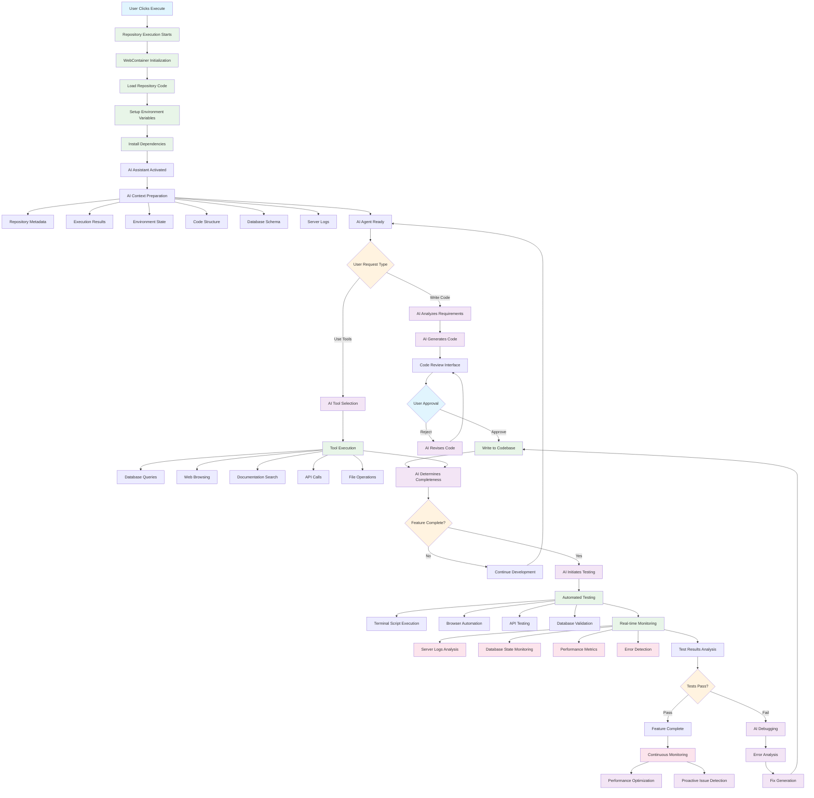
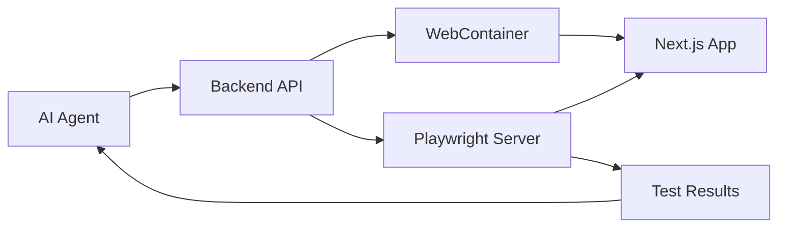

# Enhanced AI Agent Workflow - Complete Development Environment

> **Document Version**: 1.0.0  
> **Last Updated**: 2025-01-20  
> **Status**: Proposed Enhancement  

## Overview

This document outlines the enhanced AI agent workflow that transforms the repository execution environment into a complete AI-powered development environment. The agent can write code, use tools, test implementations, and has full visibility into the development environment including server logs, database state, and execution results.

## Enhanced Workflow Diagram



## Detailed Workflow Phases

### Phase 1: Environment Initialization

#### 1.1 Repository Execution Start
```typescript
// Enhanced execution with AI integration
interface EnhancedExecutionOptions {
  repositoryId: string;
  enableAI: boolean;
  autoApprove: boolean;
  testingMode: 'manual' | 'automated' | 'continuous';
  monitoringLevel: 'basic' | 'detailed' | 'comprehensive';
}

const executionResult = await repositoryExecutionService.executeWithAI({
  repositoryId: 'repo_123',
  enableAI: true,
  autoApprove: false,
  testingMode: 'automated',
  monitoringLevel: 'comprehensive'
});
```

#### 1.2 WebContainer Setup with Enhanced Monitoring
```typescript
class EnhancedWebContainer extends WebContainer {
  private logStream: WritableStream;
  private performanceMonitor: PerformanceMonitor;
  private databaseMonitor: DatabaseMonitor;
  
  async boot(): Promise<void> {
    await super.boot();
    this.setupMonitoring();
    this.enableAIIntegration();
  }
  
  private setupMonitoring(): void {
    // Real-time log streaming
    this.logStream = new WritableStream({
      write: (chunk) => this.aiAgent.processLogEntry(chunk)
    });
    
    // Performance monitoring
    this.performanceMonitor = new PerformanceMonitor({
      onMetric: (metric) => this.aiAgent.analyzePerformance(metric)
    });
    
    // Database state monitoring
    this.databaseMonitor = new DatabaseMonitor({
      onChange: (change) => this.aiAgent.trackDatabaseChange(change)
    });
  }
}
```

### Phase 2: AI Context Preparation

#### 2.1 Comprehensive Context Loading
```typescript
interface AIAgentContext {
  repository: RepositoryMetadata;
  codeStructure: CodeStructureMap;
  executionState: ExecutionState;
  environmentVariables: Record<string, string>;
  databaseSchema: DatabaseSchema;
  serverLogs: LogEntry[];
  performanceMetrics: PerformanceMetrics;
  testResults: TestResult[];
  dependencies: DependencyMap;
  apiEndpoints: APIEndpoint[];
}

class AIContextBuilder {
  async buildContext(repositoryId: string): Promise<AIAgentContext> {
    return {
      repository: await this.getRepositoryMetadata(repositoryId),
      codeStructure: await this.analyzeCodeStructure(repositoryId),
      executionState: await this.getCurrentExecutionState(repositoryId),
      environmentVariables: await this.getEnvironmentVariables(repositoryId),
      databaseSchema: await this.analyzeDatabaseSchema(repositoryId),
      serverLogs: await this.getRecentLogs(repositoryId),
      performanceMetrics: await this.getPerformanceMetrics(repositoryId),
      testResults: await this.getTestResults(repositoryId),
      dependencies: await this.analyzeDependencies(repositoryId),
      apiEndpoints: await this.discoverAPIEndpoints(repositoryId)
    };
  }
}
```

### Phase 3: AI Agent Capabilities

#### 3.1 Code Writing with Approval Flow
```typescript
class AICodeWriter {
  async writeCode(request: CodeWriteRequest): Promise<CodeWriteResult> {
    // 1. Analyze requirements
    const analysis = await this.analyzeRequirements(request);
    
    // 2. Generate code
    const generatedCode = await this.generateCode(analysis);
    
    // 3. Present for review
    const reviewResult = await this.presentForReview(generatedCode);
    
    if (reviewResult.approved || this.autoApprove) {
      // 4. Write to codebase
      await this.writeToCodebase(generatedCode);
      
      // 5. Update context
      await this.updateAIContext(generatedCode);
      
      return { success: true, files: generatedCode.files };
    } else {
      // 6. Revise based on feedback
      return this.reviseCode(generatedCode, reviewResult.feedback);
    }
  }
  
  private async presentForReview(code: GeneratedCode): Promise<ReviewResult> {
    return new Promise((resolve) => {
      // Show code diff in UI
      this.ui.showCodeReview({
        files: code.files,
        changes: code.changes,
        onApprove: () => resolve({ approved: true }),
        onReject: (feedback) => resolve({ approved: false, feedback })
      });
    });
  }
}
```

#### 3.2 Tool Usage System
```typescript
interface AITool {
  name: string;
  description: string;
  execute(params: any): Promise<any>;
}

class AIToolRegistry {
  private tools: Map<string, AITool> = new Map();
  
  constructor() {
    this.registerDefaultTools();
  }
  
  private registerDefaultTools(): void {
    // Database tools
    this.register(new DatabaseQueryTool());
    this.register(new DatabaseSchemaTool());
    
    // Web browsing tools
    this.register(new WebBrowsingTool());
    this.register(new APITestingTool());
    
    // Documentation tools
    this.register(new DocumentationSearchTool());
    this.register(new CodeSearchTool());
    
    // File system tools
    this.register(new FileOperationsTool());
    this.register(new GitOperationsTool());
    
    // Testing tools
    this.register(new TestExecutionTool());
    this.register(new BrowserAutomationTool());
  }
}

// Example tool implementations
class DatabaseQueryTool implements AITool {
  name = 'database_query';
  description = 'Execute database queries and analyze results';
  
  async execute(params: { query: string; database?: string }): Promise<any> {
    const connection = await this.getDatabaseConnection(params.database);
    const result = await connection.query(params.query);
    
    return {
      rows: result.rows,
      rowCount: result.rowCount,
      fields: result.fields,
      executionTime: result.executionTime
    };
  }
}

class WebBrowsingTool implements AITool {
  name = 'web_browse';
  description = 'Browse websites and extract information';
  
  async execute(params: { url: string; action: string }): Promise<any> {
    const browser = await this.getBrowserInstance();
    const page = await browser.newPage();
    
    await page.goto(params.url);
    
    switch (params.action) {
      case 'screenshot':
        return await page.screenshot();
      case 'extract_text':
        return await page.evaluate(() => document.body.innerText);
      case 'extract_links':
        return await page.evaluate(() => 
          Array.from(document.links).map(link => ({
            href: link.href,
            text: link.textContent
          }))
        );
      default:
        return await page.content();
    }
  }
}
```

### Phase 4: Testing and Validation

#### 4.1 Automated Testing System
```typescript
class AITestingOrchestrator {
  async runComprehensiveTests(repositoryId: string): Promise<TestResults> {
    const testSuite = await this.buildTestSuite(repositoryId);
    
    const results = await Promise.all([
      this.runUnitTests(testSuite.unit),
      this.runIntegrationTests(testSuite.integration),
      this.runE2ETests(testSuite.e2e),
      this.runPerformanceTests(testSuite.performance),
      this.runSecurityTests(testSuite.security)
    ]);
    
    return this.aggregateResults(results);
  }
  
  private async runE2ETests(tests: E2ETest[]): Promise<TestResult[]> {
    const browser = await this.getBrowserInstance();
    const results: TestResult[] = [];
    
    for (const test of tests) {
      try {
        const page = await browser.newPage();
        await this.executeTestSteps(page, test.steps);
        
        results.push({
          name: test.name,
          status: 'passed',
          duration: test.duration,
          screenshots: test.screenshots
        });
      } catch (error) {
        results.push({
          name: test.name,
          status: 'failed',
          error: error.message,
          screenshot: await this.captureErrorScreenshot()
        });
      }
    }
    
    return results;
  }
}
```

#### 4.2 Real-time Monitoring System
```typescript
class AIMonitoringSystem {
  private metrics: MetricsCollector;
  private logAnalyzer: LogAnalyzer;
  private performanceTracker: PerformanceTracker;
  
  async startMonitoring(repositoryId: string): Promise<void> {
    // Server logs monitoring
    this.logAnalyzer.onError((error) => {
      this.aiAgent.handleRuntimeError(error);
    });
    
    // Performance monitoring
    this.performanceTracker.onThreshold((metric) => {
      this.aiAgent.optimizePerformance(metric);
    });
    
    // Database monitoring
    this.databaseMonitor.onChange((change) => {
      this.aiAgent.validateDatabaseState(change);
    });
    
    // API monitoring
    this.apiMonitor.onFailure((failure) => {
      this.aiAgent.handleAPIFailure(failure);
    });
  }
  
  async getSystemHealth(): Promise<SystemHealth> {
    return {
      cpu: await this.metrics.getCPUUsage(),
      memory: await this.metrics.getMemoryUsage(),
      disk: await this.metrics.getDiskUsage(),
      network: await this.metrics.getNetworkStats(),
      database: await this.databaseMonitor.getHealth(),
      services: await this.serviceMonitor.getHealth()
    };
  }
}
```

### Phase 5: Continuous Improvement

#### 5.1 AI Learning and Optimization
```typescript
class AILearningSystem {
  async learnFromExecution(execution: ExecutionSession): Promise<void> {
    // Analyze successful patterns
    const successPatterns = await this.analyzeSuccessPatterns(execution);
    await this.updateKnowledgeBase(successPatterns);
    
    // Learn from failures
    const failurePatterns = await this.analyzeFailurePatterns(execution);
    await this.updateErrorHandling(failurePatterns);
    
    // Optimize performance
    const performanceInsights = await this.analyzePerformance(execution);
    await this.updateOptimizations(performanceInsights);
  }
  
  async suggestProactiveImprovements(repositoryId: string): Promise<Improvement[]> {
    const context = await this.getRepositoryContext(repositoryId);
    const analysis = await this.analyzeCodeQuality(context);
    
    return [
      ...await this.suggestPerformanceImprovements(analysis),
      ...await this.suggestSecurityImprovements(analysis),
      ...await this.suggestMaintainabilityImprovements(analysis),
      ...await this.suggestTestingImprovements(analysis)
    ];
  }
}
```

## API Integration Points

### Enhanced Repository Assistant API

```typescript
// Enhanced API endpoint with tool support
POST /api/ai/repository-assistant

interface EnhancedRequestBody {
  message: string;
  context: RepositoryContext;
  repositoryId: string;
  projectId: string;
  tools?: string[]; // Available tools for this session
  autoApprove?: boolean;
  testingEnabled?: boolean;
}

interface EnhancedResponse {
  response: string;
  actions?: AIAction[]; // Code changes, tool executions, etc.
  testResults?: TestResult[];
  monitoring?: MonitoringData;
  suggestions?: Improvement[];
}

interface AIAction {
  type: 'code_write' | 'tool_execution' | 'test_run' | 'optimization';
  description: string;
  data: any;
  requiresApproval: boolean;
  status: 'pending' | 'approved' | 'rejected' | 'executed';
}
```

### Tool Execution API

```typescript
// Tool execution endpoint
POST /api/ai/tools/execute

interface ToolExecutionRequest {
  toolName: string;
  parameters: Record<string, any>;
  repositoryId: string;
  sessionId: string;
}

interface ToolExecutionResponse {
  success: boolean;
  result: any;
  logs: string[];
  duration: number;
  error?: string;
}
```

## User Interface Enhancements

### Code Review Interface
```tsx
interface CodeReviewProps {
  changes: CodeChange[];
  onApprove: () => void;
  onReject: (feedback: string) => void;
}

function CodeReviewInterface({ changes, onApprove, onReject }: CodeReviewProps) {
  return (
    <div className="code-review-panel">
      <div className="changes-overview">
        {changes.map(change => (
          <FileChangeView key={change.file} change={change} />
        ))}
      </div>
      
      <div className="review-actions">
        <Button onClick={onApprove} variant="success">
          Approve Changes
        </Button>
        <Button onClick={() => onReject("Feedback here")} variant="destructive">
          Request Changes
        </Button>
      </div>
    </div>
  );
}
```

### Real-time Monitoring Dashboard
```tsx
function MonitoringDashboard({ repositoryId }: { repositoryId: string }) {
  const [metrics, setMetrics] = useState<SystemMetrics>();
  const [logs, setLogs] = useState<LogEntry[]>([]);
  
  useEffect(() => {
    const ws = new WebSocket(`/api/monitoring/${repositoryId}`);
    
    ws.onmessage = (event) => {
      const data = JSON.parse(event.data);
      
      switch (data.type) {
        case 'metrics':
          setMetrics(data.payload);
          break;
        case 'log':
          setLogs(prev => [...prev, data.payload]);
          break;
      }
    };
    
    return () => ws.close();
  }, [repositoryId]);
  
  return (
    <div className="monitoring-dashboard">
      <MetricsPanel metrics={metrics} />
      <LogsPanel logs={logs} />
      <DatabasePanel repositoryId={repositoryId} />
      <PerformancePanel repositoryId={repositoryId} />
    </div>
  );
}
```

## Security and Safety Considerations

### Code Execution Safety
```typescript
class CodeExecutionSafety {
  async validateCodeSafety(code: string): Promise<SafetyResult> {
    const checks = await Promise.all([
      this.checkForMaliciousPatterns(code),
      this.validateResourceUsage(code),
      this.checkSecurityVulnerabilities(code),
      this.validateDependencies(code)
    ]);
    
    return {
      safe: checks.every(check => check.safe),
      warnings: checks.flatMap(check => check.warnings),
      errors: checks.flatMap(check => check.errors)
    };
  }
  
  async sandboxExecution(code: string): Promise<ExecutionResult> {
    const sandbox = await this.createSandbox();
    
    try {
      return await sandbox.execute(code, {
        timeout: 30000,
        memoryLimit: '512MB',
        networkAccess: 'restricted'
      });
    } finally {
      await sandbox.destroy();
    }
  }
}
```

### Permission System
```typescript
interface AIPermissions {
  canWriteCode: boolean;
  canExecuteTools: boolean;
  canAccessDatabase: boolean;
  canModifyEnvironment: boolean;
  canRunTests: boolean;
  autoApprovalLevel: 'none' | 'safe' | 'all';
}

class PermissionManager {
  async checkPermission(
    action: string, 
    userId: string, 
    repositoryId: string
  ): Promise<boolean> {
    const userPermissions = await this.getUserPermissions(userId);
    const repositoryPermissions = await this.getRepositoryPermissions(repositoryId);
    
    return this.evaluatePermission(action, userPermissions, repositoryPermissions);
  }
}
```

## Playwright Integration Architecture

### Browser Testing Integration

The AI agent workflow integrates Playwright for comprehensive browser automation and testing capabilities. Here's how it works:

#### Architecture Overview


#### Implementation Details

##### 1. Enhanced Browser Testing Service
```typescript
class AIBrowserTester {
  private playwright: Browser | null = null;
  
  async initialize(): Promise<void> {
    this.playwright = await chromium.launch({
      headless: true,
      args: ['--no-sandbox', '--disable-setuid-sandbox']
    });
  }
  
  async testWebContainerApp(previewUrl: string, testInstructions: string[]): Promise<TestResults> {
    if (!this.playwright) await this.initialize();
    
    const context = await this.playwright.newContext();
    const page = await context.newPage();
    
    try {
      await page.goto(previewUrl);
      await page.waitForLoadState('networkidle');
      
      const results = await this.executeTestInstructions(page, testInstructions);
      return results;
    } finally {
      await context.close();
    }
  }
  
  private async executeTestInstructions(page: Page, instructions: string[]): Promise<TestResults> {
    const results: TestResult[] = [];
    
    for (const instruction of instructions) {
      try {
        const action = this.parseInstruction(instruction);
        const result = await this.executeAction(page, action);
        
        results.push({
          instruction,
          success: true,
          result,
          screenshot: await page.screenshot()
        });
      } catch (error) {
        results.push({
          instruction,
          success: false,
          error: error.message,
          screenshot: await page.screenshot()
        });
      }
    }
    
    return { results, summary: this.generateSummary(results) };
  }
}
```

##### 2. Playwright as AI Tool
```typescript
class PlaywrightTool implements AITool {
  name = 'browser_automation';
  description = 'Automate browser interactions and test web applications';
  
  async execute(params: {
    url: string;
    actions: BrowserAction[];
    assertions?: string[];
  }): Promise<BrowserTestResult> {
    const browser = await chromium.launch();
    const page = await browser.newPage();
    
    try {
      await page.goto(params.url);
      
      // Execute actions
      for (const action of params.actions) {
        await this.executeAction(page, action);
      }
      
      // Run assertions
      const assertionResults = [];
      for (const assertion of params.assertions || []) {
        const result = await this.runAssertion(page, assertion);
        assertionResults.push(result);
      }
      
      return {
        success: true,
        screenshot: await page.screenshot(),
        assertions: assertionResults,
        logs: await this.getConsoleLogs(page)
      };
    } finally {
      await browser.close();
    }
  }
}
```

##### 3. AI Testing Workflow Integration
```typescript
class AIAssistantWithTesting {
  private browserTester: AIBrowserTester;
  
  async handleTestingRequest(message: string, context: RepositoryContext): Promise<AIResponse> {
    // 1. Generate test instructions from AI message
    const testInstructions = await this.generateTestInstructions(message, context);
    
    // 2. Execute tests using Playwright
    const testResults = await this.browserTester.testWebContainerApp(
      context.executionResult.previewUrl,
      testInstructions
    );
    
    // 3. Analyze results and provide feedback
    const analysis = await this.analyzeTestResults(testResults);
    
    // 4. Generate code fixes if needed
    if (analysis.hasIssues) {
      const fixes = await this.generateCodeFixes(analysis.issues, context);
      return {
        response: `I found ${analysis.issues.length} issues. Here are the fixes:`,
        actions: fixes,
        testResults
      };
    }
    
    return {
      response: `All tests passed! Your application is working correctly.`,
      testResults
    };
  }
}
```

#### Enhanced Execute Button Workflow
```typescript
// When user clicks execute with testing enabled
const executeWithTesting = async (repositoryId: string) => {
  // 1. Start WebContainer
  const execution = await repositoryExecutionService.executeRepository({
    repositoryId,
    enableTesting: true
  });
  
  // 2. Initialize Playwright for this execution
  await aiAssistant.initializeBrowserTesting(execution.previewUrl);
  
  // 3. AI assistant now has browser automation capabilities
  return execution;
};
```

#### AI Testing Commands
The AI can now respond to testing requests such as:
- "Test the login form"
- "Check if the navigation works"
- "Verify the API endpoints are working"
- "Take a screenshot of the current state"
- "Test the responsive design"
- "Check for accessibility issues"

#### Automated Code-Test-Fix Loop
```typescript
const aiCodeWriteAndTest = async (codeRequest: string) => {
  // 1. AI writes code
  const generatedCode = await aiService.generateCode(codeRequest);
  
  // 2. User approves code
  if (await userApproves(generatedCode)) {
    // 3. Write code to WebContainer
    await webContainer.fs.writeFile(generatedCode.path, generatedCode.content);
    
    // 4. Wait for hot reload
    await waitForReload();
    
    // 5. Automatically test the changes
    const testResults = await playwright.testChanges(generatedCode.testInstructions);
    
    // 6. Provide feedback
    return {
      codeWritten: true,
      testResults,
      feedback: await aiService.analyzeTestResults(testResults)
    };
  }
};
```

### Configuration Requirements

#### Environment Variables
```bash
# .env.local
BROWSERLESS_TOKEN=your_browserless_token  # Optional for production scale
PLAYWRIGHT_HEADLESS=true
PLAYWRIGHT_TIMEOUT=30000
WEBCONTAINER_TIMEOUT=60000
```

#### Package Dependencies
```json
{
  "dependencies": {
    "@webcontainer/api": "^1.1.0",
    "playwright": "^1.40.0",
    "puppeteer": "^21.0.0"
  }
}
```

#### Playwright Configuration
```typescript
// playwright.config.ts for AI testing
export default defineConfig({
  testDir: './ai-tests',
  timeout: 30000,
  use: {
    headless: true,
    screenshot: 'only-on-failure',
    video: 'retain-on-failure'
  },
  projects: [
    {
      name: 'ai-testing',
      use: { ...devices['Desktop Chrome'] }
    }
  ]
});
```

### Benefits of Playwright Integration

#### ✅ **Perfect for AI Agent Workflow**
- **Real-time testing**: Test immediately after code changes
- **Visual feedback**: Screenshots and videos for AI analysis
- **Comprehensive coverage**: UI, API, and integration testing
- **Error detection**: Automatic issue identification

#### ✅ **WebContainer Integration**
- **Direct URL access**: Playwright connects to WebContainer preview URLs
- **No deployment needed**: Test immediately in development environment
- **Hot reload support**: Test changes as they happen
- **Isolated testing**: Each WebContainer is independent

#### ✅ **AI-Friendly Results**
- **Structured data**: JSON test results for AI analysis
- **Visual evidence**: Screenshots for AI to understand issues
- **Detailed logs**: Console logs and network activity
- **Actionable feedback**: Specific selectors and error messages

## Implementation Timeline

### Phase 1: Foundation (Weeks 1-2)
- [ ] Enhanced WebContainer with monitoring
- [ ] AI context preparation system
- [ ] Basic tool registry and execution
- [ ] **Playwright integration setup**
- [ ] **Basic browser testing service**

### Phase 2: Core AI Capabilities (Weeks 3-4)
- [ ] Code writing with approval flow
- [ ] Tool integration (database, web, files)
- [ ] **Playwright as AI tool**
- [ ] **AI test instruction generation**
- [ ] **Automated testing after code changes**

### Phase 3: Advanced Features (Weeks 5-6)
- [ ] Real-time monitoring system
- [ ] Performance optimization
- [ ] Security and safety measures
- [ ] **Visual regression testing**
- [ ] **Performance monitoring via Playwright**
- [ ] **Accessibility testing**

### Phase 4: Learning and Optimization (Weeks 7-8)
- [ ] AI learning system
- [ ] Proactive suggestions
- [ ] Continuous improvement
- [ ] **Advanced test pattern recognition**
- [ ] **Automated test generation**

## Success Metrics

### Development Efficiency
- **Code Generation Speed**: Time from request to working code
- **Bug Detection Rate**: Percentage of issues caught before deployment
- **Test Coverage**: Automated test coverage improvement
- **Development Velocity**: Features completed per sprint

### System Performance
- **Response Time**: AI response latency
- **Execution Success Rate**: Percentage of successful executions
- **Resource Utilization**: CPU, memory, and network efficiency
- **Uptime**: System availability and reliability

### User Experience
- **User Satisfaction**: Developer feedback scores
- **Adoption Rate**: Percentage of developers using AI features
- **Time to Value**: Time from setup to first successful AI assistance
- **Error Recovery**: Time to resolve issues with AI help

This enhanced workflow transforms the repository execution environment into a comprehensive AI-powered development platform that can autonomously write, test, and optimize code while providing full visibility into the development process. 