# AI Agent Enhanced Workflow - Visual Summary

> **Document Version**: 1.0.0  
> **Last Updated**: 2025-01-20  
> **Status**: Implementation Ready  

## Core Workflow Overview

This diagram shows the enhanced AI agent workflow that transforms the execute button into a complete AI-powered development environment.

```mermaid
flowchart TD
    %% Step 1: Execute
    A[👤 User Clicks Execute] --> B[🚀 Repository Execution Starts]
    
    %% Step 2: Environment & Chat Setup
    B --> C[🔧 WebContainer Initialization]
    C --> D[📁 Load Repository Code]
    D --> E[⚙️ Setup Environment Variables]
    E --> F[🤖 AI Chat Interface Loads]
    
    %% Step 3: AI Context & Tools
    F --> G[🧠 AI Context Preparation]
    G --> G1[📊 Repository Metadata]
    G --> G2[🔍 Code Analysis]
    G --> G3[📈 Execution Results]
    G --> G4[🗄️ Database Schema]
    G --> G5[📝 Server Logs]
    
    %% AI Tools Available
    G --> H[🛠️ AI Tools Ready]
    H --> H1[💾 Database Queries]
    H --> H2[🌐 Web Browsing]
    H --> H3[📚 Documentation Search]
    H --> H4[🔗 API Testing]
    H --> H5[📂 File Operations]
    
    %% Step 4: AI Code Writing
    H --> I[💬 User Requests Feature]
    I --> J[🤖 AI Analyzes & Writes Code]
    J --> K[👀 Code Review Interface]
    K --> L{✅ User Approval?}
    
    %% Approval Flow
    L -->|✅ Approve| M[💾 Write to Codebase]
    L -->|❌ Reject| N[🔄 AI Revises Code]
    N --> K
    
    %% Auto-Approve Option
    L -->|🤖 Auto-Approve| M
    
    %% Step 5: Feature Completion Check
    M --> O[🎯 AI Determines Completeness]
    O --> P{🏁 Feature Complete?}
    P -->|❌ No| Q[🔄 Continue Development]
    Q --> I
    
    %% Step 6: Testing Phase
    P -->|✅ Yes| R[🧪 AI Initiates Testing]
    R --> S[⚡ Automated Test Execution]
    S --> S1[💻 Terminal Scripts]
    S --> S2[🌐 Browser Automation]
    S --> S3[🔗 API Testing]
    S --> S4[🗄️ Database Validation]
    
    %% Real-time Monitoring
    S --> T[📊 Real-time Monitoring]
    T --> T1[📝 Server Logs Analysis]
    T --> T2[🗄️ Database State Monitoring]
    T --> T3[📈 Performance Metrics]
    T --> T4[🚨 Error Detection]
    
    %% Test Results
    T --> U[📋 Test Results Analysis]
    U --> V{✅ Tests Pass?}
    V -->|✅ Pass| W[🎉 Feature Complete]
    V -->|❌ Fail| X[🔧 AI Debugging]
    
    %% Debugging Loop
    X --> Y[🔍 Error Analysis]
    Y --> Z[🛠️ Generate Fixes]
    Z --> M
    
    %% Continuous Monitoring
    W --> AA[📊 Continuous Monitoring]
    AA --> BB[⚡ Performance Optimization]
    AA --> CC[🔮 Proactive Issue Detection]
    
    %% Styling
    classDef userAction fill:#e3f2fd,stroke:#1976d2,stroke-width:2px
    classDef aiAction fill:#f3e5f5,stroke:#7b1fa2,stroke-width:2px
    classDef systemAction fill:#e8f5e8,stroke:#388e3c,stroke-width:2px
    classDef decision fill:#fff3e0,stroke:#f57c00,stroke-width:2px
    classDef monitoring fill:#fce4ec,stroke:#c2185b,stroke-width:2px
    classDef success fill:#e0f2f1,stroke:#00695c,stroke-width:2px
    
    class A,L userAction
    class J,N,O,R,X,Y,Z,BB,CC aiAction
    class B,C,D,E,F,M,S,T systemAction
    class P,V decision
    class T1,T2,T3,T4,AA monitoring
    class W success
```



## Key Features Summary

### 🚀 **Step 1: Enhanced Execute Button**
- Starts repository execution in WebContainer
- Loads code, environment variables, and dependencies
- **New**: Activates AI assistant with full context

### 🤖 **Step 2: AI Context & Environment Loading**
- **Repository Context**: Metadata, code structure, configuration
- **Execution Context**: Real-time results, logs, performance metrics
- **Database Context**: Schema analysis, current state
- **Tool Access**: Database, web browsing, documentation, APIs

### ✍️ **Step 3: AI Code Writing with Approval**
- AI analyzes requirements and generates code
- **Code Review Interface**: Visual diff and approval workflow
- **Auto-Approve Option**: For trusted operations
- **Revision Loop**: AI improves code based on feedback

### 🛠️ **Step 4: AI Tool Usage**
```typescript
// Available AI Tools
const aiTools = [
  'database_query',     // Execute SQL queries
  'web_browse',         // Browse websites and APIs
  'documentation_search', // Search internal docs
  'api_test',          // Test API endpoints
  'file_operations',   // Read/write files
  'git_operations',    // Git commands
  'terminal_execute'   // Run shell commands
];
```

### 🧪 **Step 5: Automated Testing & Validation**
- **Terminal Testing**: Execute test scripts and commands
- **Browser Automation**: E2E testing with Playwright/Puppeteer
- **API Testing**: Validate endpoints and responses
- **Database Testing**: Verify data integrity and queries

### 📊 **Step 6: Real-time Monitoring & Visibility**
- **Server Logs**: Real-time log analysis and error detection
- **Database Monitoring**: Schema changes, query performance
- **Performance Metrics**: CPU, memory, response times
- **Error Detection**: Automatic issue identification

## Implementation Architecture

### Frontend Integration
```typescript
// Enhanced Repository Execution Panel
interface EnhancedExecutionPanel {
  // Existing tabs
  execute: ExecuteTab;
  configuration: ConfigTab;
  results: ResultsTab;
  
  // New AI-powered tabs
  aiAssistant: AIAssistantTab;
  codeReview: CodeReviewTab;
  monitoring: MonitoringTab;
  testing: TestingTab;
}
```

### Backend Services
```typescript
// Enhanced AI Assistant Service
class EnhancedAIAssistantService {
  // Code generation and modification
  async writeCode(request: CodeRequest): Promise<CodeResult>;
  
  // Tool execution
  async executeTool(tool: string, params: any): Promise<ToolResult>;
  
  // Testing orchestration
  async runTests(repositoryId: string): Promise<TestResults>;
  
  // Real-time monitoring
  async startMonitoring(repositoryId: string): Promise<MonitoringStream>;
}
```

### Tool Integration
```typescript
// AI Tool Registry
const toolRegistry = {
  database: new DatabaseTool(),
  web: new WebBrowsingTool(),
  docs: new DocumentationTool(),
  api: new APITestingTool(),
  files: new FileOperationsTool(),
  git: new GitTool(),
  terminal: new TerminalTool(),
  browser: new BrowserAutomationTool()
};
```

## User Experience Flow

### 1. **Developer Clicks Execute** 
→ Repository starts + AI assistant activates

### 2. **AI Loads Full Context**
→ Code, database, logs, performance data available

### 3. **Developer Requests Feature**
→ "Add user authentication to this app"

### 4. **AI Writes Code**
→ Generates auth components, API routes, database migrations

### 5. **Code Review & Approval**
→ Developer reviews changes, approves or requests modifications

### 6. **AI Determines Completeness**
→ Checks if feature is ready for testing

### 7. **Automated Testing**
→ Runs unit tests, integration tests, E2E tests

### 8. **Real-time Monitoring**
→ Watches logs, database, performance during testing

### 9. **Results & Iteration**
→ If tests fail, AI debugs and fixes issues automatically

### 10. **Continuous Monitoring**
→ Ongoing optimization and proactive issue detection

## Benefits

### 🚀 **Development Speed**
- Instant code generation with context awareness
- Automated testing and validation
- Real-time debugging and fixes

### 🔍 **Full Visibility**
- Complete environment monitoring
- Database state tracking
- Performance metrics analysis

### 🛡️ **Quality Assurance**
- Automated testing at every step
- Code review workflow
- Continuous monitoring

### 🤖 **AI-Powered Assistance**
- Context-aware code generation
- Intelligent debugging
- Proactive optimization

This enhanced workflow transforms the simple "execute" button into a complete AI-powered development environment that can autonomously build, test, and optimize applications while providing full transparency into the development process. 