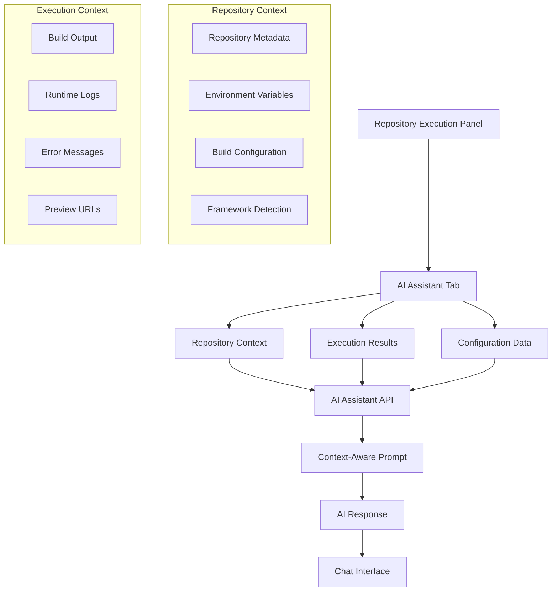

# AI Agent Integration with Repository Execution Environment

> **Document Version**: 1.0.0  
> **Last Updated**: 2025-01-20  
> **Status**: Implemented  

## Overview

The AI Agent integration provides context-aware assistance directly within the repository execution environment. This integration combines the power of WebContainer-based code execution with intelligent AI assistance, creating a development environment similar to Cursor, GitHub Copilot Workspace, and other AI-powered development tools.

## Architecture Integration

### Repository-Centric AI Context

The AI agent operates within the **repository-centric architecture**, providing assistance that is:

- **Repository-Scoped**: All AI interactions are confined to the current repository context
- **Execution-Aware**: The AI has real-time access to execution results, build outputs, and error logs
- **Configuration-Conscious**: The AI understands repository configuration, environment variables, and build commands
- **Framework-Specific**: Provides tailored advice based on detected language and framework

### Integration Points



## User Experience

### Enhanced Execute Button Workflow

When users click the **Execute** button on a repository:

1. **Repository Execution Starts**: WebContainer spins up with repository configuration
2. **AI Assistant Becomes Available**: New "AI Assistant" tab appears in the execution panel
3. **Context-Aware Chat**: AI has immediate access to:
   - Repository metadata (name, branch, language, framework)
   - Build and start commands
   - Environment variables
   - Real-time execution results
   - Error logs and build output

### Chat Interface Features

#### Repository Context Display
```typescript
// Context shown to users
{
  "Repository": "user/my-nextjs-app",
  "Branch": "main", 
  "Language": "TypeScript",
  "Framework": "Next.js",
  "Status": "active",
  "Execution": "Available" // or "None"
}
```

#### Intelligent Assistance Categories

1. **🐛 Debugging Support**
   - Analyzes error messages and build failures
   - Suggests specific fixes based on framework and configuration
   - Provides step-by-step troubleshooting guidance

2. **⚡ Configuration Optimization**
   - Reviews build and start commands
   - Suggests environment variable improvements
   - Recommends framework-specific optimizations

3. **🔧 Environment Management**
   - Helps configure environment variables
   - Suggests missing dependencies
   - Validates configuration completeness

4. **📦 Framework Best Practices**
   - Provides framework-specific guidance
   - Suggests architectural improvements
   - Recommends performance optimizations

5. **🚀 Performance Enhancement**
   - Analyzes build times and output
   - Suggests caching strategies
   - Recommends deployment optimizations

## Implementation Details

### Frontend Integration

#### Repository Execution Panel Enhancement

The `RepositoryExecutionPanel` component now includes a fourth tab:

```tsx
<TabsList className="grid w-full grid-cols-4">
  <TabsTrigger value="execute">Execute</TabsTrigger>
  <TabsTrigger value="config">Configuration</TabsTrigger>
  <TabsTrigger value="results">Results</TabsTrigger>
  <TabsTrigger value="assistant">
    <Bot className="h-4 w-4" />
    AI Assistant
  </TabsTrigger>
</TabsList>
```

#### Chat Interface Components

- **Message Display**: Chronological chat with user/assistant distinction
- **Context Panel**: Shows available repository and execution context
- **Input Interface**: Real-time message sending with Enter key support
- **Loading States**: Visual feedback during AI response generation

### Backend API

#### Repository Assistant Endpoint

**Route**: `/api/ai/repository-assistant`

**Request Format**:
```typescript
{
  message: string;
  context: {
    repository: {
      id: string;
      name: string;
      fullName: string;
      branch: string;
      language?: string;
      framework?: string;
      status: string;
      environmentVariables: Record<string, string>;
      buildCommand?: string;
      startCommand?: string;
    };
    executionResult?: {
      success: boolean;
      output: string;
      error?: string;
      previewUrl?: string;
      buildOutput?: string;
    };
    additionalEnvVars: Record<string, string>;
    customCode?: string;
  };
  repositoryId: string;
  projectId: string;
}
```

**Response Format**:
```typescript
{
  response: string;
  context: {
    repositoryId: string;
    projectId: string;
    timestamp: string;
  }
}
```

#### Context-Aware Prompt Engineering

The AI assistant uses a comprehensive system prompt that includes:

```typescript
const systemPrompt = `You are an AI assistant specialized in helping developers with repository execution, debugging, and optimization. You have access to the following repository context:

Repository Information:
- Name: ${repository.name} (${repository.fullName})
- Branch: ${repository.branch}
- Language: ${repository.language || 'Unknown'}
- Framework: ${repository.framework || 'Unknown'}
- Status: ${repository.status}

Configuration:
- Build Command: ${repository.buildCommand || 'Not configured'}
- Start Command: ${repository.startCommand || 'Not configured'}
- Environment Variables: ${JSON.stringify(environmentVariables, null, 2)}

${executionResult ? `
Execution Results:
- Success: ${executionResult.success}
- Output: ${executionResult.output}
- Error: ${executionResult.error || 'None'}
- Build Output: ${executionResult.buildOutput || 'None'}
` : 'No execution results available yet.'}

Please provide helpful, specific advice based on this context.`;
```

## Example Interactions

### Debugging Scenario

**User**: "Help me debug this execution error"

**AI Response** (with failed execution context):
```
I can see there's an execution error. Based on the error output: "Module not found: Can't resolve 'react'", here are some suggestions:

1. Check if all dependencies are properly installed
2. Verify your package.json includes react as a dependency
3. Try running `npm install` or `yarn install`
4. Ensure your build command "npm run build" is appropriate for your Next.js project
5. Check if the port 3000 is available

Would you like me to help you analyze the specific error in more detail?
```

### Optimization Scenario

**User**: "How can I optimize my build configuration?"

**AI Response**:
```
Here are some optimization suggestions for my-nextjs-app:

1. **Build Configuration**: Your current build command is "npm run build". For Next.js, consider:
   - Adding `NEXT_TELEMETRY_DISABLED=1` to environment variables
   - Using `npm run build && npm run export` for static exports
   - Enabling SWC compiler optimizations

2. **Environment Variables**: You have 3 environment variables configured. Consider:
   - Adding `NODE_ENV=production` for production builds
   - Setting `NEXT_OPTIMIZE_FONTS=true` for font optimization

3. **Performance**: Consider adding:
   - Build caching with `NEXT_CACHE_DIR=.next/cache`
   - Parallel builds if using multiple repositories

Would you like me to focus on any specific area?
```

### Environment Configuration

**User**: "What environment variables should I add?"

**AI Response**:
```
Your repository has 2 environment variables configured:
- NODE_ENV: development
- PORT: 3000

For a Next.js application, consider adding:
- `NEXT_TELEMETRY_DISABLED=1` (disable telemetry)
- `NEXT_OPTIMIZE_FONTS=true` (optimize font loading)
- `NEXT_OPTIMIZE_IMAGES=true` (optimize image loading)
- `DATABASE_URL` (if using a database)
- `API_BASE_URL` (for external API calls)

Is there a specific environment variable you'd like to add, modify, or troubleshoot?
```

## Integration with Existing AI Architecture

### Alignment with Agent MVP Specification

This implementation aligns with the **AI Agent MVP Specification** by providing:

1. **Project-Scoped Interactions**: All AI interactions are confined to the current repository and project
2. **Context-Aware Responses**: The AI has access to repository configuration, execution results, and build outputs
3. **IDE-Aware Context**: Similar to IDE context, the AI understands the current repository state
4. **Persistent Context**: Chat history is maintained within the execution session

### Future Integration Points

#### Phase 1: RAG Integration
- **Code Search Integration**: Connect with existing code search service for repository code analysis
- **Documentation Search**: Include repository documentation in AI context
- **Chat Thread Persistence**: Store chat history in MongoDB with ChatThread entities

#### Phase 2: Advanced Features
- **Code Generation**: Generate code fixes based on error analysis
- **Automated Debugging**: Automatically suggest and apply fixes
- **Performance Monitoring**: Continuous optimization suggestions
- **Multi-Repository Context**: Cross-repository knowledge sharing

## Security and Privacy

### Repository Access Control
- AI assistant validates repository ownership before providing assistance
- All interactions are scoped to the user's accessible repositories
- No cross-project data leakage

### Data Handling
- Repository context is processed in real-time, not stored permanently
- Chat history is session-based (future: stored with user consent)
- Sensitive environment variables are handled securely

## Performance Considerations

### Response Time Optimization
- Context preparation is optimized for minimal latency
- Mock responses provide immediate feedback during development
- Future: Caching of common responses and context patterns

### Resource Management
- AI assistant only activates when explicitly used
- Context is prepared on-demand, not preemptively
- Memory usage is optimized for concurrent repository executions

## Testing and Validation

### Manual Testing Scenarios
1. **Repository Execution with Errors**: Verify AI provides relevant debugging assistance
2. **Configuration Optimization**: Test AI suggestions for build and environment improvements
3. **Framework-Specific Guidance**: Validate framework detection and tailored advice
4. **Context Accuracy**: Ensure AI responses reflect actual repository state

### Integration Testing
- API endpoint validation with various repository configurations
- Context preparation accuracy across different frameworks
- Error handling for invalid repository access

## Future Enhancements

### Short-term (Next 2-4 weeks)
- **Real AI Integration**: Replace mock responses with actual AI service calls
- **Enhanced Context**: Include repository file structure and recent commits
- **Streaming Responses**: Implement real-time response streaming

### Medium-term (1-2 months)
- **Code Analysis**: Deep code understanding and suggestions
- **Automated Fixes**: One-click application of AI suggestions
- **Learning from Patterns**: AI learns from successful debugging sessions

### Long-term (3-6 months)
- **Proactive Assistance**: AI suggests improvements before issues occur
- **Cross-Repository Learning**: AI learns patterns across user's repositories
- **Advanced Debugging**: AI can modify code and test fixes automatically

## Conclusion

The AI Agent integration transforms the repository execution environment from a simple code runner into an intelligent development assistant. By providing context-aware, real-time assistance during code execution, it significantly reduces debugging time and improves development productivity.

This implementation serves as the foundation for more advanced AI-powered development features while maintaining the security, performance, and user experience standards of the Mech AI platform. 