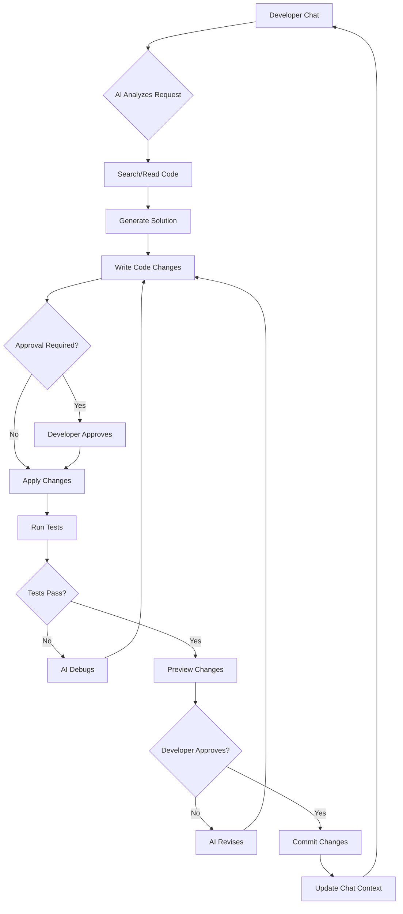

# Code Update Workflow Design

**Date**: May 27, 2025  
**Goal**: Design optimal chat → code → test → commit workflow

## 🔄 The Complete Development Loop



## 🤔 Inline Tools vs Agent Handoff

### Option 1: Inline Tool Usage (Current System)

```typescript
// How it works now - AI uses tools directly in chat
async function handleChatMessage(message: string) {
  const response = await ai.chat({
    messages: [...history, { role: 'user', content: message }],
    tools: [readFile, writeFile, runTests, gitCommit, ...],
    toolChoice: 'auto'
  });
  
  // AI calls tools as needed during response generation
  // Each tool call appears in the chat stream
}
```

**Pros:**
- ✅ Transparent - user sees every action
- ✅ Interactive - can stop/approve at each step
- ✅ Simpler implementation
- ✅ Already working in current system

**Cons:**
- ❌ Verbose - lots of tool calls in chat
- ❌ Slower - sequential execution
- ❌ Limited - can't do complex multi-step operations

### Option 2: Agent Handoff (Recommended)

```typescript
// New approach - Hand off complex tasks to specialized agents
async function handleChatMessage(message: string) {
  const intent = await analyzeIntent(message);
  
  if (intent.requiresCodeChange) {
    // Hand off to Code Update Agent
    const agent = new CodeUpdateAgent({
      context: currentContext,
      tools: [readFile, writeFile, runTests, ...],
      approvalCallback: requestUserApproval
    });
    
    const result = await agent.execute(intent);
    return formatAgentResult(result);
  }
  
  // Simple queries use inline tools
  return await ai.chat({ ... });
}
```

**Pros:**
- ✅ Efficient - parallel operations
- ✅ Powerful - complex workflows
- ✅ Clean - summary in chat
- ✅ Reusable - agents for common tasks

**Cons:**
- ❌ Less transparent initially
- ❌ More complex to implement
- ❌ Need good summarization

## 📋 Recommended Implementation

### Hybrid Approach: Smart Tool Routing

```typescript
// Best of both worlds
class MechAIOrchestrator {
  async handleRequest(message: string, context: Context) {
    const analysis = await this.analyzeRequest(message);
    
    switch (analysis.complexity) {
      case 'simple':
        // Inline tools for simple queries
        return this.handleSimpleQuery(message);
        
      case 'code_update':
        // Agent for code changes
        return this.delegateToCodeAgent(analysis);
        
      case 'investigation':
        // Agent for complex searches
        return this.delegateToSearchAgent(analysis);
        
      case 'testing':
        // Agent for test execution
        return this.delegateToTestAgent(analysis);
    }
  }
}
```

## 🛠️ Implementation Plan

### Phase 1: Enhanced Inline Tools (Week 1)

```typescript
// 1. Create workflow tools that combine operations
const updateCodeTool = {
  name: 'update_code_workflow',
  description: 'Search, modify, test, and commit code changes',
  execute: async ({ request, files, tests }) => {
    const steps = [];
    
    // Step 1: Search and understand
    steps.push({
      step: 'analyze',
      result: await searchAndAnalyze(request)
    });
    
    // Step 2: Modify files
    for (const file of files) {
      steps.push({
        step: 'modify',
        file: file.path,
        result: await modifyFile(file)
      });
    }
    
    // Step 3: Run tests
    if (tests) {
      steps.push({
        step: 'test',
        result: await runTests(tests)
      });
    }
    
    // Step 4: Prepare commit
    steps.push({
      step: 'commit',
      result: await prepareCommit(steps)
    });
    
    return { workflow: 'code_update', steps };
  }
};
```

### Phase 2: Code Update Agent (Week 2)

```typescript
class CodeUpdateAgent {
  private tools: Map<string, Tool>;
  private context: Context;
  
  async execute(task: CodeUpdateTask) {
    const plan = await this.createPlan(task);
    const results = [];
    
    // Execute plan steps
    for (const step of plan.steps) {
      try {
        const result = await this.executeStep(step);
        results.push(result);
        
        // Check if we need approval
        if (step.requiresApproval) {
          const approved = await this.requestApproval(step, result);
          if (!approved) {
            return this.handleRejection(step, results);
          }
        }
      } catch (error) {
        return this.handleError(error, step, results);
      }
    }
    
    return this.summarizeResults(results);
  }
  
  private async executeStep(step: PlanStep) {
    switch (step.type) {
      case 'search':
        return this.searchCode(step.params);
      case 'modify':
        return this.modifyCode(step.params);
      case 'test':
        return this.runTests(step.params);
      case 'commit':
        return this.createCommit(step.params);
    }
  }
}
```

### Phase 3: Visual Feedback Integration (Week 3)

```typescript
class VisualFeedbackAgent {
  async captureChanges(beforeCode: string, afterCode: string) {
    // 1. Apply changes in sandboxed environment
    const sandbox = await this.createSandbox();
    await sandbox.applyCode(beforeCode);
    const beforeScreenshot = await sandbox.screenshot();
    
    await sandbox.applyCode(afterCode);
    const afterScreenshot = await sandbox.screenshot();
    
    // 2. Generate visual diff
    const visualDiff = await this.generateDiff(
      beforeScreenshot, 
      afterScreenshot
    );
    
    // 3. Capture console output
    const consoleOutput = await sandbox.getConsoleOutput();
    
    return {
      before: beforeScreenshot,
      after: afterScreenshot,
      diff: visualDiff,
      console: consoleOutput
    };
  }
}
```

## 🎯 Recommended Workflow

### For Simple Changes (Inline Tools):
```
User: "Fix the typo in the login button"
AI: "I'll fix that typo for you..."
→ Uses read_file inline
→ Shows the fix
→ Uses write_file inline
Done in chat, transparent
```

### For Complex Changes (Agent Handoff):
```
User: "Add email validation to all forms"
AI: "I'll handle this complex update. Let me hand this off to my Code Update Agent..."

[Agent Working...]
- Found 5 forms across 3 components
- Updated validation in each
- Added shared validation utility
- Ran 15 tests (all passing)
- Created visual preview

AI: "I've completed the email validation update:
✅ Updated 5 forms
✅ All tests passing
✅ [View Changes] [View Screenshots]

Ready to commit?"
```

## 📊 Decision Matrix

| Scenario | Inline Tools | Agent Handoff |
|----------|-------------|---------------|
| Read file | ✅ Best | ❌ Overkill |
| Fix typo | ✅ Best | ❌ Overkill |
| Search code | ✅ Good | ✅ Good |
| Refactor function | 🟨 Okay | ✅ Best |
| Update multiple files | ❌ Messy | ✅ Best |
| Add feature | ❌ Too complex | ✅ Best |
| Debug issue | 🟨 Okay | ✅ Best |
| Run test suite | 🟨 Okay | ✅ Best |

## 🚀 Implementation Priority

### 1. Start with Enhanced Inline (This Week)
- Group related tools into workflows
- Add progress indicators
- Improve approval UX

### 2. Add Simple Agents (Next Week)
- CodeUpdateAgent for multi-file changes
- TestRunnerAgent for comprehensive testing
- CommitAgent for smart commits

### 3. Add Visual Feedback (Week 3)
- Screenshot capability
- Visual diffs
- Console capture

### 4. Full Integration (Week 4)
- Seamless handoff between chat and agents
- Context preservation
- Learning from outcomes

## 💡 Key Insights

1. **Use inline tools for transparency** when the user needs to see each step
2. **Use agents for efficiency** when the task is complex but well-defined
3. **Always summarize agent work** so users understand what happened
4. **Make handoffs explicit** so users know when an agent is working
5. **Preserve context** between chat and agents for continuity

The hybrid approach gives you the best of both worlds - transparency when needed, efficiency when possible.