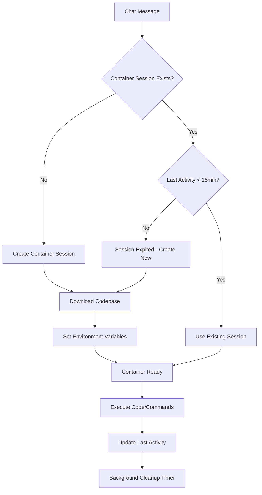

# Container Session Design

**Date**: May 27, 2025  
**Feature**: Persistent code sandboxes tied to chat sessions

## 🎯 Overview

A "Container Session" is a persistent WebContainer instance that:
- Is created when needed for a chat session
- Downloads the project codebase and environment variables
- Stays alive as long as messages are sent within 15 minutes
- Automatically shuts down after 15 minutes of inactivity
- Can be resumed if a new message arrives

## 🏗️ Architecture

### Container Session Lifecycle



### Data Model

```typescript
interface ContainerSession {
  id: string;
  chatId: string;
  projectId: string;
  repositoryId?: string;
  containerId: string; // WebContainer instance ID
  status: 'initializing' | 'ready' | 'error' | 'expired';
  createdAt: Date;
  lastActivity: Date;
  expiresAt: Date;
  previewUrl?: string;
  environmentVariables: Record<string, string>;
  codebaseVersion: string; // Git commit hash or timestamp
}
```

## 🛠️ Implementation

### 1. Container Session Manager

```typescript
// lib/services/container-session-manager.ts
export class ContainerSessionManager {
  private sessions = new Map<string, ContainerSession>();
  private cleanupInterval: NodeJS.Timeout;
  
  constructor() {
    // Cleanup expired sessions every 5 minutes
    this.cleanupInterval = setInterval(() => {
      this.cleanupExpiredSessions();
    }, 5 * 60 * 1000);
  }
  
  async getOrCreateSession(
    chatId: string, 
    projectId: string, 
    repositoryId?: string
  ): Promise<ContainerSession> {
    const existing = this.sessions.get(chatId);
    
    // Check if existing session is still valid
    if (existing && this.isSessionValid(existing)) {
      this.updateActivity(chatId);
      return existing;
    }
    
    // Clean up expired session if it exists
    if (existing) {
      await this.destroySession(chatId);
    }
    
    // Create new session
    return this.createSession(chatId, projectId, repositoryId);
  }
  
  private async createSession(
    chatId: string, 
    projectId: string, 
    repositoryId?: string
  ): Promise<ContainerSession> {
    const sessionId = generateId();
    
    const session: ContainerSession = {
      id: sessionId,
      chatId,
      projectId,
      repositoryId,
      containerId: '',
      status: 'initializing',
      createdAt: new Date(),
      lastActivity: new Date(),
      expiresAt: new Date(Date.now() + 15 * 60 * 1000), // 15 minutes
      environmentVariables: {},
      codebaseVersion: ''
    };
    
    this.sessions.set(chatId, session);
    
    try {
      // Initialize WebContainer
      const container = await WebContainer.boot();
      session.containerId = container.id;
      
      // Download codebase
      await this.downloadCodebase(session, container);
      
      // Set environment variables
      await this.setupEnvironment(session, container);
      
      // Start development server if applicable
      const previewUrl = await this.startDevServer(container);
      session.previewUrl = previewUrl;
      
      session.status = 'ready';
      
    } catch (error) {
      session.status = 'error';
      console.error('Failed to create container session:', error);
    }
    
    return session;
  }
  
  private isSessionValid(session: ContainerSession): boolean {
    return session.status === 'ready' && 
           Date.now() < session.expiresAt.getTime();
  }
  
  updateActivity(chatId: string): void {
    const session = this.sessions.get(chatId);
    if (session) {
      session.lastActivity = new Date();
      session.expiresAt = new Date(Date.now() + 15 * 60 * 1000);
    }
  }
  
  private async cleanupExpiredSessions(): void {
    const now = Date.now();
    
    for (const [chatId, session] of this.sessions) {
      if (now > session.expiresAt.getTime()) {
        await this.destroySession(chatId);
      }
    }
  }
  
  private async destroySession(chatId: string): Promise<void> {
    const session = this.sessions.get(chatId);
    if (session) {
      // Cleanup WebContainer resources
      // Note: WebContainer cleanup would go here
      console.log(`Destroying container session for chat ${chatId}`);
      this.sessions.delete(chatId);
    }
  }
}

// Singleton instance
export const containerSessionManager = new ContainerSessionManager();
```

### 2. API Endpoints

```typescript
// app/api/container-sessions/route.ts
import { containerSessionManager } from '@/lib/services/container-session-manager';

export async function POST(request: Request) {
  const { chatId, projectId, repositoryId } = await request.json();
  
  const session = await containerSessionManager.getOrCreateSession(
    chatId, 
    projectId, 
    repositoryId
  );
  
  return Response.json(session);
}

// app/api/container-sessions/[chatId]/execute/route.ts
export async function POST(
  request: Request,
  { params }: { params: { chatId: string } }
) {
  const { command, code } = await request.json();
  
  const session = containerSessionManager.getSession(params.chatId);
  if (!session || session.status !== 'ready') {
    return Response.json({ error: 'No active session' }, { status: 400 });
  }
  
  // Update activity
  containerSessionManager.updateActivity(params.chatId);
  
  // Execute command in the container
  const result = await executeInContainer(session.containerId, command, code);
  
  return Response.json(result);
}
```

### 3. Enhanced Execution Tools

```typescript
// lib/tools/container-session-tools.ts
export const containerSessionTool = {
  name: 'use_container_session',
  description: 'Execute code in a persistent container session tied to this chat',
  parameters: {
    type: 'object',
    properties: {
      command: {
        type: 'string',
        description: 'Command to execute (e.g., "npm start", "node index.js")'
      },
      code: {
        type: 'object', 
        description: 'Code files to write before execution'
      },
      workingDirectory: {
        type: 'string',
        description: 'Directory to execute command in'
      }
    }
  },
  execute: async (params, context) => {
    // Get or create container session for this chat
    const sessionResponse = await fetch('/api/container-sessions', {
      method: 'POST',
      body: JSON.stringify({
        chatId: context.chatId,
        projectId: context.projectId,
        repositoryId: context.repositoryId
      })
    });
    
    const session = await sessionResponse.json();
    
    if (session.status !== 'ready') {
      return {
        success: false,
        error: 'Container session not ready',
        status: session.status
      };
    }
    
    // Execute in the persistent session
    const executeResponse = await fetch(`/api/container-sessions/${context.chatId}/execute`, {
      method: 'POST',
      body: JSON.stringify(params)
    });
    
    const result = await executeResponse.json();
    
    return {
      success: true,
      sessionId: session.id,
      previewUrl: session.previewUrl,
      output: result.output,
      errors: result.errors,
      expiresAt: session.expiresAt
    };
  }
};
```

### 4. Chat Integration

```typescript
// components/container-session-indicator.tsx
export function ContainerSessionIndicator({ chatId }: { chatId: string }) {
  const [session, setSession] = useState<ContainerSession | null>(null);
  
  useEffect(() => {
    // Poll for session status
    const checkSession = async () => {
      const response = await fetch(`/api/container-sessions/${chatId}`);
      if (response.ok) {
        const sessionData = await response.json();
        setSession(sessionData);
      }
    };
    
    checkSession();
    const interval = setInterval(checkSession, 30000); // Check every 30s
    
    return () => clearInterval(interval);
  }, [chatId]);
  
  if (!session || session.status !== 'ready') {
    return null;
  }
  
  const timeRemaining = Math.max(0, 
    Math.floor((new Date(session.expiresAt).getTime() - Date.now()) / 1000 / 60)
  );
  
  return (
    <div className="flex items-center gap-2 p-2 bg-green-50 rounded-lg text-sm">
      <div className="w-2 h-2 bg-green-500 rounded-full animate-pulse" />
      <span>Container Session Active</span>
      <span className="text-green-700">
        Expires in {timeRemaining}m
      </span>
      {session.previewUrl && (
        <a 
          href={session.previewUrl} 
          target="_blank" 
          className="text-blue-600 underline"
        >
          Preview
        </a>
      )}
    </div>
  );
}
```

## 🎯 User Experience

### Session Creation
```
User: "Let's work on the login component"

MECH AI: "I'll set up a container session for this project..."
[Container Session indicator appears]
Container Session Active - Expires in 15m [Preview]

"I've created a persistent development environment with your 
codebase loaded. Any code we write will persist in this session 
for the next 15 minutes."
```

### Persistent Development
```
User: "Add validation to the email field"

MECH AI: "I'll update the email validation in our active session..."
[Updates activity timer]
Container Session Active - Expires in 15m [Preview]

[Modifies code in the persistent container]
"Updated! The changes are live in your development environment."
```

### Auto-cleanup
```
[After 15 minutes of inactivity]
Container Session Expired

User: "Let's continue working"

MECH AI: "I'll create a fresh container session..."
[New session created with latest codebase]
```

## 📊 Benefits

1. **Persistence**: Code changes persist during conversation
2. **Performance**: No cold starts for continued development
3. **Resource Management**: Automatic cleanup prevents resource waste
4. **Context Continuity**: Development state maintained across messages
5. **Preview URLs**: Consistent URLs during active session

## 🔧 Implementation Priority

### Phase 1: Core Session Management
1. Container session manager
2. Basic API endpoints
3. Simple expiration logic

### Phase 2: Chat Integration
1. Session indicator UI
2. Tool integration
3. Activity tracking

### Phase 3: Enhanced Features
1. Session sharing between users
2. Session snapshots
3. Advanced resource management

This creates a persistent, managed development environment that enhances the coding experience while efficiently managing resources.