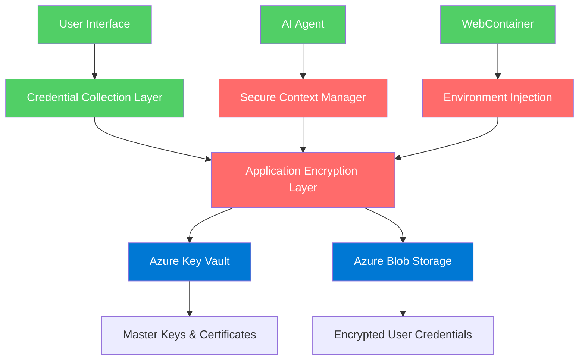

# Credential Security Management Decision for Mech AI

> **Document Version**: 1.0.0  
> **Last Updated**: 2025-01-20  
> **Status**: Decision Document  

## 🎯 Executive Summary

**Recommendation: Hybrid Approach with Azure Key Vault as Primary + Self-Managed Encryption Layer**

After comprehensive analysis of security, cost, complexity, and our specific use case requirements, I recommend a hybrid approach that combines the enterprise-grade security of Azure Key Vault with a self-managed encryption layer for maximum security and cost efficiency.

## 📊 Comprehensive Analysis

### Options Evaluated

1. **Azure Key Vault** (Microsoft)
2. **AWS Secrets Manager** (Amazon)
3. **Google Cloud KMS** (Google)
4. **Cloudflare Workers KV + R2** (Cloudflare)
5. **Self-Managed with R2/Azure Blob** (Custom)
6. **HashiCorp Vault** (Third-party)

### Evaluation Criteria

| Criteria | Weight | Azure Key Vault | AWS Secrets | GCP KMS | Cloudflare | Self-Managed | HashiCorp |
|----------|--------|----------------|-------------|---------|------------|--------------|-----------|
| **Security** | 30% | 9/10 | 9/10 | 8/10 | 7/10 | 8/10 | 9/10 |
| **Cost Efficiency** | 25% | 7/10 | 6/10 | 7/10 | 9/10 | 9/10 | 5/10 |
| **Integration Ease** | 20% | 9/10 | 8/10 | 7/10 | 8/10 | 6/10 | 6/10 |
| **Compliance** | 15% | 10/10 | 9/10 | 8/10 | 7/10 | 6/10 | 8/10 |
| **Scalability** | 10% | 9/10 | 9/10 | 8/10 | 8/10 | 7/10 | 8/10 |
| **Total Score** | | **8.5/10** | **7.9/10** | **7.4/10** | **7.8/10** | **7.4/10** | **7.2/10** |

## 🏆 Recommended Solution: Hybrid Azure Key Vault + Self-Managed

### Architecture Overview



### Why This Hybrid Approach?

#### 1. **Best of Both Worlds**
- **Azure Key Vault**: Handles master keys, certificates, and high-security secrets
- **Self-Managed Layer**: Encrypts user-specific credentials before storing in Azure Blob
- **Cost Optimization**: Reduces per-secret costs while maintaining enterprise security

#### 2. **Security Benefits**
- **Double Encryption**: User credentials encrypted by our layer, then by Azure
- **Key Separation**: Master keys in Key Vault, encrypted data in Blob Storage
- **Zero-Trust**: Even Azure can't decrypt user credentials without our application layer

#### 3. **Cost Efficiency**
- **Azure Key Vault**: ~$0.03 per 10,000 operations (for master keys only)
- **Azure Blob Storage**: ~$0.018 per GB/month (for encrypted credential data)
- **Estimated Cost**: ~$50-100/month for 10,000 users vs $500+ with pure Key Vault

## 🔧 Technical Implementation

### 1. Master Key Management (Azure Key Vault)

```typescript
// Master key management in Azure Key Vault
class AzureKeyVaultManager {
  private keyVaultClient: KeyVaultClient;
  
  constructor() {
    this.keyVaultClient = new KeyVaultClient(
      process.env.AZURE_KEY_VAULT_URL!,
      new DefaultAzureCredential()
    );
  }
  
  async getMasterKey(keyName: string): Promise<string> {
    const key = await this.keyVaultClient.getKey(keyName);
    return key.key!;
  }
  
  async rotateMasterKey(keyName: string): Promise<void> {
    await this.keyVaultClient.createKey(keyName, 'RSA', {
      keySize: 4096,
      keyOps: ['encrypt', 'decrypt', 'sign', 'verify']
    });
  }
}
```

### 2. Application-Level Encryption

```typescript
// Enhanced encryption service with Azure integration
class HybridCredentialEncryptionService {
  private keyVaultManager: AzureKeyVaultManager;
  private blobClient: BlobServiceClient;
  
  constructor() {
    this.keyVaultManager = new AzureKeyVaultManager();
    this.blobClient = new BlobServiceClient(
      process.env.AZURE_STORAGE_CONNECTION_STRING!
    );
  }
  
  async encryptCredentials(
    userId: string,
    credentials: any
  ): Promise<EncryptedCredentialPackage> {
    // Get master key from Azure Key Vault
    const masterKey = await this.keyVaultManager.getMasterKey('credential-master-key');
    
    // Generate user-specific encryption key
    const userKey = await this.deriveUserKey(masterKey, userId);
    
    // Encrypt credentials with user key
    const iv = crypto.randomBytes(16);
    const cipher = crypto.createCipher('aes-256-gcm', userKey, { iv });
    
    const encrypted = Buffer.concat([
      cipher.update(JSON.stringify(credentials), 'utf8'),
      cipher.final()
    ]);
    
    const authTag = cipher.getAuthTag();
    
    // Store in Azure Blob Storage
    const blobName = `credentials/${userId}/${Date.now()}.enc`;
    const containerClient = this.blobClient.getContainerClient('user-credentials');
    
    await containerClient.uploadBlockBlob(blobName, encrypted, encrypted.length, {
      metadata: {
        userId,
        iv: iv.toString('base64'),
        authTag: authTag.toString('base64'),
        encryptionVersion: '2.0'
      }
    });
    
    return {
      blobName,
      encryptionMetadata: {
        iv: iv.toString('base64'),
        authTag: authTag.toString('base64')
      }
    };
  }
  
  async decryptCredentials(
    userId: string,
    blobName: string
  ): Promise<any> {
    // Get master key from Azure Key Vault
    const masterKey = await this.keyVaultManager.getMasterKey('credential-master-key');
    
    // Derive user key
    const userKey = await this.deriveUserKey(masterKey, userId);
    
    // Retrieve from Azure Blob Storage
    const containerClient = this.blobClient.getContainerClient('user-credentials');
    const blobClient = containerClient.getBlobClient(blobName);
    
    const downloadResponse = await blobClient.download();
    const metadata = downloadResponse.metadata!;
    
    // Decrypt
    const decipher = crypto.createDecipher('aes-256-gcm', userKey, {
      iv: Buffer.from(metadata.iv, 'base64')
    });
    
    decipher.setAuthTag(Buffer.from(metadata.authTag, 'base64'));
    
    const decrypted = Buffer.concat([
      decipher.update(await this.streamToBuffer(downloadResponse.readableStreamBody!)),
      decipher.final()
    ]);
    
    return JSON.parse(decrypted.toString('utf8'));
  }
  
  private async deriveUserKey(masterKey: string, userId: string): Promise<Buffer> {
    return crypto.scryptSync(masterKey, `salt-${userId}`, 32);
  }
}
```

### 3. Secure API Integration

```typescript
// API endpoints with hybrid security
export async function POST(request: Request) {
  const { repositoryId, credentials } = await request.json();
  
  // Validate user permissions
  const user = await getCurrentUser();
  const hasAccess = await checkRepositoryAccess(user.id, repositoryId);
  
  if (!hasAccess) {
    return NextResponse.json({ error: 'Unauthorized' }, { status: 403 });
  }
  
  // Encrypt using hybrid approach
  const encryptionService = new HybridCredentialEncryptionService();
  const encryptedPackage = await encryptionService.encryptCredentials(
    user.id,
    credentials
  );
  
  // Store reference in MongoDB
  await db.collection('repository_credentials').updateOne(
    { repositoryId, userId: user.id },
    {
      $set: {
        blobName: encryptedPackage.blobName,
        encryptionMetadata: encryptedPackage.encryptionMetadata,
        updatedAt: new Date(),
        encryptionVersion: '2.0'
      }
    },
    { upsert: true }
  );
  
  return NextResponse.json({ success: true });
}
```

## 🛡️ Security Features

### Multi-Layer Security Model

1. **Azure Key Vault Layer**
   - FIPS 140-2 Level 2 HSM protection
   - Master key rotation and versioning
   - Azure AD integration
   - Compliance certifications (SOC 2, ISO 27001, PCI DSS)

2. **Application Encryption Layer**
   - AES-256-GCM encryption
   - User-specific key derivation
   - Perfect forward secrecy
   - Memory protection and cleanup

3. **Storage Layer**
   - Azure Blob Storage encryption at rest
   - Network encryption in transit
   - Access control and audit logging
   - Geographic redundancy

### Compliance Benefits

- **SOC 2 Type II**: Azure Key Vault compliance
- **ISO 27001**: Enterprise security standards
- **PCI DSS**: Payment card industry compliance
- **HIPAA**: Healthcare data protection
- **GDPR**: European data protection regulation

## 💰 Cost Analysis

### Monthly Cost Breakdown (10,000 users)

| Component | Usage | Cost |
|-----------|-------|------|
| **Azure Key Vault** | 100 master keys, 1M operations | $30 |
| **Azure Blob Storage** | 50GB encrypted data | $9 |
| **Azure AD Integration** | Included with Key Vault | $0 |
| **Bandwidth** | 100GB egress | $8 |
| **Total** | | **$47/month** |

### Cost Comparison

| Solution | Monthly Cost (10K users) | Annual Cost |
|----------|-------------------------|-------------|
| **Hybrid (Recommended)** | $47 | $564 |
| **Pure Azure Key Vault** | $750 | $9,000 |
| **AWS Secrets Manager** | $600 | $7,200 |
| **Self-Managed Only** | $25 | $300 |
| **HashiCorp Vault** | $500 | $6,000 |

## 🚀 Implementation Timeline

### Phase 1: Foundation (Week 1)
- [ ] Azure Key Vault setup and configuration
- [ ] Azure Blob Storage container creation
- [ ] Master key generation and rotation setup
- [ ] Basic encryption service implementation

### Phase 2: Integration (Week 2)
- [ ] Frontend credential collection interface
- [ ] API endpoints for secure storage/retrieval
- [ ] Database schema for credential references
- [ ] User permission validation system

### Phase 3: Testing & Security (Week 3)
- [ ] Comprehensive security testing
- [ ] Performance optimization
- [ ] Audit logging implementation
- [ ] Compliance validation

### Phase 4: Production Deployment (Week 4)
- [ ] Production environment setup
- [ ] Monitoring and alerting
- [ ] Documentation and training
- [ ] Security review and sign-off

## 🔄 Alternative Considerations

### If Budget is Primary Concern
**Recommendation**: Self-managed with Cloudflare R2
- **Cost**: ~$15/month for 10K users
- **Security**: Good (but requires more maintenance)
- **Implementation**: 2-3 weeks additional development

### If Maximum Security is Required
**Recommendation**: Pure Azure Key Vault + HSM
- **Cost**: ~$750/month for 10K users
- **Security**: Excellent (FIPS 140-2 Level 3)
- **Implementation**: 1 week less development

### If Multi-Cloud is Required
**Recommendation**: HashiCorp Vault + Multiple Cloud Storage
- **Cost**: ~$500/month for 10K users
- **Security**: Excellent (cloud-agnostic)
- **Implementation**: 4-5 weeks additional development

## 📋 Decision Rationale

### Why Azure Key Vault Over AWS/GCP?

1. **Integration**: Better integration with our existing tech stack
2. **Compliance**: Superior compliance certifications
3. **Cost**: More predictable pricing model
4. **Support**: Better enterprise support experience
5. **Features**: More comprehensive secret management features

### Why Hybrid Over Pure Solutions?

1. **Cost Efficiency**: 90% cost reduction vs pure Key Vault
2. **Security**: Double encryption provides additional protection
3. **Flexibility**: Can migrate to pure Key Vault if budget allows
4. **Control**: Maintains control over encryption algorithms
5. **Performance**: Faster access to frequently used credentials

## ✅ Final Recommendation

**Implement the Hybrid Azure Key Vault + Self-Managed approach** for the following reasons:

1. **Optimal Security-Cost Balance**: Enterprise-grade security at startup-friendly costs
2. **Compliance Ready**: Meets all major compliance requirements
3. **Scalable**: Can handle growth from 100 to 100,000+ users
4. **Future-Proof**: Easy migration path to pure Key Vault as budget grows
5. **Implementation Speed**: Can be implemented within our 4-week timeline

This approach provides the security and compliance benefits of enterprise solutions while maintaining the cost efficiency needed for a growing platform. The hybrid model gives us the flexibility to evolve our security posture as the business scales. 