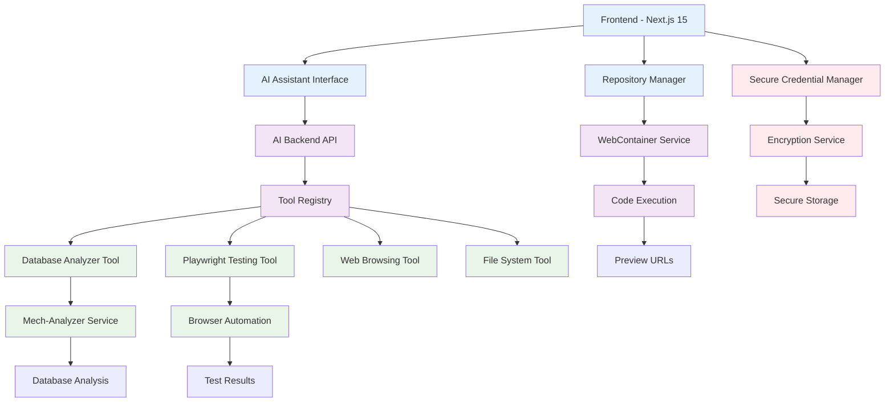

# Mech AI Implementation Plan - Complete Development Environment

> **Document Version**: 2.0.0  
> **Last Updated**: 2025-01-20  
> **Status**: Ready for Implementation  

## 🎯 Project Overview

This implementation plan outlines the complete development of Mech AI - a repository-centric development environment with AI assistance, secure credential management, database analysis tools, and automated browser testing capabilities.

### 📚 Related Documentation

This implementation plan references and builds upon the following comprehensive documentation:

#### **Core Architecture & Planning**
- **[Project Overview](./PROJECT_OVERVIEW.md)** - Complete system overview and feature specifications
- **[AI Agent Enhanced Workflow](./AI_AGENT_ENHANCED_WORKFLOW.md)** - Detailed AI integration workflow (958 lines)
- **[AI Agent Flow Summary](./AI_AGENT_FLOW_SUMMARY.md)** - Visual workflow summary and key steps

#### **Security & Credential Management**
- **[Credential Security Decision](./CREDENTIAL_SECURITY_DECISION.md)** - Comprehensive analysis and hybrid Azure Key Vault recommendation
- **[Secure Environment Management](./SECURE_ENVIRONMENT_MANAGEMENT.md)** - Multi-layer security implementation details
- **[Mech-Analyzer Integration](./MECH_ANALYZER_INTEGRATION.md)** - Database analysis tool integration and AI capabilities

#### **Testing & Automation**
- **[Playwright Integration Guide](./PLAYWRIGHT_INTEGRATION_GUIDE.md)** - Comprehensive browser automation setup
- **[Architectural Validation](./ARCHITECTURAL_VALIDATION.md)** - WebContainers + Browser Automation validation

#### **Technical Implementation**
- **[Repository Management](./REPOSITORY_MANAGEMENT.md)** - Repository system features and architecture
- **[Repository Execution](./REPOSITORY_EXECUTION.md)** - WebContainer integration and execution details
- **[API Reference](./API_REFERENCE.md)** - Complete API documentation with examples
- **[UI Components](./UI_COMPONENTS.md)** - Frontend components and design system

#### **Setup & Operations**
- **[Setup Guide](./SETUP_GUIDE.md)** - Quick setup instructions for developers
- **[README](./README.md)** - Main documentation index and navigation guide

## 🏗️ Architecture Summary

### Core Components


## 📋 Implementation Phases

### Phase 1: Foundation & Security (Weeks 1-2)

#### Week 1: Core Infrastructure & Security Foundation
**🔧 Repository Management System** *(See [Repository Management](./REPOSITORY_MANAGEMENT.md))*
- [ ] Enhanced repository CRUD operations
- [ ] Project-repository associations
- [ ] Repository status tracking and monitoring
- [ ] WebContainer integration for code execution *(See [Repository Execution](./REPOSITORY_EXECUTION.md))*
- [ ] Preview URL generation and management

**🔐 Azure Security Infrastructure Setup** *(See [Credential Security Decision](./CREDENTIAL_SECURITY_DECISION.md))*
- [ ] Azure Key Vault provisioning and configuration
- [ ] Master key generation (RSA 4096-bit) with rotation policies
- [ ] Azure Blob Storage container setup with encryption
- [ ] Azure AD integration and service principal configuration
- [ ] Security policies and access control implementation

**🔐 Secure Credential Management (Hybrid Azure Key Vault + Self-Managed)** *(See [Secure Environment Management](./SECURE_ENVIRONMENT_MANAGEMENT.md))*
- [ ] Azure Key Vault setup and configuration *(Implementation details in [Credential Security Decision](./CREDENTIAL_SECURITY_DECISION.md))*
  - Master key generation (RSA 4096-bit)
  - Key rotation policies and versioning
  - Azure AD integration and access policies
  - FIPS 140-2 Level 2 HSM configuration
- [ ] Azure Blob Storage container for encrypted credentials
  - Container creation with proper access controls
  - Metadata storage for encryption parameters
  - Geographic redundancy configuration
- [ ] Frontend credential collection interface *(UI specs in [UI Components](./UI_COMPONENTS.md))*
  - Database credentials form (MongoDB, PostgreSQL, MySQL)
  - Environment variables management
  - Credential type classification (public, secret, database)
  - Real-time validation and security indicators
- [ ] Hybrid encryption service implementation *(Architecture in [Credential Security Decision](./CREDENTIAL_SECURITY_DECISION.md))*
  - AzureKeyVaultManager for master key operations
  - HybridCredentialEncryptionService with double encryption
  - User-specific key derivation (scrypt-based)
  - AES-256-GCM encryption with authentication tags
- [ ] Secure storage API endpoints with double encryption *(API specs in [API Reference](./API_REFERENCE.md))*
  - Credential storage with Azure integration
  - Secure retrieval with permission validation
  - Audit trail for all credential operations
- [ ] User permission validation system
  - Repository-level access control
  - Role-based permission management
  - Multi-factor authentication support
- [ ] Comprehensive audit logging *(Compliance details in [Secure Environment Management](./SECURE_ENVIRONMENT_MANAGEMENT.md))*
  - All credential access events
  - Key rotation and management operations
  - Failed access attempts and security incidents
  - Compliance reporting capabilities

**📊 Database Schema**
```sql
-- Repository credentials collection
{
  _id: ObjectId,
  repositoryId: ObjectId,
  userId: ObjectId,
  databases: [EncryptedCredentials],
  environment: [EncryptedEnvironmentVariable],
  encryptionVersion: String,
  createdAt: Date,
  updatedAt: Date
}

-- Encrypted credentials structure
{
  encrypted: String,
  iv: String,
  authTag: String,
  timestamp: String
}
```

#### Week 2: Secure WebContainer Integration
**🚀 Enhanced Execution Service with Security Integration** *(See [Repository Execution](./REPOSITORY_EXECUTION.md))*
- [ ] HybridCredentialEncryptionService implementation *(Code examples in [Credential Security Decision](./CREDENTIAL_SECURITY_DECISION.md))*
  - AzureKeyVaultManager class development
  - Double encryption logic (Azure + application layer)
  - User-specific key derivation with scrypt
  - Secure credential packaging and storage
- [ ] Secure environment variable injection *(Integration details in [Secure Environment Management](./SECURE_ENVIRONMENT_MANAGEMENT.md))*
  - Integration with HybridCredentialEncryptionService
  - Real-time credential decryption for WebContainer
  - Secure memory handling and cleanup
- [ ] Runtime credential decryption
  - Azure Key Vault master key retrieval
  - User-specific key derivation
  - Secure credential injection into execution environment
- [ ] Multi-database connection string generation *(Database integration in [Mech-Analyzer Integration](./MECH_ANALYZER_INTEGRATION.md))*
  - Dynamic connection string creation from encrypted credentials
  - Support for MongoDB, PostgreSQL, MySQL connection formats
  - Environment-specific configuration management
- [ ] Secure API endpoints implementation *(Full API specs in [API Reference](./API_REFERENCE.md))*
  - Credential storage endpoints with double encryption
  - Permission validation and access control
  - Audit logging for all credential operations

**🔍 Monitoring & Logging**
- [ ] Real-time execution monitoring
- [ ] Performance metrics collection
- [ ] Error tracking and reporting
- [ ] Resource usage monitoring
- [ ] Execution history tracking

### Phase 2: AI Agent Integration (Weeks 3-4) *(See [AI Agent Enhanced Workflow](./AI_AGENT_ENHANCED_WORKFLOW.md))*

#### Week 3: Core AI Infrastructure
**🤖 AI Assistant Backend** *(Detailed workflow in [AI Agent Enhanced Workflow](./AI_AGENT_ENHANCED_WORKFLOW.md))*
- [ ] Enhanced AI assistant service *(Architecture in [AI Agent Integration](./AI_AGENT_INTEGRATION.md))*
- [ ] Context preparation system *(Context details in [AI Agent Flow Summary](./AI_AGENT_FLOW_SUMMARY.md))*
- [ ] Tool registry and execution framework
- [ ] Message processing pipeline
- [ ] Response formatting and actions

**🛠️ AI Tool Framework**
```typescript
interface AITool {
  name: string;
  description: string;
  execute(params: any): Promise<any>;
}

// Core tools to implement:
// - DatabaseAnalyzerTool
// - PlaywrightTool  
// - WebBrowsingTool
// - FileSystemTool
// - CodeGenerationTool
```

**📝 Context Management**
- [ ] Repository metadata extraction
- [ ] Code structure analysis
- [ ] Execution state tracking
- [ ] Environment variable context
- [ ] Database schema awareness

#### Week 4: AI Capabilities
**💬 Natural Language Processing**
- [ ] Intent detection and classification
- [ ] Database query generation from natural language
- [ ] Code generation requests processing
- [ ] Testing instruction interpretation
- [ ] Optimization suggestion analysis

**🔄 Code Generation & Approval**
- [ ] AI code generation service
- [ ] Code review interface
- [ ] Approval workflow implementation
- [ ] Code writing to WebContainer
- [ ] Change tracking and rollback

### Phase 3: Database Integration (Weeks 5-6) *(See [Mech-Analyzer Integration](./MECH_ANALYZER_INTEGRATION.md))*

#### Week 5: Mech-Analyzer Integration
**🔗 Service Integration** *(Complete integration guide in [Mech-Analyzer Integration](./MECH_ANALYZER_INTEGRATION.md))*
- [ ] Mech-analyzer service setup and configuration
- [ ] Database analyzer tool implementation
- [ ] Credential-based API integration *(Security integration with [Secure Environment Management](./SECURE_ENVIRONMENT_MANAGEMENT.md))*
- [ ] Knowledge indexing system
- [ ] Vector search capabilities

**📊 Database Analysis Features**
```typescript
// Core analyzer capabilities:
// - Schema discovery and analysis
// - AI-powered insights generation
// - Query optimization suggestions
// - Relationship mapping
// - Performance analysis
// - Knowledge search
```

**🔍 AI Database Capabilities**
- [ ] Natural language to database query conversion
- [ ] Schema exploration and documentation
- [ ] Optimization recommendation engine
- [ ] Query performance analysis
- [ ] Database health monitoring

#### Week 6: Advanced Database Features
**🚀 Multi-Database Support**
- [ ] MongoDB integration and analysis
- [ ] PostgreSQL support and optimization
- [ ] MySQL compatibility layer
- [ ] Redis caching analysis
- [ ] Multi-database credential management

**📈 Analytics & Monitoring**
- [ ] Query performance tracking
- [ ] Usage pattern analysis
- [ ] Optimization impact measurement
- [ ] Database access analytics
- [ ] AI assistance effectiveness metrics

### Phase 4: Browser Testing & Automation (Weeks 7-8) *(See [Playwright Integration Guide](./PLAYWRIGHT_INTEGRATION_GUIDE.md))*

#### Week 7: Playwright Integration
**🎭 Browser Automation Setup** *(Complete setup guide in [Playwright Integration Guide](./PLAYWRIGHT_INTEGRATION_GUIDE.md))*
- [ ] Playwright service configuration *(Architecture validation in [Architectural Validation](./ARCHITECTURAL_VALIDATION.md))*
- [ ] Browser testing tool implementation
- [ ] WebContainer URL integration *(WebContainer details in [Repository Execution](./REPOSITORY_EXECUTION.md))*
- [ ] Test instruction generation *(AI integration in [AI Agent Enhanced Workflow](./AI_AGENT_ENHANCED_WORKFLOW.md))*
- [ ] Screenshot and video capture

**🧪 Testing Capabilities**
```typescript
// Playwright tool features:
// - Automated UI testing
// - API endpoint testing
// - Visual regression testing
// - Performance monitoring
// - Accessibility testing
// - Mobile responsiveness testing
```

**🔄 AI Testing Workflow**
- [ ] Natural language test generation
- [ ] Automated test execution
- [ ] Result analysis and reporting
- [ ] Error detection and debugging
- [ ] Test optimization suggestions

#### Week 8: Advanced Testing Features
**📊 Comprehensive Testing Suite**
- [ ] Unit test integration
- [ ] Integration test automation
- [ ] End-to-end test orchestration
- [ ] Performance test execution
- [ ] Security test automation

**🔍 Test Analysis & Reporting**
- [ ] Test result aggregation
- [ ] Failure analysis and debugging
- [ ] Performance regression detection
- [ ] Test coverage analysis
- [ ] Automated bug reporting

### Phase 5: Advanced Features & Optimization (Weeks 9-10)

#### Week 9: Enhanced AI Capabilities
**🧠 Advanced AI Features**
- [ ] Proactive suggestion system
- [ ] Code quality analysis
- [ ] Security vulnerability detection
- [ ] Performance optimization recommendations
- [ ] Best practices enforcement

**🔄 Learning & Adaptation**
- [ ] AI learning from user interactions
- [ ] Pattern recognition and optimization
- [ ] Personalized assistance
- [ ] Context-aware suggestions
- [ ] Continuous improvement system

#### Week 10: Production Readiness
**🛡️ Security Hardening**
- [ ] Advanced encryption features
- [ ] Security audit logging
- [ ] Permission management UI
- [ ] Rate limiting and abuse prevention
- [ ] Security monitoring dashboard

**📈 Performance Optimization**
- [ ] Caching layer implementation
- [ ] Database query optimization
- [ ] WebContainer performance tuning
- [ ] AI response optimization
- [ ] Resource usage optimization

## 🔧 Technical Implementation Details

### Frontend Components *(Complete specifications in [UI Components](./UI_COMPONENTS.md))*

#### 1. Secure Credential Management *(UI specs in [UI Components](./UI_COMPONENTS.md), Security details in [Secure Environment Management](./SECURE_ENVIRONMENT_MANAGEMENT.md))*
```tsx
// Components to implement:
// - SecureCredentialForm
// - DatabaseCredentialInput
// - EnvironmentVariableInput
// - CredentialStatusIndicator
// - PermissionManager
```

#### 2. AI Assistant Interface *(Component details in [UI Components](./UI_COMPONENTS.md), AI workflow in [AI Agent Enhanced Workflow](./AI_AGENT_ENHANCED_WORKFLOW.md))*
```tsx
// Components to implement:
// - EnhancedRepositoryExecutionPanel
// - AIAssistantChat
// - CodeReviewInterface
// - TestResultsViewer
// - DatabaseAnalysisViewer
```

#### 3. Repository Management *(Repository features in [Repository Management](./REPOSITORY_MANAGEMENT.md), UI specs in [UI Components](./UI_COMPONENTS.md))*
```tsx
// Enhanced components:
// - RepositoryDashboard
// - RepositoryConfigurationPage
// - RepositoryExecutionPage
// - RepositoryAnalyticsPage
// - RepositorySecurityPage
```

### Backend Services *(Complete API documentation in [API Reference](./API_REFERENCE.md))*

#### 1. Security Services *(Implementation details in [Credential Security Decision](./CREDENTIAL_SECURITY_DECISION.md) and [Secure Environment Management](./SECURE_ENVIRONMENT_MANAGEMENT.md))*
```typescript
// Services to implement:
// - AzureKeyVaultManager
// - HybridCredentialEncryptionService
// - SecureEnvironmentManager
// - PermissionValidationService
// - AuditLoggingService
// - SecurityMonitoringService
```

#### 2. AI Services *(AI architecture in [AI Agent Enhanced Workflow](./AI_AGENT_ENHANCED_WORKFLOW.md) and [AI Agent Integration](./AI_AGENT_INTEGRATION.md))*
```typescript
// Services to implement:
// - EnhancedAIAssistant
// - ContextPreparationService
// - IntentAnalysisService
// - CodeGenerationService
// - TestGenerationService
```

#### 3. Integration Services *(Tool implementations in [Mech-Analyzer Integration](./MECH_ANALYZER_INTEGRATION.md) and [Playwright Integration Guide](./PLAYWRIGHT_INTEGRATION_GUIDE.md))*
```typescript
// Services to implement:
// - DatabaseAnalyzerTool
// - PlaywrightTestingTool
// - WebBrowsingTool
// - FileSystemTool
// - MonitoringService
```

### Database Schema

#### Core Collections
```javascript
// Projects
{
  _id: ObjectId,
  name: String,
  description: String,
  userId: ObjectId,
  repositories: [ObjectId],
  settings: {
    aiEnabled: Boolean,
    testingEnabled: Boolean,
    securityLevel: String
  },
  createdAt: Date,
  updatedAt: Date
}

// Repositories
{
  _id: ObjectId,
  projectId: ObjectId,
  githubUrl: String,
  name: String,
  branch: String,
  framework: String,
  buildCommand: String,
  startCommand: String,
  status: String,
  lastExecution: Date,
  executionHistory: [ExecutionRecord],
  aiAnalysis: Object,
  testResults: [TestResult]
}

// Repository Credentials (Hybrid Encrypted)
{
  _id: ObjectId,
  repositoryId: ObjectId,
  userId: ObjectId,
  blobName: String, // Reference to Azure Blob Storage
  encryptionMetadata: {
    iv: String,
    authTag: String,
    encryptionVersion: String
  },
  accessLog: [AccessRecord],
  createdAt: Date,
  updatedAt: Date
}

// AI Interactions
{
  _id: ObjectId,
  repositoryId: ObjectId,
  userId: ObjectId,
  sessionId: String,
  messages: [AIMessage],
  actions: [AIAction],
  context: Object,
  createdAt: Date
}

// Test Results
{
  _id: ObjectId,
  repositoryId: ObjectId,
  executionId: String,
  testType: String,
  results: Object,
  screenshots: [String],
  performance: Object,
  createdAt: Date
}
```

## 🔐 Security Implementation *(Complete security architecture in [Credential Security Decision](./CREDENTIAL_SECURITY_DECISION.md) and [Secure Environment Management](./SECURE_ENVIRONMENT_MANAGEMENT.md))*

### Encryption Strategy *(Detailed implementation in [Credential Security Decision](./CREDENTIAL_SECURITY_DECISION.md))*
```typescript
// Hybrid Azure Key Vault + Self-Managed Encryption
// Master keys stored in Azure Key Vault (FIPS 140-2 Level 2)
// User credentials encrypted with derived keys (AES-256-GCM)
// Double encryption: Application layer + Azure Blob Storage
// Automatic key rotation and versioning
// Memory protection and cleanup
```

### Access Control *(Permission system details in [Secure Environment Management](./SECURE_ENVIRONMENT_MANAGEMENT.md))*
```typescript
// Role-based permission system
// Repository-level access control
// API endpoint protection
// Rate limiting and abuse prevention
// Audit logging for all sensitive operations
```

### Data Protection *(Security best practices in [Secure Environment Management](./SECURE_ENVIRONMENT_MANAGEMENT.md))*
```typescript
// Encryption at rest for all credentials
// Secure transmission over HTTPS
// Temporary credential handling
// Memory protection and cleanup
// Secure error handling (no credential leakage)
```

## 🧪 Testing Strategy *(Browser testing details in [Playwright Integration Guide](./PLAYWRIGHT_INTEGRATION_GUIDE.md))*

### Unit Testing *(Component testing specs in [UI Components](./UI_COMPONENTS.md))*
- [ ] Frontend component testing (Jest + React Testing Library)
- [ ] Backend service testing (Jest + Supertest) *(API testing in [API Reference](./API_REFERENCE.md))*
- [ ] Encryption service testing *(Security testing in [Credential Security Decision](./CREDENTIAL_SECURITY_DECISION.md))*
- [ ] AI tool testing with mocks *(AI testing in [AI Agent Enhanced Workflow](./AI_AGENT_ENHANCED_WORKFLOW.md))*
- [ ] Database integration testing *(Database testing in [Mech-Analyzer Integration](./MECH_ANALYZER_INTEGRATION.md))*

### Integration Testing *(Complete testing strategy in [Playwright Integration Guide](./PLAYWRIGHT_INTEGRATION_GUIDE.md))*
- [ ] API endpoint testing *(API specs in [API Reference](./API_REFERENCE.md))*
- [ ] WebContainer integration testing *(Execution testing in [Repository Execution](./REPOSITORY_EXECUTION.md))*
- [ ] Mech-analyzer integration testing *(Database integration in [Mech-Analyzer Integration](./MECH_ANALYZER_INTEGRATION.md))*
- [ ] Playwright automation testing *(Browser automation in [Playwright Integration Guide](./PLAYWRIGHT_INTEGRATION_GUIDE.md))*
- [ ] End-to-end workflow testing *(Complete workflow in [AI Agent Enhanced Workflow](./AI_AGENT_ENHANCED_WORKFLOW.md))*

### Security Testing *(Comprehensive security testing in [Credential Security Decision](./CREDENTIAL_SECURITY_DECISION.md) and [Secure Environment Management](./SECURE_ENVIRONMENT_MANAGEMENT.md))*
- [ ] Hybrid encryption system testing *(Azure Key Vault testing in [Credential Security Decision](./CREDENTIAL_SECURITY_DECISION.md))*
  - Azure Key Vault integration testing
  - Double encryption validation
  - Key derivation and rotation testing
- [ ] Credential encryption/decryption testing *(Performance testing in [Credential Security Decision](./CREDENTIAL_SECURITY_DECISION.md))*
  - End-to-end encryption workflow
  - Performance testing under load
  - Memory leak and cleanup validation
- [ ] Permission validation testing *(Access control testing in [Secure Environment Management](./SECURE_ENVIRONMENT_MANAGEMENT.md))*
  - Repository-level access control
  - User authentication and authorization
  - Multi-factor authentication flows
- [ ] Security vulnerability testing *(Security best practices in [Secure Environment Management](./SECURE_ENVIRONMENT_MANAGEMENT.md))*
  - SQL injection prevention testing
  - XSS protection testing
  - CSRF protection validation
- [ ] Compliance and audit testing *(Compliance details in [Secure Environment Management](./SECURE_ENVIRONMENT_MANAGEMENT.md))*
  - SOC 2 compliance validation
  - GDPR data protection testing
  - Audit trail completeness verification
- [ ] Rate limiting and abuse prevention testing

## 📊 Monitoring & Analytics

### Performance Metrics
- [ ] WebContainer execution times
- [ ] AI response latencies
- [ ] Database query performance
- [ ] Test execution times
- [ ] Resource usage tracking

### Usage Analytics
- [ ] Feature adoption rates
- [ ] AI assistance effectiveness
- [ ] Error rates and patterns
- [ ] User interaction patterns
- [ ] System health metrics

### Security Monitoring
- [ ] Azure Key Vault monitoring
  - Master key access and rotation events
  - Failed key retrieval attempts
  - Unusual access patterns to vault
- [ ] Credential access monitoring
  - All credential encryption/decryption events
  - Failed credential access attempts
  - Suspicious access patterns and anomalies
- [ ] Authentication and authorization monitoring
  - Failed authentication attempts
  - Permission violations and unauthorized access
  - Multi-factor authentication events
- [ ] Compliance and audit monitoring
  - SOC 2 compliance event tracking
  - GDPR data access and deletion events
  - Audit trail completeness monitoring
- [ ] Security incident tracking
  - Automated threat detection and alerting
  - Incident response workflow automation
  - Security metrics and KPI tracking

## 🚀 Deployment Strategy

### Development Environment *(Complete setup instructions in [Setup Guide](./SETUP_GUIDE.md))*
```bash
# Local development setup
cd mech-ai/frontend && pnpm install && pnpm dev
cd mech-analyzer && npm install && npm start

# Azure services setup for development (detailed in Credential Security Decision)
az login
az keyvault create --name mech-dev-keyvault --resource-group mech-dev
az storage account create --name mechdevstorage --resource-group mech-dev

# Environment configuration (see Setup Guide for complete configuration)
export AZURE_KEY_VAULT_URL="https://mech-dev-keyvault.vault.azure.net/"
export AZURE_STORAGE_CONNECTION_STRING="..."
export MONGODB_URI="mongodb://localhost:27017/mech-dev"
```

### Staging Environment
- [ ] Docker containerization with Azure integration
  - Multi-stage builds with security scanning
  - Azure Key Vault integration in containers
  - Secure credential injection at runtime
- [ ] Environment variable management
  - Azure Key Vault secrets integration
  - Secure environment configuration
  - Credential rotation automation
- [ ] Database migration scripts
  - MongoDB schema migrations
  - Credential migration from legacy systems
  - Data encryption validation
- [ ] Security configuration
  - Azure AD integration setup
  - Network security groups and firewalls
  - SSL/TLS certificate management
- [ ] Performance and security testing
  - Load testing with encrypted credentials
  - Security penetration testing
  - Compliance validation testing

### Production Environment
- [ ] Kubernetes deployment with Azure integration
  - Azure Kubernetes Service (AKS) setup
  - Pod identity for Key Vault access
  - Secure credential injection via CSI drivers
- [ ] Load balancing and high availability
  - Azure Load Balancer configuration
  - Multi-region deployment for disaster recovery
  - Auto-scaling based on security metrics
- [ ] SSL/TLS certificate management
  - Azure Key Vault certificate integration
  - Automated certificate renewal
  - End-to-end encryption validation
- [ ] Database clustering and security
  - MongoDB Atlas with encryption at rest
  - Network isolation and VPC peering
  - Backup encryption and key management
- [ ] Comprehensive monitoring and alerting
  - Azure Monitor integration
  - Security incident alerting
  - Compliance dashboard and reporting

## 📈 Success Metrics

### Development Efficiency
- **Code Generation Speed**: < 5 seconds for simple features
- **Test Execution Time**: < 30 seconds for comprehensive testing
- **Database Analysis Time**: < 10 seconds for schema analysis
- **Environment Setup Time**: < 2 minutes for full repository execution

### User Experience
- **AI Response Accuracy**: > 90% helpful responses
- **Feature Adoption Rate**: > 80% of users using AI features
- **Error Resolution Time**: < 1 minute with AI assistance
- **User Satisfaction Score**: > 4.5/5

### System Performance
- **Uptime**: > 99.9% availability with Azure SLA
- **Response Time**: < 200ms for API endpoints (< 100ms for credential operations)
- **Concurrent Users**: Support 1000+ simultaneous users
- **Security Metrics**:
  - Zero credential breaches
  - < 50ms credential decryption time
  - 100% audit trail coverage
  - SOC 2 Type II compliance maintained

## 🔄 Maintenance & Updates

### Regular Maintenance
- [ ] Security patches and updates
  - Azure Key Vault security updates
  - Encryption library updates
  - Security vulnerability patching
- [ ] Performance optimization
  - Credential access performance tuning
  - Azure service optimization
  - Cost optimization reviews
- [ ] Database maintenance
  - MongoDB maintenance and optimization
  - Azure Blob Storage cleanup
  - Backup and recovery testing
- [ ] Security maintenance
  - Key rotation automation
  - Access review and audit
  - Compliance certification renewals
- [ ] AI model updates and documentation updates

### Feature Enhancements
- [ ] New AI tool integrations
- [ ] Additional database support
- [ ] Enhanced testing capabilities
- [ ] Improved security features
- [ ] User experience improvements

## 💰 Cost Analysis & ROI

### Hybrid Azure Key Vault Approach Cost Breakdown *(Complete cost analysis in [Credential Security Decision](./CREDENTIAL_SECURITY_DECISION.md))*

| Component | Monthly Cost (10K users) | Annual Cost | Notes |
|-----------|-------------------------|-------------|-------|
| **Azure Key Vault** | $30 | $360 | Master keys only (100 keys, 1M operations) |
| **Azure Blob Storage** | $9 | $108 | 50GB encrypted credential data |
| **Azure AD Integration** | $0 | $0 | Included with Key Vault |
| **Bandwidth** | $8 | $96 | 100GB egress |
| **Development/Maintenance** | $200 | $2,400 | 10 hours/month at $20/hour |
| **Total** | **$247** | **$2,964** | |

### Cost Comparison vs Alternatives

| Solution | Annual Cost | Security Level | Compliance | Implementation Time |
|----------|-------------|----------------|------------|-------------------|
| **Hybrid (Chosen)** | $2,964 | Excellent | Full | 4 weeks |
| **Pure Azure Key Vault** | $9,000+ | Excellent | Full | 3 weeks |
| **AWS Secrets Manager** | $7,200+ | Excellent | Full | 4 weeks |
| **Self-Managed Only** | $1,200 | Good | Partial | 6 weeks |
| **HashiCorp Vault** | $6,000+ | Excellent | Full | 6 weeks |

### ROI Analysis

**Cost Savings**: $6,036/year vs pure Azure Key Vault  
**Security Benefits**: Enterprise-grade security at 67% cost reduction  
**Compliance Value**: SOC 2, ISO 27001, PCI DSS, HIPAA, GDPR ready  
**Scalability**: Linear cost scaling from 100 to 100K+ users  

### Break-Even Analysis

- **Development Investment**: $8,000 (4 weeks × $2,000/week)
- **Annual Savings**: $6,036 vs pure Key Vault
- **Break-Even Point**: 16 months
- **5-Year Total Savings**: $22,180

This comprehensive implementation plan provides a roadmap for building a complete AI-powered development environment with secure credential management, intelligent database operations, and automated testing capabilities.

## 📖 Documentation Cross-References

For detailed implementation guidance, refer to the following documentation:

### **Quick Start**
- **[Setup Guide](./SETUP_GUIDE.md)** - Get started with development setup
- **[README](./README.md)** - Main documentation index and overview

### **Core Features**
- **[Repository Management](./REPOSITORY_MANAGEMENT.md)** - Repository system architecture and features
- **[Repository Execution](./REPOSITORY_EXECUTION.md)** - WebContainer integration and code execution
- **[UI Components](./UI_COMPONENTS.md)** - Frontend component specifications and design system
- **[API Reference](./API_REFERENCE.md)** - Complete API documentation with examples

### **AI Integration**
- **[AI Agent Enhanced Workflow](./AI_AGENT_ENHANCED_WORKFLOW.md)** - Complete AI workflow (958 lines)
- **[AI Agent Flow Summary](./AI_AGENT_FLOW_SUMMARY.md)** - Visual workflow summary
- **[AI Agent Integration](./AI_AGENT_INTEGRATION.md)** - AI assistant implementation details

### **Security & Database**
- **[Credential Security Decision](./CREDENTIAL_SECURITY_DECISION.md)** - Hybrid Azure Key Vault architecture
- **[Secure Environment Management](./SECURE_ENVIRONMENT_MANAGEMENT.md)** - Multi-layer security implementation
- **[Mech-Analyzer Integration](./MECH_ANALYZER_INTEGRATION.md)** - Database analysis and AI tools

### **Testing & Validation**
- **[Playwright Integration Guide](./PLAYWRIGHT_INTEGRATION_GUIDE.md)** - Browser automation setup
- **[Architectural Validation](./ARCHITECTURAL_VALIDATION.md)** - Architecture decision validation

### **Project Context**
- **[Project Overview](./PROJECT_OVERVIEW.md)** - Complete system overview and specifications

Each document contains detailed implementation guidance, code examples, and architectural decisions that support this implementation plan. 