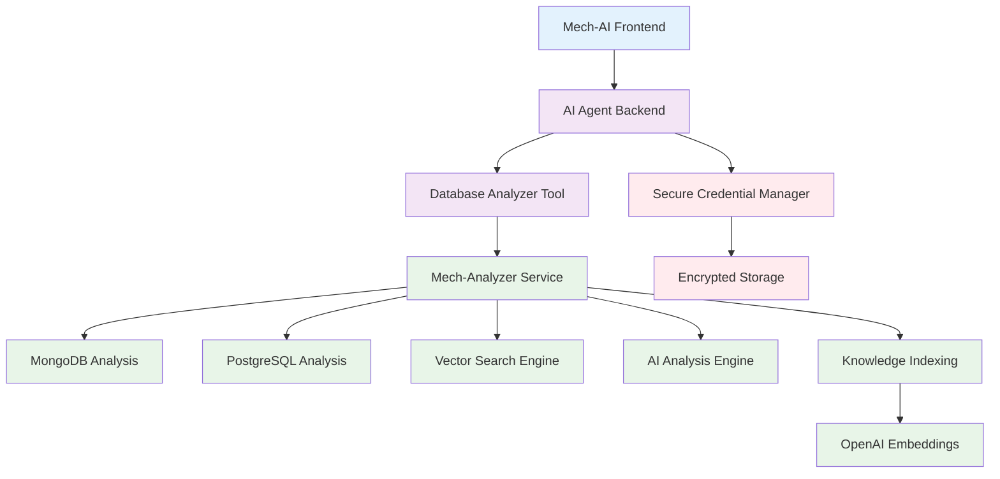

# Mech-Analyzer Integration Guide

> **Document Version**: 1.0.0  
> **Last Updated**: 2025-01-20  
> **Status**: Implementation Ready  

## Overview

This guide details the integration of the `mech-analyzer` service as an AI tool within the enhanced repository execution environment. The analyzer provides intelligent database analysis, natural language querying, and automated optimization suggestions.

## 🏗️ Architecture Integration

### Service Architecture


## 🔧 Service Setup

### 1. Mech-Analyzer Service Configuration

#### Environment Setup
```bash
# mech-analyzer/.env
PORT=3002
MONGODB_URI=mongodb://localhost:27017/analyzer
ENABLE_MCP=true
OPENAI_API_KEY=your_openai_key
LOG_LEVEL=info
```

#### Service Startup
```bash
cd mech-analyzer
npm install
npm start
# Service runs on http://localhost:3002
```

### 2. Mech-AI Integration Configuration

#### Environment Variables
```bash
# mech-ai/frontend/.env.local
MECH_ANALYZER_URL=http://localhost:3002
MECH_ANALYZER_ENABLED=true
DATABASE_ANALYSIS_ENABLED=true
```

## 🛠️ AI Tool Implementation

### 1. Database Analyzer Tool Registration

```typescript
// mech-ai/frontend/lib/ai-tools/database-analyzer-tool.ts
import { AITool, DatabaseAnalyzerParams, DatabaseAnalyzerResult } from '../types';

export class DatabaseAnalyzerTool implements AITool {
  name = 'database_analyzer';
  description = 'Analyze database structure, execute queries, and provide AI-powered insights';
  
  private baseUrl = process.env.MECH_ANALYZER_URL || 'http://localhost:3002';
  
  async execute(params: DatabaseAnalyzerParams): Promise<DatabaseAnalyzerResult> {
    const { action, projectId, credentials, query, options } = params;
    
    switch (action) {
      case 'analyze':
        return this.analyzeDatabase(projectId, credentials, options);
      case 'query':
        return this.executeQuery(projectId, credentials, query);
      case 'schema':
        return this.getSchema(projectId, credentials, options?.collection);
      case 'search':
        return this.searchKnowledge(projectId, query);
      case 'optimize':
        return this.getOptimizations(projectId, credentials);
      case 'index':
        return this.indexKnowledge(projectId, credentials);
      default:
        throw new Error(`Unknown action: ${action}`);
    }
  }
  
  private async analyzeDatabase(
    projectId: string,
    credentials: DatabaseCredentials,
    options?: AnalyzeOptions
  ): Promise<DatabaseAnalysis> {
    const response = await fetch(`${this.baseUrl}/api/analyze-with-credentials`, {
      method: 'POST',
      headers: { 'Content-Type': 'application/json' },
      body: JSON.stringify({
        projectId,
        databaseType: credentials.type,
        credentials: this.formatCredentials(credentials),
        options: {
          includeAiAnalysis: true,
          includeSchema: true,
          includeOptimizations: true,
          includeRelationships: true,
          ...options
        }
      })
    });
    
    if (!response.ok) {
      const error = await response.json();
      throw new Error(`Database analysis failed: ${error.error || response.statusText}`);
    }
    
    const result = await response.json();
    
    return {
      success: true,
      overview: result.overview,
      schema: result.schema,
      relationships: result.relationships,
      aiInsights: result.aiAnalysis,
      optimizations: result.optimizations,
      statistics: result.statistics,
      timestamp: new Date().toISOString()
    };
  }
  
  private async executeQuery(
    projectId: string,
    credentials: DatabaseCredentials,
    query: DatabaseQuery
  ): Promise<QueryResult> {
    const response = await fetch(`${this.baseUrl}/api/query-with-credentials`, {
      method: 'POST',
      headers: { 'Content-Type': 'application/json' },
      body: JSON.stringify({
        projectId,
        databaseType: credentials.type,
        credentials: this.formatCredentials(credentials),
        query: {
          collection: query.collection,
          filter: query.filter || {},
          projection: query.projection,
          limit: query.limit || 10,
          sort: query.sort
        }
      })
    });
    
    if (!response.ok) {
      const error = await response.json();
      throw new Error(`Query execution failed: ${error.error || response.statusText}`);
    }
    
    return await response.json();
  }
  
  private async searchKnowledge(
    projectId: string,
    query: string
  ): Promise<KnowledgeSearchResult> {
    const response = await fetch(`${this.baseUrl}/api/search-knowledge-vectors`, {
      method: 'POST',
      headers: { 'Content-Type': 'application/json' },
      body: JSON.stringify({
        query,
        projectId,
        limit: 10
      })
    });
    
    if (!response.ok) {
      const error = await response.json();
      throw new Error(`Knowledge search failed: ${error.error || response.statusText}`);
    }
    
    return await response.json();
  }
  
  private formatCredentials(credentials: DatabaseCredentials): any {
    switch (credentials.type) {
      case 'mongodb':
        return {
          uri: credentials.uri,
          database: credentials.database
        };
      case 'postgresql':
        return {
          host: credentials.host,
          port: credentials.port,
          database: credentials.database,
          username: credentials.username,
          password: credentials.password,
          ssl: credentials.ssl
        };
      default:
        throw new Error(`Unsupported database type: ${credentials.type}`);
    }
  }
}
```

### 2. AI Assistant Integration

```typescript
// mech-ai/frontend/lib/ai-assistant-enhanced.ts
export class EnhancedAIAssistant {
  private databaseTool: DatabaseAnalyzerTool;
  
  constructor() {
    this.databaseTool = new DatabaseAnalyzerTool();
  }
  
  async handleMessage(
    message: string,
    context: RepositoryContext
  ): Promise<AIResponse> {
    // Detect if message is database-related
    const isDatabaseQuery = this.detectDatabaseIntent(message);
    
    if (isDatabaseQuery) {
      return this.handleDatabaseRequest(message, context);
    }
    
    // Handle other types of requests...
    return this.handleGeneralRequest(message, context);
  }
  
  private detectDatabaseIntent(message: string): boolean {
    const databaseKeywords = [
      'database', 'query', 'collection', 'table', 'schema',
      'find', 'search', 'analyze', 'optimize', 'index',
      'mongodb', 'postgres', 'sql', 'document', 'record'
    ];
    
    const lowerMessage = message.toLowerCase();
    return databaseKeywords.some(keyword => lowerMessage.includes(keyword));
  }
  
  async handleDatabaseRequest(
    message: string,
    context: RepositoryContext
  ): Promise<AIResponse> {
    try {
      // Get database credentials for this repository
      const credentials = await this.getRepositoryCredentials(context.repositoryId);
      
      if (!credentials?.databases?.length) {
        return {
          response: "I'd love to help with database operations, but no database credentials are configured for this repository. Please add database connections in the repository settings.",
          actions: [{
            type: 'configure_database',
            description: 'Configure database credentials',
            data: { repositoryId: context.repositoryId }
          }]
        };
      }
      
      // Analyze the intent of the message
      const intent = await this.analyzeDatabaseIntent(message);
      
      switch (intent.type) {
        case 'analyze_database':
          return this.handleDatabaseAnalysis(message, credentials, context);
        case 'execute_query':
          return this.handleQueryExecution(message, credentials, context);
        case 'search_knowledge':
          return this.handleKnowledgeSearch(message, context);
        case 'optimize_database':
          return this.handleOptimizationRequest(message, credentials, context);
        case 'explore_schema':
          return this.handleSchemaExploration(message, credentials, context);
        default:
          return this.handleGeneralDatabaseHelp(message, credentials, context);
      }
    } catch (error) {
      return {
        response: `I encountered an error while processing your database request: ${error.message}. Please check your database configuration and try again.`,
        error: error.message
      };
    }
  }
  
  private async handleDatabaseAnalysis(
    message: string,
    credentials: DatabaseCredentials[],
    context: RepositoryContext
  ): Promise<AIResponse> {
    const primaryDb = credentials[0];
    
    const analysis = await this.databaseTool.execute({
      action: 'analyze',
      projectId: context.projectId,
      credentials: primaryDb,
      options: { includeAiAnalysis: true }
    });
    
    const response = this.formatAnalysisResponse(analysis);
    
    return {
      response,
      data: analysis,
      actions: [
        {
          type: 'view_schema',
          description: 'View detailed database schema',
          data: { schema: analysis.schema }
        },
        {
          type: 'generate_queries',
          description: 'Generate common queries for this database',
          data: { collections: Object.keys(analysis.schema) }
        }
      ]
    };
  }
  
  private async handleQueryExecution(
    message: string,
    credentials: DatabaseCredentials[],
    context: RepositoryContext
  ): Promise<AIResponse> {
    // Convert natural language to database query
    const query = await this.generateDatabaseQuery(message, credentials[0]);
    
    const result = await this.databaseTool.execute({
      action: 'query',
      projectId: context.projectId,
      credentials: credentials[0],
      query
    });
    
    return {
      response: this.formatQueryResponse(result),
      data: result,
      actions: [
        {
          type: 'code_generation',
          description: 'Generate code to implement this query',
          data: { query, result }
        },
        {
          type: 'export_data',
          description: 'Export query results',
          data: { results: result.data }
        }
      ]
    };
  }
  
  private formatAnalysisResponse(analysis: DatabaseAnalysis): string {
    const { overview, aiInsights, optimizations } = analysis;
    
    return `## Database Analysis Complete! 📊
    
**Overview:**
- Database Type: ${overview.databaseType}
- Collections/Tables: ${overview.collectionCount}
- Total Documents/Rows: ${overview.totalDocuments?.toLocaleString() || 'N/A'}
- Database Size: ${overview.size || 'Unknown'}

**AI Insights:**
${aiInsights?.patterns?.map(pattern => `- ${pattern}`).join('\\n') || 'No specific patterns detected'}

**Optimization Opportunities:**
${optimizations?.suggestions?.map(opt => `- ${opt.description} (Impact: ${opt.impact})`).join('\\n') || 'No optimizations needed'}

**Key Collections:**
${Object.entries(analysis.schema).slice(0, 5).map(([name, info]) => 
  `- **${name}**: ${info.documentCount} documents, ${info.fields?.length || 0} fields`
).join('\\n')}

Would you like me to dive deeper into any specific collection or generate queries for common operations?`;
  }
  
  private formatQueryResponse(result: QueryResult): string {
    const { data, query, executionTime } = result;
    
    return `## Query Results 🔍

**Query Executed:**
\`\`\`json
${JSON.stringify(query, null, 2)}
\`\`\`

**Results:** ${data.length} documents found
**Execution Time:** ${executionTime}ms

**Sample Results:**
\`\`\`json
${JSON.stringify(data.slice(0, 3), null, 2)}
\`\`\`

${data.length > 3 ? `... and ${data.length - 3} more results` : ''}

Would you like me to generate code to implement this query in your application?`;
  }
}
```

## 🔍 Usage Examples

### 1. Database Analysis
```typescript
// User message: "Analyze my database structure"
// AI Response includes:
{
  response: `## Database Analysis Complete! 📊
  
  **Overview:**
  - Database Type: MongoDB
  - Collections: 8
  - Total Documents: 45,230
  - Database Size: 12.3 MB
  
  **AI Insights:**
  - User authentication pattern detected in users collection
  - Project-based data organization with clear relationships
  - Message threading system with proper indexing
  
  **Optimization Opportunities:**
  - Add compound index on messages(threadId, createdAt) for 40% faster queries
  - Consider archiving old projects to reduce query time
  - Users collection could benefit from email uniqueness constraint
  
  Would you like me to generate the code to implement these optimizations?`,
  
  actions: [
    { type: 'generate_optimization_code', description: 'Generate index creation code' },
    { type: 'view_schema_details', description: 'View detailed schema information' }
  ]
}
```

### 2. Natural Language Querying
```typescript
// User message: "Show me all projects created in the last week"
// AI converts to MongoDB query and executes:
{
  response: `## Query Results 🔍
  
  **Found 12 projects created in the last week:**
  
  1. **E-commerce Platform** - Created 2 days ago by john@example.com
  2. **Mobile App Backend** - Created 4 days ago by sarah@example.com
  3. **Analytics Dashboard** - Created 6 days ago by mike@example.com
  
  ... and 9 more projects
  
  **Query Used:**
  \`\`\`javascript
  db.projects.find({
    createdAt: { $gte: new Date(Date.now() - 7 * 24 * 60 * 60 * 1000) }
  }).sort({ createdAt: -1 })
  \`\`\`
  
  Would you like me to generate code to implement this query in your application?`,
  
  actions: [
    { type: 'code_generation', description: 'Generate implementation code' },
    { type: 'export_results', description: 'Export project data' }
  ]
}
```

### 3. Schema Exploration
```typescript
// User message: "What fields are available in the users collection?"
// AI Response:
{
  response: `## Users Collection Schema 👥
  
  **Field Structure:**
  - \`_id\`: ObjectId (Primary Key)
  - \`email\`: String (Indexed, Unique)
  - \`name\`: String
  - \`role\`: String (Values: 'admin', 'user', 'viewer')
  - \`createdAt\`: Date
  - \`lastLogin\`: Date
  - \`preferences\`: Object
    - \`theme\`: String
    - \`notifications\`: Boolean
  - \`projects\`: Array of ObjectIds (References projects collection)
  
  **Statistics:**
  - Total Users: 1,247
  - Active Users (last 30 days): 892
  - Admin Users: 23
  
  **Common Queries:**
  - Find user by email: \`db.users.findOne({email: "user@example.com"})\`
  - Get active users: \`db.users.find({lastLogin: {$gte: thirtyDaysAgo}})\`
  - Find admins: \`db.users.find({role: "admin"})\`
  
  Would you like me to generate code for any of these operations?`
}
```

## 🚀 Advanced Features

### 1. Knowledge Search Integration
```typescript
// The analyzer automatically indexes database knowledge
// Users can search with natural language:
// "How do I query messages by thread?"
// Returns relevant schema info, example queries, and best practices
```

### 2. Automated Optimization Suggestions
```typescript
// AI continuously analyzes query patterns and suggests:
// - Missing indexes
// - Query optimizations  
// - Schema improvements
// - Performance enhancements
```

### 3. Multi-Database Support
```typescript
// Supports multiple databases per repository:
// - Primary MongoDB for application data
// - PostgreSQL for analytics
// - Redis for caching
// Each with separate credentials and analysis
```

## 🔧 Configuration Options

### Repository-Level Configuration
```typescript
interface RepositoryDatabaseConfig {
  databases: DatabaseCredentials[];
  analysisEnabled: boolean;
  autoOptimization: boolean;
  knowledgeIndexing: boolean;
  queryLogging: boolean;
}
```

### AI Tool Configuration
```typescript
interface DatabaseToolConfig {
  maxQueryResults: number;
  analysisDepth: 'basic' | 'detailed' | 'comprehensive';
  optimizationLevel: 'conservative' | 'moderate' | 'aggressive';
  cacheResults: boolean;
  enableVectorSearch: boolean;
}
```

## 📊 Monitoring & Analytics

### Query Performance Tracking
- Execution time monitoring
- Query pattern analysis
- Performance regression detection
- Optimization impact measurement

### Usage Analytics
- Most common queries
- Database access patterns
- AI assistance effectiveness
- User interaction metrics

This integration transforms database operations from manual tasks into intelligent, AI-assisted workflows that understand context, provide insights, and continuously optimize performance. 