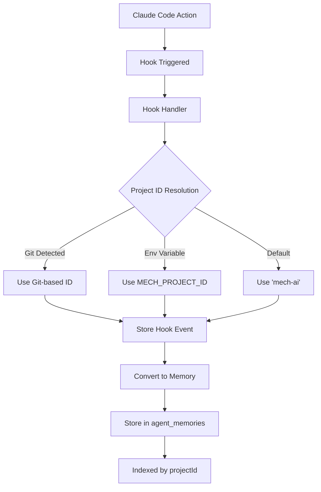

# Mech AI Memory System Documentation

## Overview

The Mech AI system implements a sophisticated memory storage architecture that links all agent activities, decisions, and interactions to specific projects. This ensures complete context preservation across sessions and enables intelligent, project-aware assistance.

## ⚠️ Important Update (Fixed)

A bug was discovered where `projectId` was missing from the memory storage implementation despite being defined in the model. This has been fixed in `agent-registry.service.ts`. The `storeAgentMemory` function now properly retrieves and stores the `projectId` from the agent registration.

### Migration for Existing Memories
To fix existing memories without projectId:
```bash
node scripts/fix-memory-project-ids.js
```

## Memory-Project Linking Architecture

### 1. **Core Memory Structure**

Every memory in the system includes a `projectId` field that creates the fundamental link:

```typescript
interface IAgentMemory {
  memoryId: string;      // Unique memory identifier
  agentId: string;       // Agent that created the memory
  sessionId: string;     // Links memories within a session
  projectId: string;     // PROJECT LINK - Direct association
  userId?: string;       // Optional user association
  type: MemoryType;      // Type of memory
  content: string;       // Memory content
  context: any;          // Contextual information
  importance: number;    // Importance score (1-10)
  timestamp: Date;       // When the memory was created
  tags: string[];        // Categorization tags
}
```

### 2. **Project Identification Methods**

Projects are identified through multiple methods in priority order:

#### A. Git-Based Auto-Detection (Primary)
```javascript
// Automatic detection from git repository
function generateProjectId(gitInfo: GitInfo): string {
  if (gitInfo.remoteUrl) {
    // Use hash of remote URL for consistent IDs
    return hashRemoteUrl(gitInfo.remoteUrl);
  } else {
    // Use directory path hash as fallback
    return hashDirectoryPath(gitInfo.rootPath);
  }
}
```

#### B. Environment Variable Override
```bash
export MECH_PROJECT_ID="my-custom-project"
```

#### C. Manual Project Registration
```bash
POST /api/projects/auto-register
{
  "workingDirectory": "/path/to/project",
  "createIfNotExists": true
}
```

### 3. **Memory Storage Flow**



### 4. **Memory Types and Project Association**

All memory types include the `projectId` field:

#### A. Tool Usage Memories
```javascript
{
  type: 'tool_usage',
  projectId: 'abc123',
  content: 'PostToolUse: Edit',
  context: {
    files: ['src/app.js'],
    operation: 'edit',
    changes: { ... }
  }
}
```

#### B. Reasoning Memories
```javascript
{
  type: 'reasoning',
  projectId: 'abc123',
  content: 'Decided to use Edit tool for refactoring',
  context: {
    decision: 'tool_selection',
    alternatives: ['MultiEdit', 'Write'],
    rationale: 'Single file change is more appropriate'
  }
}
```

#### C. Session Memories
```javascript
{
  type: 'session',
  projectId: 'abc123',
  content: 'Session started',
  context: {
    gitBranch: 'main',
    workingDirectory: '/Users/kefentse/dev_env/mech'
  }
}
```

#### D. Conversation Memories
```javascript
{
  type: 'conversation',
  projectId: 'abc123',
  content: 'User asked about implementing feature X',
  context: {
    userPrompt: 'How do I implement feature X?',
    response: 'I can help you implement that...'
  }
}
```

## Database Storage

### 1. **Collections**

Memories are stored across multiple MongoDB collections:

- **`agent_memories`**: Primary memory storage with project indexing
- **`hook_events`**: Raw Claude Code hook events
- **`reasoning_steps`**: Detailed reasoning processes
- **`claude_sessions_v2`**: Session management with project links

### 2. **Indexes for Efficient Retrieval**

```javascript
// Compound indexes for fast project-based queries
db.agent_memories.createIndex({ projectId: 1, createdAt: -1 })
db.agent_memories.createIndex({ projectId: 1, agentId: 1, type: 1 })
db.agent_memories.createIndex({ projectId: 1, importance: -1 })
```

### 3. **Memory Aggregation**

The system can aggregate memories by project:

```javascript
// Get all memories for a project
const projectMemories = await db.agent_memories.find({
  projectId: 'abc123',
  createdAt: { $gte: lastWeek }
}).sort({ importance: -1, createdAt: -1 });

// Get memory summary by type
const memorySummary = await db.agent_memories.aggregate([
  { $match: { projectId: 'abc123' } },
  { $group: {
    _id: '$type',
    count: { $sum: 1 },
    avgImportance: { $avg: '$importance' }
  }}
]);
```

## Memory Recall API

### 1. **Context Endpoint**
```http
GET /api/memory-recall/context/{projectId}
```

Returns comprehensive project context including:
- Recent sessions and activities
- Key decisions and reasoning
- File modification patterns
- User preferences and patterns
- Technical stack information

### 2. **Query Parameters**
- `limit`: Number of memories to return
- `type`: Filter by memory type
- `since`: Date filter
- `tags`: Tag-based filtering
- `importance`: Minimum importance threshold

### 3. **Response Structure**
```json
{
  "context": {
    "projectId": "abc123",
    "recentSessions": [...],
    "keyDecisions": [...],
    "patterns": {
      "fileAccessPatterns": [...],
      "toolUsagePatterns": [...],
      "errorPatterns": [...]
    },
    "preferences": {
      "codingStyle": {...},
      "toolPreferences": {...}
    }
  },
  "memories": [...],
  "summary": {
    "totalMemories": 1247,
    "dateRange": {...},
    "topTags": [...]
  }
}
```

## Hook Integration

### 1. **Hook to Memory Conversion**

The `claude.controller.ts` converts hook events to memories:

```javascript
// Extract from hook processing
const memoryData = {
  type: 'tool_usage',
  content: `${hookData.eventType}: ${hookData.toolName}`,
  context: {
    sessionId: hookData.sessionId,
    projectId: hookData.projectId,  // PROJECT LINK
    eventType: hookData.eventType,
    toolName: hookData.toolName,
    // ... additional context
  },
  importance: calculateImportance(hookData),
  tags: generateTags(hookData)
};

await agentRegistry.storeAgentMemory(agentId, memoryData);
```

### 2. **Project ID Flow in Hooks**

```javascript
// From mech-hook.js
const projectId = process.env.MECH_PROJECT_ID || 'mech-ai';

const payload = {
  sessionId: sessionId,
  eventType: mappedEventType,
  projectId: projectId,  // Attached to every hook event
  // ... other fields
};
```

## Best Practices

### 1. **Consistent Project IDs**
- Use Git-based detection for consistency
- Set `MECH_PROJECT_ID` for non-git projects
- Avoid changing project IDs mid-session

### 2. **Memory Importance Scoring**
- Session events: 10 (highest)
- File creation: 7-8
- File modification: 5-6
- Tool usage: 5
- Conversations: 3-4

### 3. **Tag Strategy**
- Include event type tags
- Add tool-specific tags
- Use semantic tags for categorization
- Include error/success tags

### 4. **Memory Retention**
- Keep high-importance memories indefinitely
- Archive old low-importance memories
- Maintain summary statistics

## Advanced Features

### 1. **Cross-Project Learning**
While memories are project-specific, the system can:
- Identify patterns across projects
- Apply learnings with user permission
- Maintain project isolation by default

### 2. **Memory Search**
```javascript
// Semantic search within project
const relevantMemories = await memoryRecallService.search({
  projectId: 'abc123',
  query: 'database migration',
  type: ['reasoning', 'tool_usage'],
  limit: 10
});
```

### 3. **Memory Analytics**
- Tool usage frequency by project
- Error patterns and resolutions
- Development velocity tracking
- Decision pattern analysis

## Security and Privacy

### 1. **Project Isolation**
- Memories are strictly isolated by `projectId`
- No cross-project memory access without explicit permission
- Separate database indexes per project

### 2. **Data Retention**
- Configurable retention policies per project
- User-controlled memory deletion
- Audit logs for memory access

### 3. **Sensitive Data**
- Automatic filtering of credentials
- Configurable content sanitization
- Encrypted storage options

## Troubleshooting

### Common Issues

1. **Missing Project ID**
   - Check Git repository configuration
   - Verify `MECH_PROJECT_ID` environment variable
   - Ensure working directory is correct

2. **Memory Not Storing**
   - Verify backend is running
   - Check hook configuration
   - Review error logs in `.claude/hook.log`

3. **Wrong Project Association**
   - Clear and regenerate project ID
   - Check for multiple `.git` directories
   - Verify environment variables

## Configuration Examples

### Setting Up Project-Specific Memory
```bash
# Option 1: Auto-detection (recommended)
cd /path/to/your/project
git init  # If not already a git repo
node setup-claude-hooks.js

# Option 2: Manual configuration
export MECH_PROJECT_ID="my-unique-project"
export MECH_BACKEND_URL="http://localhost:3001"
node setup-claude-hooks.js

# Option 3: Per-session override
MECH_PROJECT_ID="temp-project" claude
```

### Querying Project Memories
```javascript
// Get all memories for current project
const projectId = process.env.MECH_PROJECT_ID || 'mech-ai';
const memories = await fetch(`/api/memory-recall/context/${projectId}`);

// Filter by type
const toolMemories = await fetch(
  `/api/memory-recall/context/${projectId}?type=tool_usage`
);

// Get recent memories
const recentMemories = await fetch(
  `/api/memory-recall/context/${projectId}?since=2025-07-01`
);
```

This comprehensive memory system ensures that every Claude Code action is properly contextualized and retrievable, enabling intelligent assistance that improves over time while maintaining strict project boundaries.