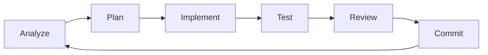

# MECH AI - MVP Self-Improvement Status

**Last Updated**: 2025-01-27  
**Status**: ✅ MVP COMPLETE - Ready for Self-Improvement

## 🎉 MVP Completion Summary

### ✅ Week 1: Core Infrastructure - COMPLETE
- **Basic Chat**: Working via Sprint 2 implementation
- **File Operations**: read_file, write_file, list_files
- **Code Search**: search_code with mech-indexer integration
- **Approval System**: Full UI approval flow for dangerous operations

### ✅ Week 2: Self-Testing & Execution - COMPLETE
- **Code Execution**: execute_command tool with approval
- **Test Runner**: run_tests tool implemented
- **Git Integration**: git_status, git_diff, git_commit tools
- **WebContainer**: Integration available

### ✅ Week 3: Self-Improvement Loop - COMPLETE
- **Context Awareness**: analyze_project tool created
- **Health Monitoring**: health_check tool created
- **Task Management**: AI task manager system implemented
- **Self-Improvement Prompts**: Comprehensive prompt library

## 📊 Tool Inventory (13 Tools)

### File Operations
1. ✅ `read_file` - Read any file in codebase
2. ✅ `write_file` - Write with approval dialog
3. ✅ `list_files` - List directory contents

### Code Understanding
4. ✅ `search_code` - Search codebase with indexer
5. ✅ `analyze_project` - Analyze structure and suggest improvements

### Execution & Testing
6. ✅ `execute_command` - Run commands with approval
7. ✅ `run_tests` - Execute test suite

### Version Control
8. ✅ `git_status` - Check repository status
9. ✅ `git_diff` - View changes
10. ✅ `git_commit` - Commit with approval

### Monitoring & Management
11. ✅ `health_check` - System health monitoring
12. ✅ Task Manager - Track improvement tasks
13. ✅ Self-Improvement Prompts - Guide AI work

## 🚀 Ready for Self-Improvement

The system now has everything needed for self-improvement:

### 1. **Read & Understand**
- Can read its entire codebase
- Can search for patterns and issues
- Can analyze project structure

### 2. **Plan & Prioritize**
- Task management system with priorities
- Project analysis suggests improvements
- Health check identifies issues

### 3. **Implement Changes**
- Write files with approval
- Full diff preview before changes
- Git integration for version control

### 4. **Test & Validate**
- Run tests after changes
- Execute commands to verify
- Health check confirms stability

### 5. **Safety & Control**
- All dangerous operations require approval
- Clear diff displays
- User maintains full control

## 📋 Initial Self-Improvement Tasks

The AI Task Manager is pre-loaded with tasks:

1. **High Priority**
   - Improve error handling in tool implementations
   - Add unit tests for all tools

2. **Medium Priority**
   - Add comprehensive logging
   - Optimize code search performance
   - Add retry logic for network operations

3. **Low Priority**
   - Document tool usage patterns
   - Implement tool usage analytics
   - Refactor duplicate code patterns

## 🎯 How to Start Self-Improvement

### 1. Start the Services
```bash
# Terminal 1: Frontend
cd mech-ai/frontend
npm run dev

# Note: The indexer is running remotely at:
# http://mech-indexer-8.eastus.azurecontainer.io:3000
# However, it doesn't have MECH codebase indexed yet.
# Code search won't work, but all other tools will!
```

### 2. Login to Chat
- Navigate to http://localhost:5500
- Use credentials from .env (TESTER_EMAIL, TESTER_PASSWORD)

### 3. Start Self-Improvement
Use this prompt:
```
You are MECH AI. Your codebase is at /Users/kefentse/dev_env/mech. 

Please start improving yourself:
1. Run health_check to assess your current state
2. Use analyze_project to understand your structure
3. Pick the highest priority task to work on
4. Implement and test the improvement
5. Commit your changes with a clear message

Focus on practical improvements that make you more capable and reliable.
```

## 📈 Success Metrics

The MVP is successful because MECH AI can now:

1. ✅ **Read its own code** - Via read_file and list_files
2. ✅ **Search its codebase** - Via search_code with indexer
3. ✅ **Propose code changes** - Via write_file with diffs
4. ✅ **User can approve/reject** - Full approval UI flow
5. ✅ **Test its changes** - Via run_tests tool
6. ✅ **Commit improvements** - Via git tools
7. ✅ **System remains stable** - Via health_check monitoring

## 🔄 Self-Improvement Cycle



Each cycle:
1. **Analyze**: health_check + analyze_project
2. **Plan**: Select task from manager
3. **Implement**: read_file + write_file
4. **Test**: run_tests + execute_command
5. **Review**: User approves changes
6. **Commit**: git_commit with message

## 🎊 MVP Complete!

MECH AI now has all the tools needed to improve itself. The next phase is to let it run and enhance its own capabilities through iterative self-improvement cycles.

**Next Step**: Start a chat session and watch MECH AI improve itself!