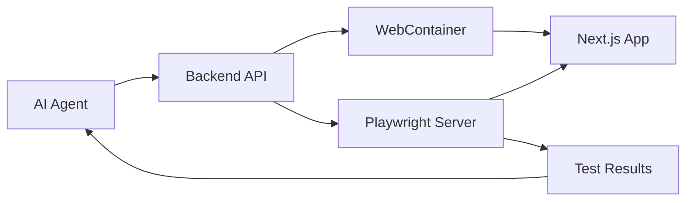
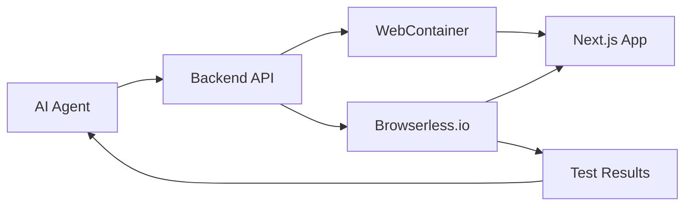

# Playwright Integration Guide for AI Agent Workflow

> **Document Version**: 1.0.0  
> **Last Updated**: 2025-01-20  
> **Status**: Implementation Guide  

## Overview

This guide explains how Playwright integrates with WebContainers in your AI agent workflow to provide comprehensive browser automation and testing capabilities. There are several approaches depending on where Playwright runs and how it connects to the WebContainer environment.

## Architecture Options

### Option 1: Server-Side Playwright (Recommended)
**Playwright runs on your backend server, connects to WebContainer preview URLs**



### Option 2: Browserless.io Service
**Playwright runs on external service, connects to WebContainer URLs**



### Option 3: Browser Extension (Future)
**Playwright runs in browser extension, direct WebContainer access**

## Implementation Details

### Option 1: Server-Side Playwright (Current Implementation)

Your codebase already has this partially implemented. Here's how it works:

#### 1. WebContainer Setup
```typescript
// From your existing repository-execution-service.ts
class RepositoryExecutionService {
  private async executeRepository(options: ExecutionOptions): Promise<ExecutionResult> {
    // 1. Boot WebContainer
    const container = await WebContainer.boot();
    
    // 2. Mount repository files
    await container.mount(repositoryFiles);
    
    // 3. Install dependencies
    const installProcess = await container.spawn('npm', ['install']);
    await installProcess.exit;
    
    // 4. Start dev server
    const serverProcess = await container.spawn('npm', ['run', 'dev']);
    
    // 5. Wait for server ready and get preview URL
    const previewUrl = await this.waitForServer(container, repository);
    
    return { previewUrl, container };
  }
}
```

#### 2. Playwright Integration
```typescript
// Enhanced browser testing service
class AIBrowserTester {
  private playwright: Browser | null = null;
  
  async initialize(): Promise<void> {
    // Initialize Playwright browser
    this.playwright = await chromium.launch({
      headless: true,
      args: ['--no-sandbox', '--disable-setuid-sandbox']
    });
  }
  
  async testWebContainerApp(previewUrl: string, testInstructions: string[]): Promise<TestResults> {
    if (!this.playwright) await this.initialize();
    
    const context = await this.playwright.newContext();
    const page = await context.newPage();
    
    try {
      // Navigate to WebContainer app
      await page.goto(previewUrl);
      
      // Wait for app to load
      await page.waitForLoadState('networkidle');
      
      // Execute AI-generated test instructions
      const results = await this.executeTestInstructions(page, testInstructions);
      
      return results;
    } finally {
      await context.close();
    }
  }
  
  private async executeTestInstructions(page: Page, instructions: string[]): Promise<TestResults> {
    const results: TestResult[] = [];
    
    for (const instruction of instructions) {
      try {
        // Parse AI instruction and convert to Playwright action
        const action = this.parseInstruction(instruction);
        const result = await this.executeAction(page, action);
        
        results.push({
          instruction,
          success: true,
          result,
          screenshot: await page.screenshot()
        });
      } catch (error) {
        results.push({
          instruction,
          success: false,
          error: error.message,
          screenshot: await page.screenshot()
        });
      }
    }
    
    return { results, summary: this.generateSummary(results) };
  }
  
  private parseInstruction(instruction: string): PlaywrightAction {
    // AI instruction parsing logic
    if (instruction.includes('click')) {
      const selector = this.extractSelector(instruction);
      return { type: 'click', selector };
    } else if (instruction.includes('type')) {
      const { selector, text } = this.extractTypeAction(instruction);
      return { type: 'type', selector, text };
    } else if (instruction.includes('check')) {
      const selector = this.extractSelector(instruction);
      return { type: 'check', selector };
    }
    // ... more instruction types
  }
}
```

#### 3. AI Agent Integration
```typescript
// Enhanced AI assistant with Playwright tools
class AIAssistantWithTesting {
  private browserTester: AIBrowserTester;
  
  async handleTestingRequest(message: string, context: RepositoryContext): Promise<AIResponse> {
    // 1. Generate test instructions from AI message
    const testInstructions = await this.generateTestInstructions(message, context);
    
    // 2. Execute tests using Playwright
    const testResults = await this.browserTester.testWebContainerApp(
      context.executionResult.previewUrl,
      testInstructions
    );
    
    // 3. Analyze results and provide feedback
    const analysis = await this.analyzeTestResults(testResults);
    
    // 4. Generate code fixes if needed
    if (analysis.hasIssues) {
      const fixes = await this.generateCodeFixes(analysis.issues, context);
      return {
        response: `I found ${analysis.issues.length} issues. Here are the fixes:`,
        actions: fixes,
        testResults
      };
    }
    
    return {
      response: `All tests passed! Your application is working correctly.`,
      testResults
    };
  }
  
  private async generateTestInstructions(message: string, context: RepositoryContext): Promise<string[]> {
    // Use AI to convert user request into specific test instructions
    const prompt = `
      Based on this user request: "${message}"
      And this repository context: ${JSON.stringify(context)}
      
      Generate specific test instructions for Playwright. Examples:
      - "Click the button with text 'Submit'"
      - "Type 'test@example.com' in the email input field"
      - "Check that the page contains 'Welcome'"
      - "Verify the form validation shows error messages"
    `;
    
    return await this.aiService.generateTestInstructions(prompt);
  }
}
```

### Option 2: Browserless.io Service

For production scale, you can use Browserless.io as mentioned in your ADR:

```typescript
class BrowserlessPlaywrightService {
  private browserlessEndpoint: string;
  
  constructor() {
    this.browserlessEndpoint = `wss://chrome.browserless.io?token=${process.env.BROWSERLESS_TOKEN}`;
  }
  
  async testWebContainerApp(previewUrl: string, testScript: string): Promise<TestResults> {
    const browser = await puppeteer.connect({
      browserWSEndpoint: this.browserlessEndpoint
    });
    
    try {
      const page = await browser.newPage();
      
      // Navigate to WebContainer app
      await page.goto(previewUrl);
      
      // Execute test script
      const results = await page.evaluate(testScript);
      
      return results;
    } finally {
      await browser.close();
    }
  }
}
```

## AI Tool Integration

### Playwright as an AI Tool

```typescript
// Add to your AI tool registry
class PlaywrightTool implements AITool {
  name = 'browser_automation';
  description = 'Automate browser interactions and test web applications';
  
  async execute(params: {
    url: string;
    actions: BrowserAction[];
    assertions?: string[];
  }): Promise<BrowserTestResult> {
    
    const browser = await chromium.launch();
    const page = await browser.newPage();
    
    try {
      await page.goto(params.url);
      
      // Execute actions
      for (const action of params.actions) {
        await this.executeAction(page, action);
      }
      
      // Run assertions
      const assertionResults = [];
      for (const assertion of params.assertions || []) {
        const result = await this.runAssertion(page, assertion);
        assertionResults.push(result);
      }
      
      return {
        success: true,
        screenshot: await page.screenshot(),
        assertions: assertionResults,
        logs: await this.getConsoleLogs(page)
      };
      
    } finally {
      await browser.close();
    }
  }
  
  private async executeAction(page: Page, action: BrowserAction): Promise<void> {
    switch (action.type) {
      case 'click':
        await page.click(action.selector);
        break;
      case 'type':
        await page.fill(action.selector, action.text);
        break;
      case 'wait':
        await page.waitForSelector(action.selector);
        break;
      case 'screenshot':
        return await page.screenshot();
      // ... more actions
    }
  }
}
```

## Enhanced AI Agent Workflow with Playwright

### Step-by-Step Integration

#### 1. Execute Button Enhancement
```typescript
// When user clicks execute
const executeWithTesting = async (repositoryId: string) => {
  // 1. Start WebContainer
  const execution = await repositoryExecutionService.executeRepository({
    repositoryId,
    enableTesting: true
  });
  
  // 2. Initialize Playwright
  await aiAssistant.initializeBrowserTesting(execution.previewUrl);
  
  // 3. AI assistant now has browser automation capabilities
  return execution;
};
```

#### 2. AI Testing Commands
```typescript
// AI can now respond to testing requests
const aiTestingCommands = [
  "Test the login form",
  "Check if the navigation works",
  "Verify the API endpoints are working",
  "Take a screenshot of the current state",
  "Test the responsive design",
  "Check for accessibility issues"
];
```

#### 3. Automated Testing Flow
```typescript
// AI automatically tests after code changes
const aiCodeWriteAndTest = async (codeRequest: string) => {
  // 1. AI writes code
  const generatedCode = await aiService.generateCode(codeRequest);
  
  // 2. User approves code
  if (await userApproves(generatedCode)) {
    // 3. Write code to WebContainer
    await webContainer.fs.writeFile(generatedCode.path, generatedCode.content);
    
    // 4. Wait for hot reload
    await waitForReload();
    
    // 5. Automatically test the changes
    const testResults = await playwright.testChanges(generatedCode.testInstructions);
    
    // 6. Provide feedback
    return {
      codeWritten: true,
      testResults,
      feedback: await aiService.analyzeTestResults(testResults)
    };
  }
};
```

## Configuration and Setup

### Environment Variables
```bash
# .env.local
BROWSERLESS_TOKEN=your_browserless_token
PLAYWRIGHT_HEADLESS=true
PLAYWRIGHT_TIMEOUT=30000
WEBCONTAINER_TIMEOUT=60000
```

### Package Dependencies
```json
{
  "dependencies": {
    "@webcontainer/api": "^1.1.0",
    "playwright": "^1.40.0",
    "puppeteer": "^21.0.0"
  }
}
```

### Playwright Configuration
```typescript
// playwright.config.ts for AI testing
export default defineConfig({
  testDir: './ai-tests',
  timeout: 30000,
  use: {
    headless: true,
    screenshot: 'only-on-failure',
    video: 'retain-on-failure'
  },
  projects: [
    {
      name: 'ai-testing',
      use: { ...devices['Desktop Chrome'] }
    }
  ]
});
```

## Benefits of This Approach

### ✅ **Perfect for AI Agent Workflow**
- **Real-time testing**: Test immediately after code changes
- **Visual feedback**: Screenshots and videos for AI analysis
- **Comprehensive coverage**: UI, API, and integration testing
- **Error detection**: Automatic issue identification

### ✅ **WebContainer Integration**
- **Direct URL access**: Playwright connects to WebContainer preview URLs
- **No deployment needed**: Test immediately in development environment
- **Hot reload support**: Test changes as they happen
- **Isolated testing**: Each WebContainer is independent

### ✅ **AI-Friendly Results**
- **Structured data**: JSON test results for AI analysis
- **Visual evidence**: Screenshots for AI to understand issues
- **Detailed logs**: Console logs and network activity
- **Actionable feedback**: Specific selectors and error messages

## Implementation Priority

### Phase 1: Basic Integration (Week 1)
- ✅ WebContainer + Playwright connection
- ✅ Simple test execution
- ✅ Screenshot capture

### Phase 2: AI Integration (Week 2)
- ✅ AI test instruction generation
- ✅ Automated testing after code changes
- ✅ Test result analysis

### Phase 3: Advanced Features (Week 3-4)
- ✅ Visual regression testing
- ✅ Performance monitoring
- ✅ Accessibility testing
- ✅ Mobile testing

This approach gives your AI agent powerful browser automation capabilities while leveraging the existing WebContainer infrastructure. The AI can write code, test it immediately, and iterate based on real browser behavior - exactly what you need for the enhanced workflow! 