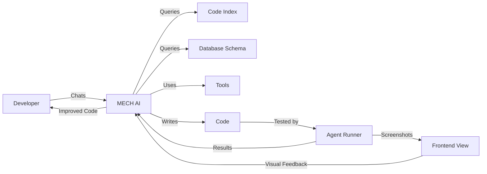

# MECH AI Primary Goal Implementation

**Date**: May 27, 2025  
**Goal**: Create a complete AI development feedback loop

## 🎯 Primary Objective

Enable developers to:
1. **Chat with MECH AI** about their codebase
2. **AI understands** code, database schema, and available tools
3. **AI writes code** with full context awareness
4. **Agents test code** automatically
5. **AI sees results** including frontend rendering
6. **Continuous improvement** through feedback loops

## 🔄 The Complete Feedback Loop



## 📋 Implementation Steps

### Step 1: Fix Authentication & Basic Chat (Day 1)

**Goal**: Get login working and basic chat interface functional

```bash
# 1. Test current auth
curl http://localhost:5500/api/auth/status

# 2. Fix GitHub OAuth
- Verify GitHub App settings
- Check callback URL: http://localhost:5500/api/auth/callback/github
- Test login flow

# 3. Create test user and project
- Login with GitHub
- Create project "mech-test"
- Link to mech repository
```

### Step 2: Enable Code Awareness (Day 2-3)

**Goal**: AI can understand and search your codebase

```typescript
// 1. Fix indexer integration
const codeSearchTool = {
  name: 'search_code',
  execute: async ({ query, projectId }) => {
    // Connect to indexer service
    const results = await fetch(`${INDEXER_URL}/api/search`, {
      method: 'POST',
      body: JSON.stringify({ query, projectId })
    });
    return formatResults(results);
  }
};

// 2. Add file reading capability
const readFileTool = {
  name: 'read_file',
  execute: async ({ path }) => {
    // Read from indexed files or filesystem
    const content = await getFileContent(projectId, path);
    return { content, language: detectLanguage(path) };
  }
};
```

### Step 3: Database Schema Awareness (Day 4)

**Goal**: AI understands your MongoDB schema

```javascript
// 1. Create schema extraction tool
const getDatabaseSchemaTool = {
  name: 'get_database_schema',
  execute: async () => {
    // Extract schema from MongoDB
    const collections = await db.listCollections();
    const schemas = {};
    
    for (const collection of collections) {
      // Sample documents to infer schema
      const sample = await db.collection(collection).findOne();
      schemas[collection] = inferSchema(sample);
    }
    
    return schemas;
  }
};

// 2. Add to AI context
const systemPrompt = `
You are MECH AI. You have access to:
- Codebase: ${projectName} 
- Database: MongoDB with collections: ${Object.keys(schemas).join(', ')}
- Tools: ${tools.map(t => t.name).join(', ')}
`;
```

### Step 4: Code Execution Agent (Day 5-6)

**Goal**: Agent can run code and capture results

```typescript
// 1. Create execution agent
class CodeExecutionAgent {
  async runCode(code: string, language: string) {
    // Use WebContainer or Docker
    const container = await WebContainer.boot();
    
    // Write code to container
    await container.mount({
      'index.js': code
    });
    
    // Execute and capture output
    const process = await container.spawn('node', ['index.js']);
    const output = await process.output.getReader().read();
    
    return {
      success: process.exitCode === 0,
      output: output.value,
      errors: process.stderr
    };
  }
}

// 2. Add execution tool
const executeCodeTool = {
  name: 'execute_code',
  requiresApproval: true,
  execute: async ({ code, language }) => {
    const agent = new CodeExecutionAgent();
    return await agent.runCode(code, language);
  }
};
```

### Step 5: Frontend Visualization (Day 7-8)

**Goal**: AI can see what the frontend looks like

```typescript
// 1. Add Playwright for screenshots
import { chromium } from 'playwright';

const captureScreenshotTool = {
  name: 'capture_screenshot',
  execute: async ({ url, selector }) => {
    const browser = await chromium.launch();
    const page = await browser.newPage();
    
    await page.goto(url);
    if (selector) {
      await page.waitForSelector(selector);
    }
    
    const screenshot = await page.screenshot({ 
      fullPage: true,
      type: 'png' 
    });
    
    await browser.close();
    
    return {
      screenshot: screenshot.toString('base64'),
      url,
      timestamp: new Date()
    };
  }
};

// 2. Visual feedback integration
const runAndVisualizeTool = {
  name: 'run_and_visualize',
  execute: async ({ code, componentPath }) => {
    // 1. Execute code changes
    await writeFile(componentPath, code);
    
    // 2. Wait for hot reload
    await sleep(2000);
    
    // 3. Capture screenshot
    const screenshot = await captureScreenshot({
      url: 'http://localhost:5500',
      selector: '.main-content'
    });
    
    // 4. Return visual + console feedback
    return {
      visual: screenshot,
      console: await getConsoleOutput(),
      errors: await getErrorOutput()
    };
  }
};
```

### Step 6: Complete Integration (Day 9-10)

**Goal**: Everything working together seamlessly

```typescript
// Complete chat flow example
async function handleChatMessage(message: string, context: Context) {
  // 1. AI understands request with full context
  const response = await ai.chat({
    messages: [
      {
        role: 'system',
        content: `You have access to:
          - Codebase: ${await getCodebaseInfo(context.projectId)}
          - Database: ${await getDatabaseSchema()}
          - Frontend: ${context.currentUrl}
          - Tools: code search, file read/write, execute, screenshot`
      },
      {
        role: 'user',
        content: message
      }
    ],
    tools: [
      codeSearchTool,
      readFileTool,
      writeFileTool,
      executeCodeTool,
      captureScreenshotTool,
      getDatabaseSchemaTool
    ]
  });
  
  // 2. AI might search code
  // "Let me search for the user authentication logic..."
  // -> Uses search_code tool
  
  // 3. AI writes improved code
  // "I'll update the login component to fix this issue..."
  // -> Uses write_file tool
  
  // 4. AI tests the change
  // "Let me run this to ensure it works..."
  // -> Uses execute_code tool
  
  // 5. AI captures visual result
  // "Here's how it looks now..."
  // -> Uses capture_screenshot tool
  
  return response;
}
```

## 🚀 Quick Start Path

### Today (Immediate Actions):

1. **Get Auth Working**
   ```bash
   cd mech-ai/frontend
   npm run dev
   # Navigate to http://localhost:5500
   # Click "Sign in with GitHub"
   ```

2. **Create Simple Tool Integration**
   ```typescript
   // Add to frontend/lib/tools/mech-tools.ts
   export const mechTools = [
     {
       name: 'get_project_info',
       execute: async () => ({
         project: 'mech',
         files: 1500,
         language: 'TypeScript',
         database: 'MongoDB'
       })
     }
   ];
   ```

3. **Test Basic Chat**
   - Login to MECH
   - Ask: "What files are in this project?"
   - AI should use the tool to respond

### Tomorrow:

1. **Add Code Search**
   - Connect to indexer service
   - Create search tool
   - Test with: "Find authentication code"

2. **Add Database Schema Tool**
   - Query MongoDB for collections
   - Show schema to AI
   - Test with: "What user fields do we store?"

### This Week:

1. **Code Execution Agent**
   - Set up WebContainer
   - Add execution tool
   - Test with: "Run this function and show output"

2. **Frontend Screenshots**
   - Install Playwright
   - Add screenshot tool
   - Test with: "Show me the login page"

## 📊 Success Metrics

- [ ] Can login and chat with MECH
- [ ] AI can search and read code
- [ ] AI understands database schema
- [ ] AI can write and execute code
- [ ] AI can see frontend screenshots
- [ ] Complete feedback loop working

## 🎯 End Goal Experience

```
Developer: "The login form doesn't validate email properly"

MECH AI: "Let me investigate the login form validation..."
*searches code*
"I found the issue in components/auth-form.tsx. The email regex is missing 
domain validation. Let me fix this..."
*writes updated code*
"I've updated the validation. Let me test it..."
*runs tests*
"Tests pass! Here's how it looks now:"
*shows screenshot*
"The email field now properly validates domains. Would you like me to 
also add validation for common typos like 'gmial.com'?"

Developer: "Yes, add that too"

MECH AI: "I'll add a common typo checker..."
*implements and tests*
"Done! The form now catches common email typos and suggests corrections."
```

This creates the complete feedback loop you want - MECH AI that truly understands your entire system and can help improve it.