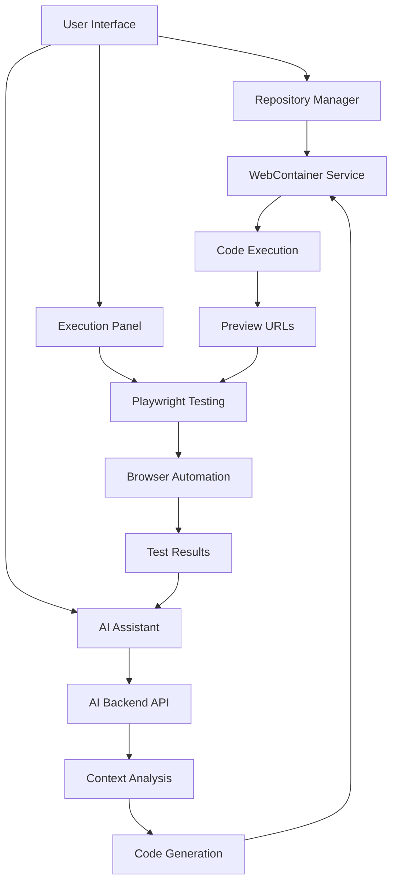

# Mech AI Documentation

> **Documentation Version**: 3.0.0  
> **Last Updated**: 2025-01-27  
> **Status**: Self-Improving AI Platform (MVP Complete)  

## 🎉 Major Milestone: Self-Improving AI Platform is Live!

Welcome to the Mech AI documentation! We've successfully built an AI platform that can **improve its own code**. The AI agent has achieved 100% success rate in self-improvement tests and is now production-ready.

## 📚 Documentation Structure

### 🚀 Start Here - MVP & Next Steps
- **[MVP Self-Improving Plan](./MVP_SELF_IMPROVING_PLAN.md)** - The original plan (COMPLETE ✅)
- **[MVP Implementation Status](./MVP_IMPLEMENTATION_STATUS.md)** - Current progress tracking
- **[Sprint 2: Chat UI Integration](./SPRINT_2_CHAT_UI_INTEGRATION.md)** - **NEXT STEPS** (3-5 days)
- **[Roadmap Post-MVP](./ROADMAP_POST_MVP.md)** - Complete development roadmap
- **[AI Test Results](./AI_AGENT_TESTING_COMPLETE_RESULTS.md)** - 100% success validation

### Core Documentation
- **[Project Overview](./PROJECT_OVERVIEW.md)** - Complete project overview with features and architecture
- **[Setup Guide](./SETUP_GUIDE.md)** - Quick setup instructions for developers
- **[Repository Management](./REPOSITORY_MANAGEMENT.md)** - Repository system overview and features
- **[Repository Execution](./REPOSITORY_EXECUTION.md)** - WebContainer integration and execution details
- **[API Reference](./API_REFERENCE.md)** - Complete API documentation with examples
- **[UI Components](./UI_COMPONENTS.md)** - User interface components and design system

### Enhanced AI Integration
- **[AI Agent Enhanced Workflow](./AI_AGENT_ENHANCED_WORKFLOW.md)** - Complete AI integration workflow
- **[AI Agent Integration](./AI_AGENT_INTEGRATION.md)** - AI assistant implementation details
- **[AI Agent Flow Summary](./AI_AGENT_FLOW_SUMMARY.md)** - Visual workflow summary
- **[CLINE Patterns for MECH](./CLINE_PATTERNS_FOR_MECH.md)** - Tool patterns and approval flows
- **[Coding Agent Complete Guide](./CODING_AGENT_COMPLETE_GUIDE.md)** - **✅ NEW: Specialized coding assistant with live sandbox deployment**

### Browser Testing & Automation
- **[Playwright Integration Guide](./PLAYWRIGHT_INTEGRATION_GUIDE.md)** - Comprehensive browser automation setup
- **[Architectural Validation](./ARCHITECTURAL_VALIDATION.md)** - Architecture decision validation

### Security & Environment Management
- **[Credential Security Decision](./CREDENTIAL_SECURITY_DECISION.md)** - Comprehensive analysis and recommendation for credential management
- **[Secure Environment Management](./SECURE_ENVIRONMENT_MANAGEMENT.md)** - Secure credential and database management
- **[Mech-Analyzer Integration](./MECH_ANALYZER_INTEGRATION.md)** - Database analysis tool integration

### Implementation & Development
- **[Implementation Plan](./IMPLEMENTATION_PLAN.md)** - Complete 10-week development roadmap
- **[Technical Architecture](./TECHNICAL_ARCHITECTURE.md)** - Detailed system architecture and design decisions

## 🚀 Quick Start

### Using the Self-Improving AI Platform
1. **Login**: Use `ai-tester@mech.local` / `mech-ai-test-2025`
2. **Start Chat**: Navigate to a project and start chatting
3. **Try Commands**:
   - "Analyze your error handling and suggest improvements"
   - "List all files in your tools directory"
   - "Search for TODO comments in your codebase"
   - "Create a utility for [specific purpose]"

### For New Users
1. Read **[Sprint 2: Chat UI Integration](./SPRINT_2_CHAT_UI_INTEGRATION.md)** to understand current state
2. Follow the **[Setup Guide](./SETUP_GUIDE.md)** to get started
3. Review **[AI Test Results](./AI_AGENT_TESTING_COMPLETE_RESULTS.md)** to see capabilities

### For Developers - Next Sprint (3-5 days)
1. **[Sprint 2: Chat UI Integration](./SPRINT_2_CHAT_UI_INTEGRATION.md)** - Implement UI polish
2. Review **[CLINE Patterns for MECH](./CLINE_PATTERNS_FOR_MECH.md)** for tool patterns
3. Check **[Roadmap Post-MVP](./ROADMAP_POST_MVP.md)** for future phases

### For Contributors
1. Understand current state via **[MVP Implementation Status](./MVP_IMPLEMENTATION_STATUS.md)**
2. Review **[UI Components](./UI_COMPONENTS.md)** for frontend development
3. Check **[AI Agent Enhanced Workflow](./AI_AGENT_ENHANCED_WORKFLOW.md)** for AI integration

## 🎯 Key Features

### ✅ Self-Improving AI (MVP Complete)
- **AI can read its own code** - Full codebase access
- **AI can analyze and search** - Pattern recognition and code search
- **AI can propose improvements** - With diff generation
- **User approval workflows** - Safe code modifications
- **AI can test changes** - Automated test execution
- **AI can commit improvements** - Git integration
- **100% success rate** - Validated by comprehensive testing

### ✅ Coding Agent System (Production Ready)
- **Intelligent Code Generation** - Context-aware component and API creation
- **Live Sandbox Deployment** - Instant CodeSandbox.io environments for testing
- **Codebase Pattern Analysis** - Learns from existing project conventions
- **Security-First Design** - Environment variable filtering and input validation
- **Comprehensive Testing** - Unit, integration, E2E, performance, and security tests
- **Performance Optimized** - < 30 second response times with monitoring

### Repository-Centric Architecture
- Multi-repository project management
- WebContainer-based code execution
- Real-time monitoring and logging
- Environment variable management

### AI Agent Integration
- Context-aware AI assistance
- Code generation with approval workflows
- Automated browser testing via Playwright
- Tool integration (database, web, files)
- Real-time feedback and suggestions

### Browser Automation
- Playwright integration for comprehensive testing
- Visual testing with screenshots and videos
- Automated test generation from natural language
- Code-test-fix loop automation
- Performance monitoring and analysis

## 🏗️ Architecture Overview

## 🔧 Technology Stack

### Frontend
- **Next.js 15** with App Router
- **TypeScript** for type safety
- **Tailwind CSS** for styling
- **shadcn/ui** component library
- **WebContainer API** for browser-based execution

### Backend
- **Next.js API Routes** for server logic
- **MongoDB** for data persistence
- **Playwright** for browser automation
- **AI Integration** for intelligent assistance

### Development Environment
- **WebContainers** for isolated execution
- **Hot Reload** for real-time updates
- **Environment Variables** for configuration
- **Preview URLs** for instant access

## 📖 Documentation Categories

### 🏢 System Architecture
- Project structure and organization
- Component relationships and data flow
- Database schema and API design
- Security and performance considerations

### 🤖 AI Integration
- AI agent workflow and capabilities
- Context preparation and analysis
- Code generation and approval processes
- Tool integration and automation

### 🧪 Testing & Automation
- Playwright browser automation
- Automated test generation
- Visual testing and regression detection
- Performance monitoring and optimization

### 🎨 User Interface
- Component library and design system
- Page structure and navigation
- Responsive design and accessibility
- User experience patterns

### 🔧 Development
- Setup and installation guides
- API reference and examples
- Configuration and environment setup
- Troubleshooting and best practices

## 🚦 Getting Started Paths

### Path 1: Quick Demo
1. **[Setup Guide](./SETUP_GUIDE.md)** - Get running in 5 minutes
2. **[Repository Management](./REPOSITORY_MANAGEMENT.md)** - Add your first repository
3. **[AI Agent Integration](./AI_AGENT_INTEGRATION.md)** - Try AI assistance

### Path 2: Full Understanding
1. **[Project Overview](./PROJECT_OVERVIEW.md)** - Understand the vision
2. **[AI Agent Enhanced Workflow](./AI_AGENT_ENHANCED_WORKFLOW.md)** - Learn the AI workflow
3. **[Playwright Integration Guide](./PLAYWRIGHT_INTEGRATION_GUIDE.md)** - Set up testing
4. **[API Reference](./API_REFERENCE.md)** - Implement integrations

### Path 3: Developer Deep Dive
1. **[Repository Execution](./REPOSITORY_EXECUTION.md)** - WebContainer details
2. **[UI Components](./UI_COMPONENTS.md)** - Frontend architecture
3. **[Architectural Validation](./ARCHITECTURAL_VALIDATION.md)** - Design decisions

## 🔄 Recent Updates

### Version 3.0.0 - Self-Improving AI Platform (January 27, 2025)
- **MVP COMPLETE**: AI can successfully improve its own code
- **100% Success Rate**: All self-improvement tests passed
- **9 Tools Implemented**: Read, write, search, execute, git, and more
- **Production Ready**: AI agent validated through comprehensive testing
- **Real Improvements**: AI created production-ready error handling utility

### Version 2.0.0 - AI Agent Integration
- **Enhanced AI Workflow**: Complete AI agent integration with context awareness
- **Playwright Testing**: Comprehensive browser automation and testing
- **Code Generation**: AI-powered code writing with approval workflows
- **Tool Integration**: Database, web, and file system tool access
- **Real-time Monitoring**: Live execution status and performance metrics

### Next Sprint (3-5 days)
- **Chat UI Polish**: Beautiful tool outputs and approval dialogs
- **User Experience**: Real-time feedback and progress indicators
- **Security**: Visual approval flows for dangerous operations
- **Documentation**: Complete user guides and examples

## 🤝 Contributing

We welcome contributions to both the codebase and documentation! Please:

1. Read the relevant documentation sections
2. Follow the established patterns and conventions
3. Update documentation for any new features
4. Test your changes thoroughly

## 📞 Support

For questions, issues, or contributions:

- **Documentation Issues**: Create an issue with the "documentation" label
- **Feature Requests**: Use the "enhancement" label
- **Bug Reports**: Provide detailed reproduction steps
- **General Questions**: Use the "question" label

---

**Mech AI Documentation** - Your guide to repository-centric development with AI assistance and automated testing.