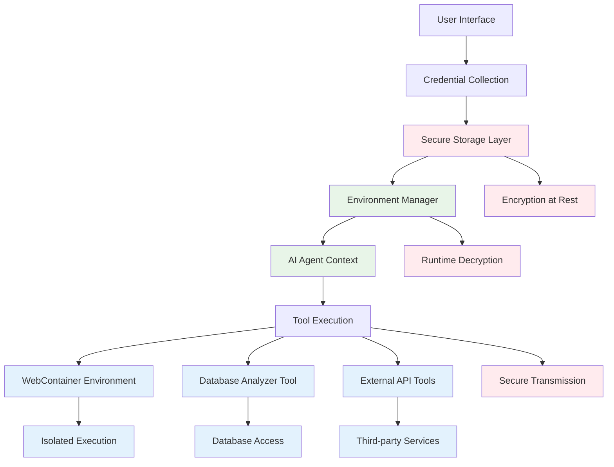

# Secure Environment & Database Management for AI Agent Workflow

> **Document Version**: 1.0.0  
> **Last Updated**: 2025-01-20  
> **Status**: Implementation Guide  

## Overview

This document outlines the secure management of environment variables, secrets, and database access within the AI agent workflow, including integration with the `mech-analyzer` service as an AI tool for intelligent database operations.

## 🔐 Security Architecture

### Multi-Layer Security Model



## 🗝️ Environment Variable Management

### 1. Secure Credential Collection

#### Frontend Credential Interface
```tsx
interface DatabaseCredentials {
  type: 'mongodb' | 'postgresql' | 'mysql';
  uri?: string;
  host?: string;
  port?: number;
  database: string;
  username?: string;
  password?: string;
  ssl?: boolean;
  options?: Record<string, any>;
}

interface EnvironmentVariable {
  key: string;
  value: string;
  type: 'public' | 'secret' | 'database';
  description?: string;
  required?: boolean;
}

function SecureCredentialForm({ repositoryId, onSave }: {
  repositoryId: string;
  onSave: (credentials: DatabaseCredentials[]) => void;
}) {
  const [credentials, setCredentials] = useState<DatabaseCredentials[]>([]);
  const [envVars, setEnvVars] = useState<EnvironmentVariable[]>([]);
  
  const handleSaveCredentials = async () => {
    // Encrypt sensitive data before sending
    const encryptedCredentials = await encryptCredentials(credentials);
    const encryptedEnvVars = await encryptEnvironmentVariables(envVars);
    
    await fetch(`/api/repositories/${repositoryId}/credentials`, {
      method: 'POST',
      headers: { 'Content-Type': 'application/json' },
      body: JSON.stringify({
        databases: encryptedCredentials,
        environment: encryptedEnvVars
      })
    });
    
    onSave(credentials);
  };
  
  return (
    <div className="credential-form">
      <div className="database-section">
        <h3>Database Connections</h3>
        {credentials.map((cred, index) => (
          <DatabaseCredentialInput
            key={index}
            credential={cred}
            onChange={(updated) => updateCredential(index, updated)}
            onDelete={() => removeCredential(index)}
          />
        ))}
        <Button onClick={addDatabaseCredential}>Add Database</Button>
      </div>
      
      <div className="environment-section">
        <h3>Environment Variables</h3>
        {envVars.map((envVar, index) => (
          <EnvironmentVariableInput
            key={index}
            variable={envVar}
            onChange={(updated) => updateEnvVar(index, updated)}
            onDelete={() => removeEnvVar(index)}
          />
        ))}
        <Button onClick={addEnvironmentVariable}>Add Variable</Button>
      </div>
      
      <Button onClick={handleSaveCredentials} variant="primary">
        Save Secure Configuration
      </Button>
    </div>
  );
}
```

### 2. Backend Secure Storage

#### Credential Encryption Service
```typescript
import crypto from 'crypto';

class CredentialEncryptionService {
  private readonly algorithm = 'aes-256-gcm';
  private readonly keyLength = 32;
  
  constructor(private masterKey: string) {}
  
  async encryptCredentials(credentials: any): Promise<EncryptedCredentials> {
    const iv = crypto.randomBytes(16);
    const key = crypto.scryptSync(this.masterKey, 'salt', this.keyLength);
    const cipher = crypto.createCipher(this.algorithm, key, { iv });
    
    const encrypted = Buffer.concat([
      cipher.update(JSON.stringify(credentials), 'utf8'),
      cipher.final()
    ]);
    
    const authTag = cipher.getAuthTag();
    
    return {
      encrypted: encrypted.toString('base64'),
      iv: iv.toString('base64'),
      authTag: authTag.toString('base64'),
      timestamp: new Date().toISOString()
    };
  }
  
  async decryptCredentials(encryptedData: EncryptedCredentials): Promise<any> {
    const key = crypto.scryptSync(this.masterKey, 'salt', this.keyLength);
    const decipher = crypto.createDecipher(this.algorithm, key, {
      iv: Buffer.from(encryptedData.iv, 'base64')
    });
    
    decipher.setAuthTag(Buffer.from(encryptedData.authTag, 'base64'));
    
    const decrypted = Buffer.concat([
      decipher.update(Buffer.from(encryptedData.encrypted, 'base64')),
      decipher.final()
    ]);
    
    return JSON.parse(decrypted.toString('utf8'));
  }
}
```

#### Secure Storage API
```typescript
// API endpoint for secure credential storage
export async function POST(request: Request) {
  const { repositoryId } = await request.json();
  const { databases, environment } = await request.json();
  
  // Validate user permissions
  const user = await getCurrentUser();
  const hasAccess = await checkRepositoryAccess(user.id, repositoryId);
  
  if (!hasAccess) {
    return NextResponse.json({ error: 'Unauthorized' }, { status: 403 });
  }
  
  // Encrypt credentials
  const encryptionService = new CredentialEncryptionService(
    process.env.CREDENTIAL_MASTER_KEY!
  );
  
  const encryptedDatabases = await Promise.all(
    databases.map(db => encryptionService.encryptCredentials(db))
  );
  
  const encryptedEnvironment = await Promise.all(
    environment.map(env => encryptionService.encryptCredentials(env))
  );
  
  // Store in database with user association
  await db.collection('repository_credentials').updateOne(
    { repositoryId, userId: user.id },
    {
      $set: {
        databases: encryptedDatabases,
        environment: encryptedEnvironment,
        updatedAt: new Date(),
        encryptionVersion: '1.0'
      }
    },
    { upsert: true }
  );
  
  return NextResponse.json({ success: true });
}
```

## 🛠️ Mech-Analyzer Integration as AI Tool

### 1. Database Analyzer Tool Implementation

```typescript
class DatabaseAnalyzerTool implements AITool {
  name = 'database_analyzer';
  description = 'Analyze database structure, execute queries, and provide insights using mech-analyzer service';
  
  private analyzerBaseUrl = process.env.MECH_ANALYZER_URL || 'http://localhost:3002';
  
  async execute(params: DatabaseAnalyzerParams): Promise<DatabaseAnalyzerResult> {
    const { action, projectId, credentials, query, options } = params;
    
    switch (action) {
      case 'analyze':
        return this.analyzeDatabase(projectId, credentials, options);
      case 'query':
        return this.executeQuery(projectId, credentials, query);
      case 'schema':
        return this.getSchema(projectId, credentials, options?.collection);
      case 'search':
        return this.searchKnowledge(projectId, query);
      case 'optimize':
        return this.getOptimizationSuggestions(projectId, credentials);
      default:
        throw new Error(`Unknown action: ${action}`);
    }
  }
  
  private async analyzeDatabase(
    projectId: string,
    credentials: DatabaseCredentials,
    options?: AnalyzeOptions
  ): Promise<DatabaseAnalysis> {
    const response = await fetch(`${this.analyzerBaseUrl}/api/analyze-with-credentials`, {
      method: 'POST',
      headers: { 'Content-Type': 'application/json' },
      body: JSON.stringify({
        projectId,
        databaseType: credentials.type,
        credentials: this.formatCredentials(credentials),
        options: {
          includeAiAnalysis: true,
          includeSchema: true,
          includeOptimizations: true,
          ...options
        }
      })
    });
    
    if (!response.ok) {
      throw new Error(`Database analysis failed: ${response.statusText}`);
    }
    
    const result = await response.json();
    
    // Index knowledge for future searches
    await this.indexKnowledge(projectId, credentials);
    
    return {
      overview: result.overview,
      schema: result.schema,
      relationships: result.relationships,
      aiInsights: result.aiAnalysis,
      optimizations: result.optimizations,
      timestamp: new Date().toISOString()
    };
  }
  
  private async executeQuery(
    projectId: string,
    credentials: DatabaseCredentials,
    query: DatabaseQuery
  ): Promise<QueryResult> {
    const response = await fetch(`${this.analyzerBaseUrl}/api/query-with-credentials`, {
      method: 'POST',
      headers: { 'Content-Type': 'application/json' },
      body: JSON.stringify({
        projectId,
        databaseType: credentials.type,
        credentials: this.formatCredentials(credentials),
        query
      })
    });
    
    if (!response.ok) {
      throw new Error(`Query execution failed: ${response.statusText}`);
    }
    
    return await response.json();
  }
  
  private async searchKnowledge(
    projectId: string,
    query: string
  ): Promise<KnowledgeSearchResult> {
    const response = await fetch(`${this.analyzerBaseUrl}/api/search-knowledge-vectors`, {
      method: 'POST',
      headers: { 'Content-Type': 'application/json' },
      body: JSON.stringify({
        query,
        projectId,
        limit: 10
      })
    });
    
    if (!response.ok) {
      throw new Error(`Knowledge search failed: ${response.statusText}`);
    }
    
    return await response.json();
  }
  
  private async indexKnowledge(
    projectId: string,
    credentials: DatabaseCredentials
  ): Promise<void> {
    await fetch(`${this.analyzerBaseUrl}/api/index-with-credentials`, {
      method: 'POST',
      headers: { 'Content-Type': 'application/json' },
      body: JSON.stringify({
        projectId,
        databaseType: credentials.type,
        credentials: this.formatCredentials(credentials),
        openaiApiKey: process.env.OPENAI_API_KEY
      })
    });
  }
  
  private formatCredentials(credentials: DatabaseCredentials): any {
    switch (credentials.type) {
      case 'mongodb':
        return {
          uri: credentials.uri,
          database: credentials.database
        };
      case 'postgresql':
        return {
          host: credentials.host,
          port: credentials.port,
          database: credentials.database,
          username: credentials.username,
          password: credentials.password,
          ssl: credentials.ssl
        };
      default:
        throw new Error(`Unsupported database type: ${credentials.type}`);
    }
  }
}
```

### 2. AI Agent Integration

```typescript
class EnhancedAIAssistant {
  private databaseTool: DatabaseAnalyzerTool;
  
  constructor() {
    this.databaseTool = new DatabaseAnalyzerTool();
  }
  
  async handleDatabaseRequest(
    message: string,
    context: RepositoryContext
  ): Promise<AIResponse> {
    // Extract database credentials from secure storage
    const credentials = await this.getRepositoryCredentials(context.repositoryId);
    
    if (!credentials.databases.length) {
      return {
        response: "No database credentials configured. Please add database connections in the repository settings.",
        actions: [{
          type: 'configure_database',
          description: 'Configure database credentials',
          data: { repositoryId: context.repositoryId }
        }]
      };
    }
    
    // Analyze the user's request to determine intent
    const intent = await this.analyzeIntent(message);
    
    switch (intent.type) {
      case 'database_analysis':
        return this.handleDatabaseAnalysis(message, credentials, context);
      case 'database_query':
        return this.handleDatabaseQuery(message, credentials, context);
      case 'schema_exploration':
        return this.handleSchemaExploration(message, credentials, context);
      case 'optimization_request':
        return this.handleOptimizationRequest(message, credentials, context);
      default:
        return this.handleGeneralDatabaseHelp(message, credentials, context);
    }
  }
  
  private async handleDatabaseAnalysis(
    message: string,
    credentials: DatabaseCredentials[],
    context: RepositoryContext
  ): Promise<AIResponse> {
    const primaryDb = credentials[0]; // Use first database as primary
    
    try {
      const analysis = await this.databaseTool.execute({
        action: 'analyze',
        projectId: context.projectId,
        credentials: primaryDb,
        options: { includeAiAnalysis: true }
      });
      
      return {
        response: this.formatAnalysisResponse(analysis),
        data: analysis,
        actions: this.generateAnalysisActions(analysis)
      };
    } catch (error) {
      return {
        response: `Database analysis failed: ${error.message}. Please check your database credentials and connection.`,
        error: error.message
      };
    }
  }
  
  private async handleDatabaseQuery(
    message: string,
    credentials: DatabaseCredentials[],
    context: RepositoryContext
  ): Promise<AIResponse> {
    // Convert natural language to database query
    const query = await this.generateDatabaseQuery(message, credentials[0]);
    
    try {
      const result = await this.databaseTool.execute({
        action: 'query',
        projectId: context.projectId,
        credentials: credentials[0],
        query
      });
      
      return {
        response: this.formatQueryResponse(result),
        data: result,
        actions: [{
          type: 'code_generation',
          description: 'Generate code to implement this query',
          data: { query, result }
        }]
      };
    } catch (error) {
      return {
        response: `Query execution failed: ${error.message}. Let me help you fix the query.`,
        error: error.message,
        actions: [{
          type: 'query_assistance',
          description: 'Get help with query syntax',
          data: { originalQuery: query, error: error.message }
        }]
      };
    }
  }
}
```

## 🔄 Environment Variable Injection

### 1. WebContainer Environment Setup

```typescript
class SecureEnvironmentManager {
  async prepareEnvironment(
    repositoryId: string,
    userId: string
  ): Promise<EnvironmentConfig> {
    // Retrieve and decrypt credentials
    const encryptedCredentials = await this.getEncryptedCredentials(repositoryId, userId);
    const credentials = await this.decryptCredentials(encryptedCredentials);
    
    // Prepare environment variables for WebContainer
    const environment = new Map<string, string>();
    
    // Add database connection strings
    credentials.databases.forEach((db, index) => {
      const prefix = index === 0 ? 'DATABASE' : `DATABASE_${index + 1}`;
      environment.set(`${prefix}_URL`, this.buildConnectionString(db));
      environment.set(`${prefix}_TYPE`, db.type);
    });
    
    // Add custom environment variables
    credentials.environment.forEach(envVar => {
      if (envVar.type === 'public' || envVar.type === 'secret') {
        environment.set(envVar.key, envVar.value);
      }
    });
    
    // Add AI service keys (if configured)
    if (process.env.OPENAI_API_KEY) {
      environment.set('OPENAI_API_KEY', process.env.OPENAI_API_KEY);
    }
    
    return {
      variables: Object.fromEntries(environment),
      databases: credentials.databases,
      timestamp: new Date().toISOString()
    };
  }
  
  async injectIntoWebContainer(
    container: WebContainer,
    environment: EnvironmentConfig
  ): Promise<void> {
    // Create .env file in WebContainer
    const envContent = Object.entries(environment.variables)
      .map(([key, value]) => `${key}=${value}`)
      .join('\\n');
    
    await container.fs.writeFile('.env', envContent);
    
    // Create database configuration files if needed
    for (const db of environment.databases) {
      await this.createDatabaseConfig(container, db);
    }
  }
  
  private buildConnectionString(db: DatabaseCredentials): string {
    switch (db.type) {
      case 'mongodb':
        return db.uri || `mongodb://${db.username}:${db.password}@${db.host}:${db.port}/${db.database}`;
      case 'postgresql':
        return `postgresql://${db.username}:${db.password}@${db.host}:${db.port}/${db.database}`;
      default:
        throw new Error(`Unsupported database type: ${db.type}`);
    }
  }
}
```

### 2. Runtime Environment Access

```typescript
// Enhanced repository execution with secure environment
class SecureRepositoryExecutionService extends RepositoryExecutionService {
  private environmentManager = new SecureEnvironmentManager();
  
  async executeRepository(options: ExecutionOptions): Promise<ExecutionResult> {
    // Prepare secure environment
    const environment = await this.environmentManager.prepareEnvironment(
      options.repositoryId,
      options.userId
    );
    
    // Boot WebContainer with environment
    const container = await WebContainer.boot();
    await this.environmentManager.injectIntoWebContainer(container, environment);
    
    // Mount repository files
    await container.mount(options.repositoryFiles);
    
    // Install dependencies
    await this.installDependencies(container);
    
    // Start application with environment
    const serverProcess = await container.spawn('npm', ['run', 'dev'], {
      env: environment.variables
    });
    
    // Initialize AI assistant with database access
    const aiAssistant = new EnhancedAIAssistant();
    await aiAssistant.initializeWithDatabaseAccess(environment.databases);
    
    return {
      container,
      environment,
      aiAssistant,
      previewUrl: await this.getPreviewUrl(container),
      status: 'running'
    };
  }
}
```

## 🔍 AI Tool Usage Examples

### 1. Database Analysis Request

```typescript
// User: "Analyze my database structure and suggest optimizations"
const response = await aiAssistant.handleMessage(
  "Analyze my database structure and suggest optimizations",
  {
    repositoryId: 'repo_123',
    projectId: 'project_456',
    executionResult: { /* ... */ }
  }
);

// AI Response:
{
  response: `I've analyzed your database and found:
  
  **Database Overview:**
  - 5 collections with 12,450 total documents
  - Primary collections: users (3,200), projects (1,800), messages (7,450)
  
  **Key Insights:**
  - Users collection has good indexing on email field
  - Projects collection missing index on userId field (performance impact)
  - Messages collection could benefit from compound index on (threadId, createdAt)
  
  **Optimization Recommendations:**
  1. Add index on projects.userId for faster user project queries
  2. Create compound index on messages for thread-based queries
  3. Consider archiving old messages (>1 year) to improve performance
  
  Would you like me to generate the code to implement these optimizations?`,
  
  actions: [
    {
      type: 'code_generation',
      description: 'Generate database optimization code',
      data: {
        indexes: [
          { collection: 'projects', index: { userId: 1 } },
          { collection: 'messages', index: { threadId: 1, createdAt: -1 } }
        ]
      }
    }
  ]
}
```

### 2. Natural Language Database Query

```typescript
// User: "Show me all active projects for user john@example.com"
const response = await aiAssistant.handleMessage(
  "Show me all active projects for user john@example.com",
  context
);

// AI converts to database query and executes:
{
  response: `Found 3 active projects for john@example.com:
  
  1. **E-commerce Platform** (created 2 weeks ago)
     - Status: Active
     - Last updated: 2 days ago
     - 15 repositories
  
  2. **Mobile App Backend** (created 1 month ago)
     - Status: Active  
     - Last updated: 1 week ago
     - 8 repositories
  
  3. **Analytics Dashboard** (created 3 days ago)
     - Status: Active
     - Last updated: 1 day ago
     - 3 repositories
  
  Would you like me to show details for any specific project?`,
  
  data: {
    query: {
      collection: 'projects',
      pipeline: [
        { $lookup: { from: 'users', localField: 'userId', foreignField: '_id', as: 'user' } },
        { $match: { 'user.email': 'john@example.com', status: 'active' } },
        { $project: { name: 1, status: 1, createdAt: 1, updatedAt: 1 } }
      ]
    },
    results: [/* project data */]
  }
}
```

## 🛡️ Security Best Practices

### 1. Credential Security
- **Encryption at Rest**: All credentials encrypted with AES-256-GCM
- **Key Management**: Master keys stored in secure environment variables
- **Access Control**: User-specific credential access with permission validation
- **Audit Logging**: All credential access logged for security monitoring

### 2. Runtime Security
- **Temporary Connections**: Database connections created per-request, not persistent
- **Credential Isolation**: Each user's credentials isolated from others
- **Secure Transmission**: All credential data transmitted over HTTPS
- **Memory Protection**: Credentials cleared from memory after use

### 3. AI Tool Security
- **Permission Validation**: AI tools validate user permissions before database access
- **Query Sanitization**: All generated queries sanitized to prevent injection
- **Rate Limiting**: Database operations rate-limited to prevent abuse
- **Error Handling**: Sensitive information filtered from error messages

## 📊 Implementation Timeline

### Phase 1: Core Security (Week 1)
- [ ] Credential encryption service
- [ ] Secure storage API endpoints
- [ ] Frontend credential collection interface
- [ ] Basic environment variable injection

### Phase 2: Database Integration (Week 2)
- [ ] Mech-analyzer tool implementation
- [ ] AI assistant database capabilities
- [ ] Natural language query processing
- [ ] Knowledge indexing and search

### Phase 3: Advanced Features (Week 3)
- [ ] Multi-database support
- [ ] Query optimization suggestions
- [ ] Real-time database monitoring
- [ ] Automated schema analysis

### Phase 4: Security Hardening (Week 4)
- [ ] Advanced encryption features
- [ ] Audit logging system
- [ ] Permission management UI
- [ ] Security monitoring dashboard

This comprehensive approach ensures secure, scalable, and intelligent database management within the AI agent workflow while maintaining the highest security standards for sensitive credentials and data access. 