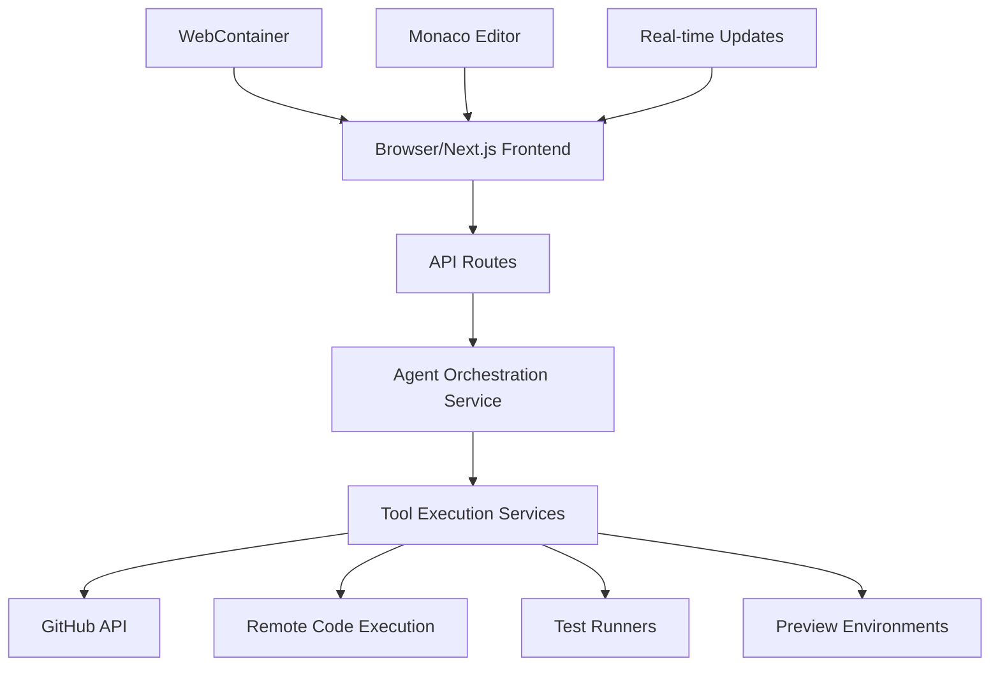

# Web Application Agent Architecture

**Date**: May 27, 2025  
**Context**: MECH AI is a Next.js web application

## 🌐 Web Architecture Constraints

### What We CAN'T Do (Browser Limitations):
- ❌ Direct file system access
- ❌ Run shell commands directly
- ❌ Execute git operations locally
- ❌ Access user's local development environment

### What We CAN Do:
- ✅ API calls to backend services
- ✅ WebContainer for in-browser code execution
- ✅ GitHub API for repository operations
- ✅ Remote execution via services
- ✅ Real-time updates via WebSockets/SSE

## 🏗️ Recommended Architecture



## 📋 Implementation Approach

### 1. Frontend Agent Manager (Browser)

```typescript
// frontend/lib/agents/agent-manager.ts
export class WebAgentManager {
  private ws: WebSocket;
  private activeAgents: Map<string, AgentSession>;
  
  constructor() {
    // Connect to agent orchestration service
    this.ws = new WebSocket(process.env.NEXT_PUBLIC_AGENT_WS_URL!);
    this.activeAgents = new Map();
  }
  
  async startAgent(type: AgentType, params: any): Promise<string> {
    const sessionId = generateId();
    
    // Create agent session
    const session: AgentSession = {
      id: sessionId,
      type,
      status: 'initializing',
      steps: [],
      startTime: new Date()
    };
    
    this.activeAgents.set(sessionId, session);
    
    // Send to backend
    const response = await fetch('/api/agents/start', {
      method: 'POST',
      body: JSON.stringify({ type, params, sessionId })
    });
    
    if (!response.ok) throw new Error('Failed to start agent');
    
    // Listen for updates
    this.subscribeToUpdates(sessionId);
    
    return sessionId;
  }
  
  private subscribeToUpdates(sessionId: string) {
    // Real-time updates via WebSocket
    this.ws.send(JSON.stringify({
      action: 'subscribe',
      sessionId
    }));
  }
}
```

### 2. API Routes for Agent Orchestration

```typescript
// app/api/agents/start/route.ts
export async function POST(request: Request) {
  const { type, params, sessionId } = await request.json();
  const session = await getSession();
  
  if (!session?.user) {
    return new Response('Unauthorized', { status: 401 });
  }
  
  // Start agent in backend service
  const agent = await startBackendAgent({
    type,
    params,
    userId: session.user.id,
    projectId: params.projectId,
    sessionId
  });
  
  // Return immediately, updates come via WebSocket
  return Response.json({
    sessionId,
    status: 'started'
  });
}
```

### 3. Backend Agent Service (Separate Process)

```typescript
// services/agent-orchestrator/index.ts
export class AgentOrchestrator {
  async executeCodeUpdateAgent(params: CodeUpdateParams) {
    const steps = [];
    
    // Step 1: Use GitHub API to search code
    const files = await this.searchGitHub(params);
    this.updateClient({ step: 'search', result: files });
    
    // Step 2: Read files via GitHub API
    const contents = await this.readGitHubFiles(files);
    this.updateClient({ step: 'read', result: contents });
    
    // Step 3: Generate changes (AI)
    const changes = await this.generateChanges(contents, params);
    this.updateClient({ step: 'generate', result: changes });
    
    // Step 4: Create PR or push to branch
    if (params.autoApply) {
      const pr = await this.createPullRequest(changes);
      this.updateClient({ step: 'pr', result: pr });
    }
    
    // Step 5: Trigger CI/CD for testing
    if (params.runTests) {
      const tests = await this.triggerTests(pr);
      this.updateClient({ step: 'test', result: tests });
    }
    
    return { steps, success: true };
  }
}
```

### 4. In-Browser Code Execution (WebContainer)

```typescript
// components/code-playground.tsx
import { WebContainer } from '@webcontainer/api';

export function CodePlayground({ code, onResult }: Props) {
  const [container, setContainer] = useState<WebContainer>();
  
  useEffect(() => {
    WebContainer.boot().then(setContainer);
  }, []);
  
  const runCode = async () => {
    if (!container) return;
    
    // Write code to virtual file system
    await container.mount({
      'index.js': {
        file: { contents: code }
      },
      'package.json': {
        file: { contents: JSON.stringify({
          name: 'test',
          type: 'module',
          dependencies: {}
        })}
      }
    });
    
    // Install dependencies if needed
    const install = await container.spawn('npm', ['install']);
    await install.exit;
    
    // Run the code
    const process = await container.spawn('node', ['index.js']);
    
    // Capture output
    process.output.pipeTo(new WritableStream({
      write(data) {
        onResult({ type: 'stdout', data });
      }
    }));
  };
  
  return (
    <div className="border rounded-lg p-4">
      <MonacoEditor value={code} onChange={setCode} />
      <Button onClick={runCode}>Run in Browser</Button>
    </div>
  );
}
```

### 5. Real-time Agent Status Updates

```typescript
// components/agent-status-panel.tsx
export function AgentStatusPanel({ sessionId }: { sessionId: string }) {
  const [status, setStatus] = useState<AgentStatus>();
  
  useEffect(() => {
    // Subscribe to real-time updates
    const ws = new WebSocket(`${WS_URL}?session=${sessionId}`);
    
    ws.onmessage = (event) => {
      const update = JSON.parse(event.data);
      setStatus(update);
    };
    
    return () => ws.close();
  }, [sessionId]);
  
  return (
    <Card>
      <CardHeader>
        <CardTitle>Agent Progress</CardTitle>
      </CardHeader>
      <CardContent>
        <Progress value={status?.progress || 0} />
        <div className="mt-4 space-y-2">
          {status?.steps.map((step, i) => (
            <StepIndicator key={i} step={step} />
          ))}
        </div>
      </CardContent>
    </Card>
  );
}
```

## 🔄 Complete Web Workflow

### User Flow:
```
1. User: "Fix email validation in all forms"
2. Frontend: Detects complex request → starts CodeUpdateAgent
3. API: Creates agent session, returns sessionId
4. Frontend: Shows agent status panel with real-time updates
5. Backend Agent:
   - Searches GitHub for form files
   - Reads current code
   - Generates fixes with AI
   - Creates feature branch
   - Pushes changes
   - Creates PR
   - Triggers CI/CD
6. Frontend: Shows PR link and test results
7. User: Reviews PR in GitHub or embedded view
```

## 🛠️ Technology Stack

### Frontend (Browser):
- **Next.js** - React framework
- **WebContainer** - In-browser Node.js
- **Monaco Editor** - VS Code editor
- **WebSocket** - Real-time updates
- **React Query** - Data fetching

### Backend Services:
- **Node.js** - Agent orchestration
- **GitHub API** - Repository operations
- **OpenAI/Anthropic** - AI code generation
- **Redis** - Job queuing
- **PostgreSQL/MongoDB** - State persistence

### Infrastructure:
- **Vercel** - Frontend hosting
- **Azure Container Apps** - Backend services
- **GitHub Actions** - CI/CD
- **Cloudflare Workers** - Edge functions

## 📊 State Management

```typescript
// Frontend state for agents
interface AgentState {
  sessions: Map<string, AgentSession>;
  activeSession: string | null;
  
  // Actions
  startAgent: (type: AgentType, params: any) => Promise<string>;
  stopAgent: (sessionId: string) => void;
  getSession: (sessionId: string) => AgentSession | undefined;
  
  // Real-time subscriptions
  subscribeToSession: (sessionId: string, callback: (update: any) => void) => void;
  unsubscribeFromSession: (sessionId: string) => void;
}

// Use Zustand or Redux Toolkit
export const useAgentStore = create<AgentState>((set, get) => ({
  sessions: new Map(),
  activeSession: null,
  
  startAgent: async (type, params) => {
    // Implementation
  },
  
  // ... other methods
}));
```

## 🚀 Implementation Priority

### Phase 1: Basic Infrastructure (Week 1)
1. Set up WebSocket server for real-time updates
2. Create agent API routes
3. Implement basic agent status UI
4. Connect to GitHub API

### Phase 2: Code Update Agent (Week 2)
1. Implement GitHub code search
2. Add AI-powered code generation
3. Create PR workflow
4. Add approval UI

### Phase 3: Testing & Preview (Week 3)
1. Integrate with CI/CD
2. Add preview deployments
3. Implement test result display
4. Add visual regression testing

### Phase 4: Advanced Features (Week 4)
1. Multi-agent coordination
2. Learning from outcomes
3. Performance optimization
4. Analytics dashboard

## 💡 Key Design Decisions

1. **Server-side Agents**: Agents run on backend, not in browser
2. **Real-time Updates**: WebSocket for live progress
3. **GitHub-first**: Use GitHub as source of truth
4. **Preview Deployments**: See changes before merging
5. **Approval Gates**: Human-in-the-loop for safety

This architecture leverages web technologies while respecting browser limitations, providing a powerful yet secure development experience.