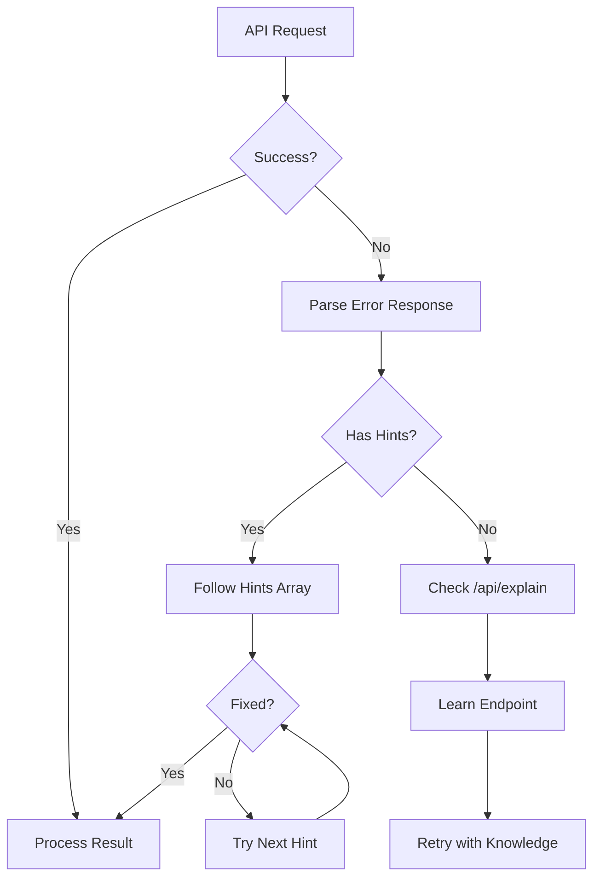

# AI Agent Integration Guide

This queue service is designed to be AI-friendly, with built-in features to help AI agents understand and use the API effectively.

## AI-Friendly Features

### 1. Self-Documenting `/explain` Endpoints

Every major API section has an explain endpoint that provides detailed information:

- **GET /api/explain** - Overview of the entire API
- **GET /api/explain/auth** - Authentication details
- **GET /api/explain/jobs** - Job submission guide
- **GET /api/explain/jobs/{queue}** - Queue-specific examples
- **GET /api/explain/queues** - Queue management info
- **GET /api/explain/errors** - Error code reference
- **GET /api/explain/patterns** - Best practices and patterns

### 2. Intelligent Error Messages

Every error response includes:

```json
{
  "success": false,
  "error": {
    "code": "MISSING_API_KEY",
    "message": "Missing x-api-key header",
    "hints": [
      "Add 'x-api-key: your-api-key' to request headers",
      "Get API key from POST /api/tenants (requires master key)",
      "Check /api/explain/auth for authentication details"
    ],
    "possibleCauses": [
      "Header not included in request",
      "Header name typo (should be lowercase)",
      "Using wrong header name"
    ],
    "suggestedFixes": [
      "curl -H \"x-api-key: your-key\" ...",
      "fetch(url, { headers: { \"x-api-key\": \"your-key\" } })",
      "Check your HTTP client configuration"
    ]
  }
}
```

### 3. AI Agent Best Practices

#### Understanding the API

```python
# First, get an overview
response = requests.get('http://localhost:3003/api/explain')
api_info = response.json()

# Learn about specific endpoints
auth_info = requests.get('http://localhost:3003/api/explain/auth').json()
job_info = requests.get('http://localhost:3003/api/explain/jobs').json()
```

#### Error Recovery

```python
def submit_job_with_recovery(queue_name, job_data, api_key):
    response = requests.post(
        f'http://localhost:3003/api/jobs/{queue_name}',
        headers={'x-api-key': api_key},
        json={'name': 'ai-job', 'data': job_data}
    )
    
    if not response.ok:
        error = response.json()['error']
        
        # Use hints for recovery
        if error['code'] == 'MISSING_API_KEY':
            # Follow the first hint
            print(f"Fix: {error['hints'][0]}")
            
        elif error['code'] == 'QUEUE_NOT_FOUND':
            # Get list of valid queues
            queues = requests.get(
                'http://localhost:3003/api/explain/queues'
            ).json()
            print(f"Available queues: {queues['data']['availableQueues']}")
            
        # Log all hints for human review
        for hint in error['hints']:
            print(f"Hint: {hint}")
```

#### Pattern Recognition

The API provides common patterns that AI agents can learn:

```javascript
// Get patterns for reliable job submission
const patterns = await fetch('/api/explain/patterns').then(r => r.json());
const reliableSubmission = patterns.data.patterns.reliableJobSubmission;

// Use the provided code example
eval(reliableSubmission.code); // Be careful with eval in production!
```

## Example: AI Agent Queue Client

```python
class AIQueueClient:
    def __init__(self, base_url, api_key):
        self.base_url = base_url
        self.api_key = api_key
        self.explain_cache = {}
    
    def learn_endpoint(self, endpoint):
        """Learn about an endpoint before using it"""
        if endpoint not in self.explain_cache:
            response = requests.get(
                f"{self.base_url}/api/explain/{endpoint}"
            )
            self.explain_cache[endpoint] = response.json()
        return self.explain_cache[endpoint]
    
    def submit_job_smart(self, queue_name, job_data):
        """Submit job with automatic error handling"""
        # Learn about the queue first
        queue_info = self.learn_endpoint(f"jobs/{queue_name}")
        
        # Validate data against requirements
        if 'requiredFields' in queue_info['data']:
            for field in queue_info['data']['requiredFields']:
                if field not in job_data:
                    raise ValueError(f"Missing required field: {field}")
        
        # Submit the job
        response = requests.post(
            f"{self.base_url}/api/jobs/{queue_name}",
            headers={'x-api-key': self.api_key},
            json={'name': f'ai-{queue_name}-job', 'data': job_data}
        )
        
        if response.ok:
            return response.json()['data']
        
        # Handle errors intelligently
        error = response.json()['error']
        
        # Try suggested fixes
        for i, fix in enumerate(error.get('suggestedFixes', [])):
            print(f"Attempting fix {i+1}: {fix}")
            # Implement fix logic here
        
        # If all fixes fail, raise with helpful context
        raise Exception(
            f"Failed to submit job. "
            f"Error: {error['message']}. "
            f"Hints: {', '.join(error['hints'])}"
        )
```

## LLM-Specific Tips

### For GPT/Claude/Other LLMs

1. **Always check `/api/explain` first** when unsure about an endpoint
2. **Parse error hints** to automatically fix issues
3. **Use provided examples** from explain endpoints
4. **Follow suggested fixes** in error responses
5. **Cache explain responses** to reduce API calls

### Prompt Engineering for Queue Usage

```
You are interacting with a queue service API. Before making any requests:

1. Check /api/explain/{endpoint} for documentation
2. When errors occur, follow the hints array in order
3. Use possibleCauses to diagnose issues
4. Implement suggestedFixes automatically
5. If confused, check /api/explain for help

The API is self-documenting and provides examples for every endpoint.
```

## Troubleshooting Flowchart for AI



## Integration Examples

### OpenAI Function Calling

```json
{
  "name": "submit_queue_job",
  "description": "Submit a job to the queue service",
  "parameters": {
    "type": "object",
    "properties": {
      "queue": {
        "type": "string",
        "enum": ["email", "webhook", "ai-processing", "notifications"],
        "description": "Queue to submit job to"
      },
      "job_data": {
        "type": "object",
        "description": "Job-specific data (check /api/explain/jobs/{queue} for requirements)"
      }
    },
    "required": ["queue", "job_data"]
  }
}
```

### LangChain Tool

```python
from langchain.tools import Tool

def queue_submit_tool(queue: str, data: dict) -> str:
    """Submit a job to the queue service.
    
    If unsure about data format, check:
    GET /api/explain/jobs/{queue}
    """
    response = requests.post(
        f"http://localhost:3003/api/jobs/{queue}",
        headers={"x-api-key": os.environ["QUEUE_API_KEY"]},
        json={"name": "langchain-job", "data": data}
    )
    
    if response.ok:
        job_id = response.json()["data"]["jobId"]
        return f"Job submitted successfully. ID: {job_id}"
    
    error = response.json()["error"]
    hints = "\n".join(error.get("hints", []))
    return f"Error: {error['message']}\n\nHints:\n{hints}"

queue_tool = Tool(
    name="QueueService",
    func=queue_submit_tool,
    description="Submit jobs to the queue service. Supports: email, webhook, ai-processing, etc."
)
```

## Summary

This queue service is designed to be self-documenting and self-healing when used by AI agents. Always:

1. **Explore** - Use `/api/explain` endpoints
2. **Learn** - Cache endpoint documentation
3. **Recover** - Follow error hints automatically
4. **Adapt** - Use suggested fixes from errors

The API will guide you to success!